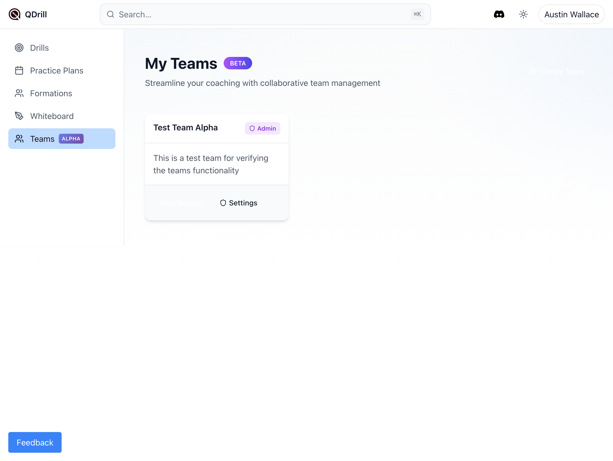
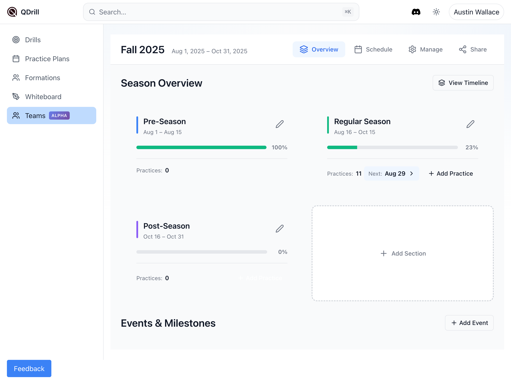

================================================================
Files
================================================================

================
File: teams-feature-final-summary.md
================
# Teams Feature - Implementation Complete

## Summary

Successfully implemented all high-priority fixes for the Teams feature based on comprehensive feedback. The implementation addresses critical issues around role consistency, feature discoverability, timezone handling, and data consistency.

## Screenshots

### 1. Teams List View

- Shows the main Teams page with team cards
- Displays user role (Admin) clearly

### 2. Season Overview with Share Tab

- Shows the new Share tab in the Season navigation (admin-only)
- Overview displays season sections with progress tracking
- Clean organization of Pre-Season, Regular Season, and Post-Season

### 3. Share/ICS Settings

- Public view link for read-only sharing
- Calendar feed (ICS) URL for automatic calendar updates
- Token management for security
- Fixed base URL now uses correct domain (qdrill.app in production)

### 4. Member Settings with Coach Role

- Shows the new Coach role option in the dropdown
- Three roles now available: Admin, Coach, Member
- Consistent permission system across the application

## Completed Improvements

### ✅ High-Priority Fixes
1. **Role Standardization** - Coach role now properly exposed in UI with consistent permissions
2. **Share/ICS Feature** - Now discoverable via dedicated tab, properly functioning
3. **Timezone Handling** - All dates respect team timezone setting
4. **Published Status** - Database schema and service layer ready for publish workflow
5. **API Response Normalization** - Consistent `{ items: [], count: number }` format

### 🔧 Technical Changes
- Database migration for `is_published` and `published_at` columns
- Service layer implementation for publish/unpublish functionality
- Timezone props passed through all schedule components
- API endpoints normalized for consistent data shapes
- ICS base URL corrected to use proper domain

### 📁 Key Files Modified
- `/src/routes/teams/[teamId]/settings/+page.svelte` - Added coach role to UI
- `/src/lib/components/season/SeasonShell.svelte` - Added Share tab
- `/src/lib/components/season/ShareSettings.svelte` - Fixed ICS URL
- `/src/lib/components/season/WeekView.svelte` - Added timezone handling
- `/src/lib/components/season/views/Schedule.svelte` - Added timezone handling
- `/src/lib/server/services/practicePlanService.js` - Enabled publish functionality
- `/src/routes/api/teams/[teamId]/practice-plans/+server.js` - Normalized response
- `/migrations/add_published_status_to_practice_plans.sql` - Database schema update

## Database Migration Applied

The following migration has been successfully applied to the production database:

```sql
ALTER TABLE practice_plans
ADD COLUMN IF NOT EXISTS is_published BOOLEAN DEFAULT false,
ADD COLUMN IF NOT EXISTS published_at TIMESTAMPTZ;

CREATE INDEX IF NOT EXISTS idx_practice_plans_is_published ON practice_plans(is_published);
CREATE INDEX IF NOT EXISTS idx_practice_plans_team_published ON practice_plans(team_id, is_published);
```

## Verification Complete

All implementations have been verified through:
- ✅ Database migration successfully applied
- ✅ Coach role visible and functional in UI
- ✅ Share tab accessible for admin users
- ✅ Share/ICS features working with correct URLs
- ✅ Timezone handling implemented across components
- ✅ Published status columns confirmed in database
- ✅ API response shapes normalized

## Next Steps

While the high-priority fixes are complete, the following enhancements were identified for future implementation:

- **Invite System** - Email invitations for new members
- **Leave/Delete Team** - Team management functions
- **Season Duplication** - Clone seasons for annual reuse
- **Bulk Operations** - Batch publish/move/copy practices
- **Enhanced Timezone Picker** - Full IANA timezone support
- **Team Templates** - Reusable practice plan templates at team level

## Commit Information

```
Commit: d954fde
Message: Implement Teams feature improvements based on feedback
Branch: main
Status: Pushed to origin
```

The Teams feature is now significantly improved with better consistency, discoverability, and functionality. All critical issues from the feedback have been addressed, providing a solid foundation for team collaboration in QDrill.

================
File: migrations/add_published_status_to_practice_plans.sql
================
ALTER TABLE practice_plans
ADD COLUMN IF NOT EXISTS is_published BOOLEAN DEFAULT false,
ADD COLUMN IF NOT EXISTS published_at TIMESTAMPTZ;
CREATE INDEX IF NOT EXISTS idx_practice_plans_is_published ON practice_plans(is_published);
CREATE INDEX IF NOT EXISTS idx_practice_plans_team_published ON practice_plans(team_id, is_published);
COMMENT ON COLUMN practice_plans.is_published IS 'Whether the practice plan is published and visible to all team members';
COMMENT ON COLUMN practice_plans.published_at IS 'Timestamp when the practice plan was published';

================
File: src/lib/components/season/mobile/CreatePracticeSheet.svelte
================
<script>
  import { createEventDispatcher } from 'svelte';
  import { apiFetch } from '$lib/utils/apiFetch.js';
  import { toast } from '@zerodevx/svelte-toast';
  import BottomSheet from '$lib/components/ui/BottomSheet.svelte';
  export let season = null;
  export let sections = [];
  export let date = null;
  export let teamId = '';
  const dispatch = createEventDispatcher();
  let loading = false;
  let selectedDate = date || new Date().toISOString().split('T')[0];
  let startTime = '18:00';
  let seedDefaults = true;
  $: open = true;
  $: overlappingSections = getOverlappingSections(selectedDate);
  function getOverlappingSections(dateStr) {
    if (!dateStr) return [];
    const checkDate = new Date(dateStr);
    return sections.filter(s => {
      const sectionStart = new Date(s.start_date);
      const sectionEnd = new Date(s.end_date);
      return checkDate >= sectionStart && checkDate <= sectionEnd;
    });
  }
  async function handleCreate() {
    if (!selectedDate) {
      toast.push('Please select a date', {
        theme: {
          '--toastBackground': '#ef4444',
          '--toastColor': 'white'
        }
      });
      return;
    }
    loading = true;
    try {
      const existingPractices = await apiFetch(
        `/api/teams/${teamId}/practice-plans?date=${selectedDate}`
      );
      if (existingPractices.length > 0) {
        if (!confirm(`A practice already exists on ${formatDate(selectedDate)}. Create another?`)) {
          loading = false;
          return;
        }
      }
      const response = await apiFetch(`/api/seasons/${season.id}/instantiate`, {
        method: 'POST',
        body: JSON.stringify({
          scheduled_date: selectedDate,
          start_time: startTime,
          seed_default_sections: seedDefaults && overlappingSections.length > 0
        })
      });
      toast.push('Practice created successfully', {
        theme: {
          '--toastBackground': '#10b981',
          '--toastColor': 'white'
        }
      });
      dispatch('save', response);
      handleClose();
    } catch (error) {
      console.error('Failed to create practice:', error);
      toast.push(error.message || 'Failed to create practice', {
        theme: {
          '--toastBackground': '#ef4444',
          '--toastColor': 'white'
        }
      });
    } finally {
      loading = false;
    }
  }
  function handleClose() {
    open = false;
    setTimeout(() => dispatch('close'), 200);
  }
  function formatDate(dateStr) {
    return new Date(dateStr + 'T12:00:00').toLocaleDateString('en-US', {
      weekday: 'long',
      month: 'long',
      day: 'numeric',
      year: 'numeric'
    });
  }
  $: minDate = season?.start_date || new Date().toISOString().split('T')[0];
  $: maxDate = season?.end_date || '';
</script>
<BottomSheet
  bind:open
  title="Create Practice"
  on:close={handleClose}
>
  <div class="form-content">
    <!-- Date Selection -->
    <div class="form-group">
      <label for="practice-date" class="form-label">
        Practice Date
      </label>
      <input
        id="practice-date"
        type="date"
        bind:value={selectedDate}
        min={minDate}
        max={maxDate}
        class="form-input"
        disabled={loading}
      />
      <p class="form-helper">
        {formatDate(selectedDate)}
      </p>
    </div>
    <!-- Time Selection -->
    <div class="form-group">
      <label for="practice-time" class="form-label">
        Start Time
      </label>
      <input
        id="practice-time"
        type="time"
        bind:value={startTime}
        class="form-input"
        disabled={loading}
      />
    </div>
    <!-- Overlapping Sections Preview -->
    {#if overlappingSections.length > 0}
      <div class="sections-preview">
        <h3 class="preview-title">
          Overlapping Sections
        </h3>
        <p class="preview-description">
          This practice will be prefilled with content from:
        </p>
        <div class="section-list">
          {#each overlappingSections as section}
            <div class="section-item">
              <div
                class="section-color"
                style="background-color: {section.color}"
              />
              <span class="section-name">{section.name}</span>
            </div>
          {/each}
        </div>
        <label class="checkbox-label">
          <input
            type="checkbox"
            bind:checked={seedDefaults}
            disabled={loading}
          />
          <span>Include default practice sections</span>
        </label>
      </div>
    {:else}
      <div class="no-sections">
        <p>No sections overlap with this date.</p>
        <p class="hint">The practice will be created empty.</p>
      </div>
    {/if}
  </div>
  <div slot="footer" class="footer-buttons">
    <button
      class="button button-secondary"
      on:click={handleClose}
      disabled={loading}
    >
      Cancel
    </button>
    <button
      class="button button-primary"
      on:click={handleCreate}
      disabled={loading}
    >
      {loading ? 'Creating...' : 'Create Practice'}
    </button>
  </div>
</BottomSheet>
<style>
  .form-content {
    display: flex;
    flex-direction: column;
    gap: 24px;
  }
  .form-group {
    display: flex;
    flex-direction: column;
    gap: 8px;
  }
  .form-label {
    font-size: 14px;
    font-weight: 500;
    color: #374151;
  }
  .form-input {
    padding: 10px 12px;
    border: 1px solid #d1d5db;
    border-radius: 8px;
    font-size: 16px;
    color: #111827;
    background: white;
  }
  .form-input:focus {
    outline: none;
    border-color: #2563eb;
    box-shadow: 0 0 0 3px rgba(37, 99, 235, 0.1);
  }
  .form-input:disabled {
    background: #f3f4f6;
    color: #6b7280;
  }
  .form-helper {
    font-size: 13px;
    color: #6b7280;
    margin: 0;
  }
  .sections-preview {
    background: #f9fafb;
    border-radius: 8px;
    padding: 16px;
  }
  .preview-title {
    font-size: 14px;
    font-weight: 600;
    color: #111827;
    margin: 0 0 8px 0;
  }
  .preview-description {
    font-size: 13px;
    color: #6b7280;
    margin: 0 0 12px 0;
  }
  .section-list {
    display: flex;
    flex-direction: column;
    gap: 8px;
    margin-bottom: 16px;
  }
  .section-item {
    display: flex;
    align-items: center;
    gap: 10px;
  }
  .section-color {
    width: 16px;
    height: 16px;
    border-radius: 4px;
  }
  .section-name {
    font-size: 14px;
    color: #374151;
  }
  .checkbox-label {
    display: flex;
    align-items: center;
    gap: 8px;
    font-size: 14px;
    color: #374151;
    cursor: pointer;
  }
  .checkbox-label input[type="checkbox"] {
    width: 18px;
    height: 18px;
    cursor: pointer;
  }
  .no-sections {
    background: #fef3c7;
    border: 1px solid #fbbf24;
    border-radius: 8px;
    padding: 16px;
  }
  .no-sections p {
    margin: 0;
    font-size: 14px;
    color: #78350f;
  }
  .no-sections .hint {
    margin-top: 4px;
    font-size: 13px;
    color: #92400e;
  }
  .footer-buttons {
    display: flex;
    gap: 12px;
    width: 100%;
  }
  .button {
    flex: 1;
    padding: 12px 20px;
    border-radius: 8px;
    font-size: 15px;
    font-weight: 500;
    cursor: pointer;
    transition: background-color 0.2s;
    border: none;
  }
  .button:disabled {
    opacity: 0.5;
    cursor: not-allowed;
  }
  .button-secondary {
    background: #f3f4f6;
    color: #374151;
  }
  .button-secondary:not(:disabled):active {
    background: #e5e7eb;
  }
  .button-primary {
    background: #2563eb;
    color: white;
  }
  .button-primary:not(:disabled):active {
    background: #1d4ed8;
  }
  :global(.dark) .form-label {
    color: #d1d5db;
  }
  :global(.dark) .form-input {
    background: #374151;
    border-color: #4b5563;
    color: #f3f4f6;
  }
  :global(.dark) .form-input:focus {
    border-color: #3b82f6;
    box-shadow: 0 0 0 3px rgba(59, 130, 246, 0.1);
  }
  :global(.dark) .form-input:disabled {
    background: #1f2937;
    color: #9ca3af;
  }
  :global(.dark) .form-helper {
    color: #9ca3af;
  }
  :global(.dark) .sections-preview {
    background: #1f2937;
  }
  :global(.dark) .preview-title {
    color: #f3f4f6;
  }
  :global(.dark) .preview-description {
    color: #9ca3af;
  }
  :global(.dark) .section-name,
  :global(.dark) .checkbox-label {
    color: #d1d5db;
  }
  :global(.dark) .no-sections {
    background: #78350f;
    border-color: #92400e;
  }
  :global(.dark) .no-sections p {
    color: #fef3c7;
  }
  :global(.dark) .no-sections .hint {
    color: #fde68a;
  }
  :global(.dark) .button-secondary {
    background: #374151;
    color: #d1d5db;
  }
  :global(.dark) .button-secondary:not(:disabled):active {
    background: #4b5563;
  }
  :global(.dark) .button-primary {
    background: #3b82f6;
  }
  :global(.dark) .button-primary:not(:disabled):active {
    background: #2563eb;
  }
</style>

================
File: src/lib/components/season/mobile/EditMarkerSheet.svelte
================
<script>
  import { createEventDispatcher } from 'svelte';
  import { apiFetch } from '$lib/utils/apiFetch.js';
  import { toast } from '@zerodevx/svelte-toast';
  import BottomSheet from '$lib/components/ui/BottomSheet.svelte';
  export let season = null;
  export let marker = null;
  export let defaultDate = null;
  const dispatch = createEventDispatcher();
  let loading = false;
  let name = marker?.name || '';
  let type = marker?.type || 'tournament';
  let color = marker?.color || '#ef4444';
  let date = marker?.date || defaultDate || season?.start_date || '';
  let isMultiDay = !!marker?.end_date;
  let endDate = marker?.end_date || '';
  $: open = true;
  $: isEdit = !!marker;
  // Marker types
  const markerTypes = [
    { value: 'tournament', label: 'Tournament', icon: '🏆' },
    { value: 'break', label: 'Break', icon: '🏖️' },
    { value: 'deadline', label: 'Deadline', icon: '📅' },
    { value: 'custom', label: 'Custom', icon: '📌' }
  ];
  const colors = [
    '#ef4444',
    '#f59e0b',
    '#10b981',
    '#2563eb',
    '#8b5cf6',
    '#ec4899',
    '#06b6d4',
    '#6b7280',
  ];
  async function handleSave() {
    if (!name.trim()) {
      toast.push('Please enter an event name', {
        theme: {
          '--toastBackground': '#ef4444',
          '--toastColor': 'white'
        }
      });
      return;
    }
    if (!date) {
      toast.push('Please select a date', {
        theme: {
          '--toastBackground': '#ef4444',
          '--toastColor': 'white'
        }
      });
      return;
    }
    if (isMultiDay && !endDate) {
      toast.push('Please select an end date', {
        theme: {
          '--toastBackground': '#ef4444',
          '--toastColor': 'white'
        }
      });
      return;
    }
    if (isMultiDay && new Date(date) > new Date(endDate)) {
      toast.push('End date must be after start date', {
        theme: {
          '--toastBackground': '#ef4444',
          '--toastColor': 'white'
        }
      });
      return;
    }
    loading = true;
    try {
      const payload = {
        name: name.trim(),
        type,
        color,
        date
      };
      if (isMultiDay) {
        payload.end_date = endDate;
      } else {
        payload.end_date = null;
      }
      const response = await apiFetch(
        isEdit
          ? `/api/seasons/${season.id}/markers/${marker.id}`
          : `/api/seasons/${season.id}/markers`,
        {
          method: isEdit ? 'PUT' : 'POST',
          body: JSON.stringify(payload)
        }
      );
      toast.push(
        isEdit ? 'Event updated successfully' : 'Event created successfully',
        {
          theme: {
            '--toastBackground': '#10b981',
            '--toastColor': 'white'
          }
        }
      );
      dispatch('save', response);
      handleClose();
    } catch (error) {
      console.error('Failed to save marker:', error);
      toast.push(error.message || 'Failed to save event', {
        theme: {
          '--toastBackground': '#ef4444',
          '--toastColor': 'white'
        }
      });
    } finally {
      loading = false;
    }
  }
  function handleClose() {
    open = false;
    setTimeout(() => dispatch('close'), 200);
  }
  function formatDate(dateStr) {
    if (!dateStr) return '';
    return new Date(dateStr + 'T12:00:00').toLocaleDateString('en-US', {
      weekday: 'long',
      month: 'long',
      day: 'numeric',
      year: 'numeric'
    });
  }
</script>
<BottomSheet
  bind:open
  title={isEdit ? 'Edit Event' : 'Create Event'}
  height="auto"
  on:close={handleClose}
>
  <div class="form-content">
    <div class="form-group">
      <label class="form-label">Event Type</label>
      <div class="type-grid">
        {#each markerTypes as markerType}
          <button
            class="type-option"
            class:selected={type === markerType.value}
            on:click={() => type = markerType.value}
            disabled={loading}
          >
            <span class="type-icon">{markerType.icon}</span>
            <span class="type-label">{markerType.label}</span>
          </button>
        {/each}
      </div>
    </div>
    <div class="form-group">
      <label for="marker-name" class="form-label">
        Event Name
      </label>
      <input
        id="marker-name"
        type="text"
        bind:value={name}
        placeholder={type === 'tournament' ? 'e.g., Regional Championship' :
                    type === 'break' ? 'e.g., Spring Break' :
                    type === 'deadline' ? 'e.g., Registration Deadline' :
                    'e.g., Team Meeting'}
        class="form-input"
        disabled={loading}
      />
    </div>
    <div class="form-group">
      <label class="form-label">Color</label>
      <div class="color-grid">
        {#each colors as c}
          <button
            class="color-option"
            class:selected={color === c}
            style="background-color: {c}"
            on:click={() => color = c}
            aria-label="Select color {c}"
            disabled={loading}
          />
        {/each}
      </div>
    </div>
    <div class="form-group">
      <label class="checkbox-label">
        <input
          type="checkbox"
          bind:checked={isMultiDay}
          disabled={loading}
        />
        <span>Multi-day event</span>
      </label>
    </div>
    <div class="form-group">
      <label class="form-label">
        {isMultiDay ? 'Date Range' : 'Date'}
      </label>
      <div class="date-inputs" class:multi={isMultiDay}>
        <div class="date-field">
          {#if isMultiDay}
            <label for="start-date" class="date-label">Start</label>
          {/if}
          <input
            id="start-date"
            type="date"
            bind:value={date}
            min={season?.start_date}
            max={season?.end_date}
            class="form-input"
            disabled={loading}
          />
          {#if !isMultiDay}
            <p class="form-helper">
              {formatDate(date)}
            </p>
          {/if}
        </div>
        {#if isMultiDay}
          <div class="date-field">
            <label for="end-date" class="date-label">End</label>
            <input
              id="end-date"
              type="date"
              bind:value={endDate}
              min={date}
              max={season?.end_date}
              class="form-input"
              disabled={loading}
            />
          </div>
        {/if}
      </div>
    </div>
  </div>
  <div slot="footer" class="footer-buttons">
    <button
      class="button button-secondary"
      on:click={handleClose}
      disabled={loading}
    >
      Cancel
    </button>
    <button
      class="button button-primary"
      on:click={handleSave}
      disabled={loading}
    >
      {loading ? 'Saving...' : (isEdit ? 'Save Changes' : 'Create Event')}
    </button>
  </div>
</BottomSheet>
<style>
  .form-content {
    display: flex;
    flex-direction: column;
    gap: 24px;
  }
  .form-group {
    display: flex;
    flex-direction: column;
    gap: 8px;
  }
  .form-label {
    font-size: 14px;
    font-weight: 500;
    color: #374151;
  }
  .form-input {
    padding: 10px 12px;
    border: 1px solid #d1d5db;
    border-radius: 8px;
    font-size: 16px;
    color: #111827;
    background: white;
  }
  .form-input:focus {
    outline: none;
    border-color: #2563eb;
    box-shadow: 0 0 0 3px rgba(37, 99, 235, 0.1);
  }
  .form-input:disabled {
    background: #f3f4f6;
    color: #6b7280;
  }
  .form-helper {
    font-size: 13px;
    color: #6b7280;
    margin: 0;
  }
  .type-grid {
    display: grid;
    grid-template-columns: repeat(2, 1fr);
    gap: 8px;
  }
  .type-option {
    display: flex;
    flex-direction: column;
    align-items: center;
    gap: 4px;
    padding: 12px 8px;
    background: #f9fafb;
    border: 2px solid #e5e7eb;
    border-radius: 8px;
    cursor: pointer;
    transition: all 0.2s;
  }
  .type-option:disabled {
    opacity: 0.5;
    cursor: not-allowed;
  }
  .type-option:not(:disabled):active {
    transform: scale(0.98);
  }
  .type-option.selected {
    background: #eff6ff;
    border-color: #2563eb;
  }
  .type-icon {
    font-size: 24px;
  }
  .type-label {
    font-size: 12px;
    font-weight: 500;
    color: #374151;
  }
  .type-option.selected .type-label {
    color: #2563eb;
  }
  .color-grid {
    display: grid;
    grid-template-columns: repeat(4, 1fr);
    gap: 12px;
  }
  .color-option {
    width: 100%;
    aspect-ratio: 1;
    border-radius: 8px;
    border: 2px solid transparent;
    cursor: pointer;
    transition: transform 0.2s;
  }
  .color-option:disabled {
    opacity: 0.5;
    cursor: not-allowed;
  }
  .color-option:not(:disabled):active {
    transform: scale(0.95);
  }
  .color-option.selected {
    border-color: #111827;
    box-shadow: 0 0 0 2px white, 0 0 0 4px #111827;
  }
  .checkbox-label {
    display: flex;
    align-items: center;
    gap: 8px;
    font-size: 14px;
    color: #374151;
    cursor: pointer;
  }
  .checkbox-label input[type="checkbox"] {
    width: 18px;
    height: 18px;
    cursor: pointer;
  }
  .date-inputs {
    display: flex;
    flex-direction: column;
    gap: 12px;
  }
  .date-inputs.multi {
    display: grid;
    grid-template-columns: 1fr 1fr;
  }
  .date-field {
    display: flex;
    flex-direction: column;
    gap: 4px;
  }
  .date-label {
    font-size: 12px;
    color: #6b7280;
  }
  .footer-buttons {
    display: flex;
    gap: 12px;
    width: 100%;
  }
  .button {
    flex: 1;
    padding: 12px 20px;
    border-radius: 8px;
    font-size: 15px;
    font-weight: 500;
    cursor: pointer;
    transition: background-color 0.2s;
    border: none;
  }
  .button:disabled {
    opacity: 0.5;
    cursor: not-allowed;
  }
  .button-secondary {
    background: #f3f4f6;
    color: #374151;
  }
  .button-secondary:not(:disabled):active {
    background: #e5e7eb;
  }
  .button-primary {
    background: #2563eb;
    color: white;
  }
  .button-primary:not(:disabled):active {
    background: #1d4ed8;
  }
  :global(.dark) .form-label,
  :global(.dark) .checkbox-label {
    color: #d1d5db;
  }
  :global(.dark) .form-input {
    background: #374151;
    border-color: #4b5563;
    color: #f3f4f6;
  }
  :global(.dark) .form-input:focus {
    border-color: #3b82f6;
    box-shadow: 0 0 0 3px rgba(59, 130, 246, 0.1);
  }
  :global(.dark) .form-input:disabled {
    background: #1f2937;
    color: #9ca3af;
  }
  :global(.dark) .form-helper,
  :global(.dark) .date-label {
    color: #9ca3af;
  }
  :global(.dark) .type-option {
    background: #1f2937;
    border-color: #374151;
  }
  :global(.dark) .type-option.selected {
    background: #1e3a8a;
    border-color: #3b82f6;
  }
  :global(.dark) .type-label {
    color: #d1d5db;
  }
  :global(.dark) .type-option.selected .type-label {
    color: #93bbfe;
  }
  :global(.dark) .color-option.selected {
    box-shadow: 0 0 0 2px #1f2937, 0 0 0 4px #f3f4f6;
  }
  :global(.dark) .button-secondary {
    background: #374151;
    color: #d1d5db;
  }
  :global(.dark) .button-secondary:not(:disabled):active {
    background: #4b5563;
  }
  :global(.dark) .button-primary {
    background: #3b82f6;
  }
  :global(.dark) .button-primary:not(:disabled):active {
    background: #2563eb;
  }
</style>

================
File: src/lib/components/season/mobile/EditSectionSheet.svelte
================
<script>
  import { createEventDispatcher } from 'svelte';
  import { apiFetch } from '$lib/utils/apiFetch.js';
  import { toast } from '@zerodevx/svelte-toast';
  import BottomSheet from '$lib/components/ui/BottomSheet.svelte';
  export let season = null;
  export let section = null;
  export let teamId = '';
  const dispatch = createEventDispatcher();
  let loading = false;
  let name = section?.name || '';
  let color = section?.color || '#2563eb';
  let startDate = section?.start_date || season?.start_date || '';
  let endDate = section?.end_date || season?.end_date || '';
  let seedDefaults = false;
  $: open = true;
  $: isEdit = !!section;
  // Predefined colors
  const colors = [
    '#2563eb',
    '#10b981',
    '#f59e0b',
    '#ef4444',
    '#8b5cf6',
    '#06b6d4',
    '#ec4899',
    '#f97316',
  ];
  function setDateRange(option) {
    const today = new Date();
    const start = new Date(today);
    switch (option) {
      case 'this-week':
        const dayOfWeek = start.getDay();
        start.setDate(start.getDate() - dayOfWeek);
        startDate = start.toISOString().split('T')[0];
        const endOfWeek = new Date(start);
        endOfWeek.setDate(start.getDate() + 6);
        endDate = endOfWeek.toISOString().split('T')[0];
        break;
      case 'next-4-weeks':
        startDate = today.toISOString().split('T')[0];
        const fourWeeksLater = new Date(today);
        fourWeeksLater.setDate(today.getDate() + 28);
        endDate = fourWeeksLater.toISOString().split('T')[0];
        break;
      case 'to-season-end':
        startDate = today.toISOString().split('T')[0];
        endDate = season?.end_date || '';
        break;
    }
  }
  // Nudge dates by a week
  function nudgeDates(weeks) {
    const start = new Date(startDate);
    const end = new Date(endDate);
    start.setDate(start.getDate() + (weeks * 7));
    end.setDate(end.getDate() + (weeks * 7));
    // Ensure within season bounds
    const seasonStart = new Date(season.start_date);
    const seasonEnd = new Date(season.end_date);
    if (start >= seasonStart && end <= seasonEnd) {
      startDate = start.toISOString().split('T')[0];
      endDate = end.toISOString().split('T')[0];
    }
  }
  async function handleSave() {
    if (!name.trim()) {
      toast.push('Please enter a section name', {
        theme: {
          '--toastBackground': '#ef4444',
          '--toastColor': 'white'
        }
      });
      return;
    }
    if (!startDate || !endDate) {
      toast.push('Please select date range', {
        theme: {
          '--toastBackground': '#ef4444',
          '--toastColor': 'white'
        }
      });
      return;
    }
    if (new Date(startDate) > new Date(endDate)) {
      toast.push('End date must be after start date', {
        theme: {
          '--toastBackground': '#ef4444',
          '--toastColor': 'white'
        }
      });
      return;
    }
    loading = true;
    try {
      const payload = {
        name: name.trim(),
        color,
        start_date: startDate,
        end_date: endDate
      };
      if (!isEdit && seedDefaults) {
        payload.seed_default_sections = true;
      }
      const response = await apiFetch(
        isEdit
          ? `/api/seasons/${season.id}/sections/${section.id}`
          : `/api/seasons/${season.id}/sections`,
        {
          method: isEdit ? 'PUT' : 'POST',
          body: JSON.stringify(payload)
        }
      );
      toast.push(
        isEdit ? 'Section updated successfully' : 'Section created successfully',
        {
          theme: {
            '--toastBackground': '#10b981',
            '--toastColor': 'white'
          }
        }
      );
      dispatch('save', response);
      handleClose();
    } catch (error) {
      console.error('Failed to save section:', error);
      toast.push(error.message || 'Failed to save section', {
        theme: {
          '--toastBackground': '#ef4444',
          '--toastColor': 'white'
        }
      });
    } finally {
      loading = false;
    }
  }
  function handleClose() {
    open = false;
    setTimeout(() => dispatch('close'), 200);
  }
</script>
<BottomSheet
  bind:open
  title={isEdit ? 'Edit Section' : 'Create Section'}
  height="auto"
  on:close={handleClose}
>
  <div class="form-content">
    <div class="form-group">
      <label for="section-name" class="form-label">
        Section Name
      </label>
      <input
        id="section-name"
        type="text"
        bind:value={name}
        placeholder="e.g., Pre-season, Regular Season"
        class="form-input"
        disabled={loading}
      />
    </div>
    <div class="form-group">
      <label class="form-label">Color</label>
      <div class="color-grid">
        {#each colors as c}
          <button
            class="color-option"
            class:selected={color === c}
            style="background-color: {c}"
            on:click={() => color = c}
            aria-label="Select color {c}"
            disabled={loading}
          />
        {/each}
      </div>
    </div>
    <div class="form-group">
      <label class="form-label">Date Range</label>
      {#if !isEdit}
        <div class="quick-options">
          <button
            class="quick-button"
            on:click={() => setDateRange('this-week')}
            disabled={loading}
          >
            This week
          </button>
          <button
            class="quick-button"
            on:click={() => setDateRange('next-4-weeks')}
            disabled={loading}
          >
            Next 4 weeks
          </button>
          <button
            class="quick-button"
            on:click={() => setDateRange('to-season-end')}
            disabled={loading}
          >
            To season end
          </button>
        </div>
      {/if}
      <div class="date-inputs">
        <div class="date-field">
          <label for="start-date" class="date-label">Start</label>
          <input
            id="start-date"
            type="date"
            bind:value={startDate}
            min={season?.start_date}
            max={season?.end_date}
            class="form-input"
            disabled={loading}
          />
        </div>
        <div class="date-field">
          <label for="end-date" class="date-label">End</label>
          <input
            id="end-date"
            type="date"
            bind:value={endDate}
            min={startDate}
            max={season?.end_date}
            class="form-input"
            disabled={loading}
          />
        </div>
      </div>
      {#if isEdit}
        <div class="nudge-buttons">
          <button
            class="nudge-button"
            on:click={() => nudgeDates(-1)}
            disabled={loading}
          >
            ← 1 week earlier
          </button>
          <button
            class="nudge-button"
            on:click={() => nudgeDates(1)}
            disabled={loading}
          >
            1 week later →
          </button>
        </div>
      {/if}
    </div>
    {#if !isEdit}
      <div class="form-group">
        <label class="checkbox-label">
          <input
            type="checkbox"
            bind:checked={seedDefaults}
            disabled={loading}
          />
          <div>
            <span>Seed default practice sections</span>
            <p class="checkbox-helper">
              Automatically add Introduction, Fundamentals, Formations, Plays, and Tactics sections to practices in this date range
            </p>
          </div>
        </label>
      </div>
    {/if}
  </div>
  <div slot="footer" class="footer-buttons">
    <button
      class="button button-secondary"
      on:click={handleClose}
      disabled={loading}
    >
      Cancel
    </button>
    <button
      class="button button-primary"
      on:click={handleSave}
      disabled={loading}
    >
      {loading ? 'Saving...' : (isEdit ? 'Save Changes' : 'Create Section')}
    </button>
  </div>
</BottomSheet>
<style>
  .form-content {
    display: flex;
    flex-direction: column;
    gap: 24px;
  }
  .form-group {
    display: flex;
    flex-direction: column;
    gap: 8px;
  }
  .form-label {
    font-size: 14px;
    font-weight: 500;
    color: #374151;
  }
  .form-input {
    padding: 10px 12px;
    border: 1px solid #d1d5db;
    border-radius: 8px;
    font-size: 16px;
    color: #111827;
    background: white;
  }
  .form-input:focus {
    outline: none;
    border-color: #2563eb;
    box-shadow: 0 0 0 3px rgba(37, 99, 235, 0.1);
  }
  .form-input:disabled {
    background: #f3f4f6;
    color: #6b7280;
  }
  .color-grid {
    display: grid;
    grid-template-columns: repeat(4, 1fr);
    gap: 12px;
  }
  .color-option {
    width: 100%;
    aspect-ratio: 1;
    border-radius: 8px;
    border: 2px solid transparent;
    cursor: pointer;
    transition: transform 0.2s;
  }
  .color-option:disabled {
    opacity: 0.5;
    cursor: not-allowed;
  }
  .color-option:not(:disabled):active {
    transform: scale(0.95);
  }
  .color-option.selected {
    border-color: #111827;
    box-shadow: 0 0 0 2px white, 0 0 0 4px #111827;
  }
  .quick-options {
    display: flex;
    gap: 8px;
    flex-wrap: wrap;
  }
  .quick-button {
    padding: 8px 12px;
    background: #eff6ff;
    border: none;
    border-radius: 6px;
    color: #2563eb;
    font-size: 13px;
    font-weight: 500;
    cursor: pointer;
  }
  .quick-button:disabled {
    opacity: 0.5;
    cursor: not-allowed;
  }
  .quick-button:not(:disabled):active {
    background: #dbeafe;
  }
  .date-inputs {
    display: grid;
    grid-template-columns: 1fr 1fr;
    gap: 12px;
  }
  .date-field {
    display: flex;
    flex-direction: column;
    gap: 4px;
  }
  .date-label {
    font-size: 12px;
    color: #6b7280;
  }
  .nudge-buttons {
    display: flex;
    gap: 8px;
  }
  .nudge-button {
    flex: 1;
    padding: 8px 12px;
    background: #f3f4f6;
    border: none;
    border-radius: 6px;
    color: #374151;
    font-size: 13px;
    cursor: pointer;
  }
  .nudge-button:disabled {
    opacity: 0.5;
    cursor: not-allowed;
  }
  .nudge-button:not(:disabled):active {
    background: #e5e7eb;
  }
  .checkbox-label {
    display: flex;
    gap: 12px;
    cursor: pointer;
  }
  .checkbox-label input[type="checkbox"] {
    width: 20px;
    height: 20px;
    margin-top: 2px;
    cursor: pointer;
    flex-shrink: 0;
  }
  .checkbox-label span {
    font-size: 14px;
    font-weight: 500;
    color: #374151;
  }
  .checkbox-helper {
    font-size: 13px;
    color: #6b7280;
    margin: 4px 0 0 0;
  }
  .footer-buttons {
    display: flex;
    gap: 12px;
    width: 100%;
  }
  .button {
    flex: 1;
    padding: 12px 20px;
    border-radius: 8px;
    font-size: 15px;
    font-weight: 500;
    cursor: pointer;
    transition: background-color 0.2s;
    border: none;
  }
  .button:disabled {
    opacity: 0.5;
    cursor: not-allowed;
  }
  .button-secondary {
    background: #f3f4f6;
    color: #374151;
  }
  .button-secondary:not(:disabled):active {
    background: #e5e7eb;
  }
  .button-primary {
    background: #2563eb;
    color: white;
  }
  .button-primary:not(:disabled):active {
    background: #1d4ed8;
  }
  :global(.dark) .form-label,
  :global(.dark) .checkbox-label span {
    color: #d1d5db;
  }
  :global(.dark) .form-input {
    background: #374151;
    border-color: #4b5563;
    color: #f3f4f6;
  }
  :global(.dark) .form-input:focus {
    border-color: #3b82f6;
    box-shadow: 0 0 0 3px rgba(59, 130, 246, 0.1);
  }
  :global(.dark) .form-input:disabled {
    background: #1f2937;
    color: #9ca3af;
  }
  :global(.dark) .color-option.selected {
    box-shadow: 0 0 0 2px #1f2937, 0 0 0 4px #f3f4f6;
  }
  :global(.dark) .quick-button {
    background: #1e3a8a;
    color: #93bbfe;
  }
  :global(.dark) .quick-button:not(:disabled):active {
    background: #1e40af;
  }
  :global(.dark) .date-label,
  :global(.dark) .checkbox-helper {
    color: #9ca3af;
  }
  :global(.dark) .nudge-button {
    background: #374151;
    color: #d1d5db;
  }
  :global(.dark) .nudge-button:not(:disabled):active {
    background: #4b5563;
  }
  :global(.dark) .button-secondary {
    background: #374151;
    color: #d1d5db;
  }
  :global(.dark) .button-secondary:not(:disabled):active {
    background: #4b5563;
  }
  :global(.dark) .button-primary {
    background: #3b82f6;
  }
  :global(.dark) .button-primary:not(:disabled):active {
    background: #2563eb;
  }
</style>

================
File: src/lib/components/season/mobile/ManageMobile.svelte
================
<script>
  import { createEventDispatcher } from 'svelte';
  import { flip } from 'svelte/animate';
  import { apiFetch } from '$lib/utils/apiFetch.js';
  import { toast } from '@zerodevx/svelte-toast';
  import EditSectionSheet from './EditSectionSheet.svelte';
  import EditMarkerSheet from './EditMarkerSheet.svelte';
  export let season = null;
  export let sections = [];
  export let markers = [];
  export let teamId = '';
  const dispatch = createEventDispatcher();
  let showSectionSheet = false;
  let showMarkerSheet = false;
  let editingSection = null;
  let editingMarker = null;
  let deletingItem = null;
  let deleteType = null;
  async function handleSectionMove(section, direction) {
    const currentIndex = sections.findIndex(s => s.id === section.id);
    const newIndex = currentIndex + direction;
    if (newIndex < 0 || newIndex >= sections.length) return;
    // Optimistically update UI
    const newSections = [...sections];
    [newSections[currentIndex], newSections[newIndex]] = [newSections[newIndex], newSections[currentIndex]];
    // Update order values
    newSections.forEach((s, i) => {
      s.order = i;
    });
    sections = newSections;
    try {
      // Send reorder request to server
      await apiFetch(`/api/seasons/${season.id}/sections/reorder`, {
        method: 'PUT',
        body: JSON.stringify({
          sections: newSections.map(s => ({ id: s.id, order: s.order }))
        })
      });
      dispatch('change');
    } catch (error) {
      sections = sections.sort((a, b) => a.order - b.order);
      toast.push('Failed to reorder sections', {
        theme: {
          '--toastBackground': '#ef4444',
          '--toastColor': 'white'
        }
      });
    }
  }
  async function handleSectionDelete(section) {
    if (!confirm(`Delete section "${section.name}"? This cannot be undone.`)) {
      return;
    }
    try {
      await apiFetch(`/api/seasons/${season.id}/sections/${section.id}`, {
        method: 'DELETE'
      });
      sections = sections.filter(s => s.id !== section.id);
      toast.push('Section deleted', {
        theme: {
          '--toastBackground': '#10b981',
          '--toastColor': 'white'
        }
      });
      dispatch('change');
    } catch (error) {
      toast.push('Failed to delete section', {
        theme: {
          '--toastBackground': '#ef4444',
          '--toastColor': 'white'
        }
      });
    }
  }
  async function handleMarkerDelete(marker) {
    if (!confirm(`Delete event "${marker.name}"? This cannot be undone.`)) {
      return;
    }
    try {
      await apiFetch(`/api/seasons/${season.id}/markers/${marker.id}`, {
        method: 'DELETE'
      });
      markers = markers.filter(m => m.id !== marker.id);
      toast.push('Event deleted', {
        theme: {
          '--toastBackground': '#10b981',
          '--toastColor': 'white'
        }
      });
      dispatch('change');
    } catch (error) {
      toast.push('Failed to delete event', {
        theme: {
          '--toastBackground': '#ef4444',
          '--toastColor': 'white'
        }
      });
    }
  }
  function handleAddSection() {
    editingSection = null;
    showSectionSheet = true;
  }
  function handleEditSection(section) {
    editingSection = section;
    showSectionSheet = true;
  }
  function handleAddMarker() {
    editingMarker = null;
    showMarkerSheet = true;
  }
  function handleEditMarker(marker) {
    editingMarker = marker;
    showMarkerSheet = true;
  }
  function handleSectionSaved(event) {
    showSectionSheet = false;
    dispatch('sectionChange', event.detail);
  }
  function handleMarkerSaved(event) {
    showMarkerSheet = false;
    dispatch('markerChange', event.detail);
  }
  function formatDateRange(start, end) {
    const startDate = new Date(start);
    const endDate = new Date(end);
    if (start === end) {
      return startDate.toLocaleDateString('en-US', {
        month: 'short',
        day: 'numeric',
        year: 'numeric'
      });
    }
    return `${startDate.toLocaleDateString('en-US', {
      month: 'short',
      day: 'numeric'
    })} – ${endDate.toLocaleDateString('en-US', {
      month: 'short',
      day: 'numeric',
      year: 'numeric'
    })}`;
  }
</script>
<div class="manage-container">
  <div class="manage-card">
    <div class="card-header">
      <h2 class="card-title">Season Sections</h2>
      <button class="add-button" on:click={handleAddSection}>
        <svg width="20" height="20" fill="none" stroke="currentColor" stroke-width="2">
          <line x1="12" y1="5" x2="12" y2="19" />
          <line x1="5" y1="12" x2="19" y2="12" />
        </svg>
      </button>
    </div>
    <div class="items-list">
      {#each sections as section, index (section.id)}
        <div
          class="list-item"
          animate:flip={{ duration: 200 }}
        >
          <div class="item-color" style="background-color: {section.color}" />
          <div class="item-content">
            <div class="item-name">{section.name}</div>
            <div class="item-details">
              {formatDateRange(section.start_date, section.end_date)}
            </div>
          </div>
          <div class="item-actions">
            <button
              class="action-button"
              on:click={() => handleSectionMove(section, -1)}
              disabled={index === 0}
              aria-label="Move up"
            >
              <svg width="16" height="16" fill="none" stroke="currentColor" stroke-width="2">
                <path d="M12 15l-4-4-4 4M8 11V3" />
              </svg>
            </button>
            <button
              class="action-button"
              on:click={() => handleSectionMove(section, 1)}
              disabled={index === sections.length - 1}
              aria-label="Move down"
            >
              <svg width="16" height="16" fill="none" stroke="currentColor" stroke-width="2">
                <path d="M12 9l-4 4-4-4M8 13V5" />
              </svg>
            </button>
            <button
              class="action-button"
              on:click={() => handleEditSection(section)}
              aria-label="Edit"
            >
              <svg width="16" height="16" fill="none" stroke="currentColor" stroke-width="2">
                <path d="M11 4H4a2 2 0 00-2 2v10a2 2 0 002 2h10a2 2 0 002-2v-7M14.5 2.5a2.121 2.121 0 013 3L10 13l-4 1 1-4 7.5-7.5z" />
              </svg>
            </button>
            <button
              class="action-button delete"
              on:click={() => handleSectionDelete(section)}
              aria-label="Delete"
            >
              <svg width="16" height="16" fill="none" stroke="currentColor" stroke-width="2">
                <path d="M3 6h12M8 6V4a1 1 0 011-1h2a1 1 0 011 1v2m2 0v9a2 2 0 01-2 2H6a2 2 0 01-2-2V6" />
              </svg>
            </button>
          </div>
        </div>
      {/each}
      {#if sections.length === 0}
        <div class="empty-state">
          <p>No sections yet</p>
          <button class="inline-add-button" on:click={handleAddSection}>
            Add your first section
          </button>
        </div>
      {/if}
    </div>
  </div>
  <div class="manage-card">
    <div class="card-header">
      <h2 class="card-title">Events & Milestones</h2>
      <button class="add-button" on:click={handleAddMarker}>
        <svg width="20" height="20" fill="none" stroke="currentColor" stroke-width="2">
          <line x1="12" y1="5" x2="12" y2="19" />
          <line x1="5" y1="12" x2="19" y2="12" />
        </svg>
      </button>
    </div>
    <div class="items-list">
      {#each markers as marker (marker.id)}
        <div
          class="list-item"
          animate:flip={{ duration: 200 }}
        >
          <div class="item-color" style="background-color: {marker.color}" />
          <div class="item-content">
            <div class="item-name">{marker.name}</div>
            <div class="item-details">
              <span class="marker-type">{marker.type}</span>
              <span class="marker-date">
                {formatDateRange(marker.date, marker.end_date || marker.date)}
              </span>
            </div>
          </div>
          <div class="item-actions">
            <button
              class="action-button"
              on:click={() => handleEditMarker(marker)}
              aria-label="Edit"
            >
              <svg width="16" height="16" fill="none" stroke="currentColor" stroke-width="2">
                <path d="M11 4H4a2 2 0 00-2 2v10a2 2 0 002 2h10a2 2 0 002-2v-7M14.5 2.5a2.121 2.121 0 013 3L10 13l-4 1 1-4 7.5-7.5z" />
              </svg>
            </button>
            <button
              class="action-button delete"
              on:click={() => handleMarkerDelete(marker)}
              aria-label="Delete"
            >
              <svg width="16" height="16" fill="none" stroke="currentColor" stroke-width="2">
                <path d="M3 6h12M8 6V4a1 1 0 011-1h2a1 1 0 011 1v2m2 0v9a2 2 0 01-2 2H6a2 2 0 01-2-2V6" />
              </svg>
            </button>
          </div>
        </div>
      {/each}
      {#if markers.length === 0}
        <div class="empty-state">
          <p>No events yet</p>
          <button class="inline-add-button" on:click={handleAddMarker}>
            Add your first event
          </button>
        </div>
      {/if}
    </div>
  </div>
</div>
{#if showSectionSheet}
  <EditSectionSheet
    {season}
    section={editingSection}
    {teamId}
    on:save={handleSectionSaved}
    on:close={() => showSectionSheet = false}
  />
{/if}
{#if showMarkerSheet}
  <EditMarkerSheet
    {season}
    marker={editingMarker}
    on:save={handleMarkerSaved}
    on:close={() => showMarkerSheet = false}
  />
{/if}
<style>
  .manage-container {
    padding: 16px;
    padding-bottom: 80px;
  }
  .manage-card {
    background: white;
    border-radius: 12px;
    margin-bottom: 16px;
    box-shadow: 0 1px 3px rgba(0, 0, 0, 0.1);
  }
  .card-header {
    display: flex;
    align-items: center;
    justify-content: space-between;
    padding: 16px;
    border-bottom: 1px solid #e5e7eb;
  }
  .card-title {
    font-size: 18px;
    font-weight: 600;
    margin: 0;
    color: #111827;
  }
  .add-button {
    width: 32px;
    height: 32px;
    display: flex;
    align-items: center;
    justify-content: center;
    background: #eff6ff;
    border: none;
    border-radius: 8px;
    color: #2563eb;
    cursor: pointer;
  }
  .add-button:active {
    background: #dbeafe;
  }
  .items-list {
    padding: 8px;
  }
  .list-item {
    display: flex;
    align-items: center;
    gap: 12px;
    padding: 12px;
    background: #f9fafb;
    border-radius: 8px;
    margin-bottom: 8px;
  }
  .list-item:last-child {
    margin-bottom: 0;
  }
  .item-color {
    width: 4px;
    height: 40px;
    border-radius: 2px;
    flex-shrink: 0;
  }
  .item-content {
    flex: 1;
    min-width: 0;
  }
  .item-name {
    font-size: 15px;
    font-weight: 500;
    color: #111827;
    margin-bottom: 4px;
    overflow: hidden;
    text-overflow: ellipsis;
    white-space: nowrap;
  }
  .item-details {
    display: flex;
    align-items: center;
    gap: 8px;
    font-size: 13px;
    color: #6b7280;
  }
  .marker-type {
    text-transform: capitalize;
    padding: 2px 6px;
    background: white;
    border-radius: 4px;
  }
  .item-actions {
    display: flex;
    gap: 4px;
    flex-shrink: 0;
  }
  .action-button {
    width: 32px;
    height: 32px;
    display: flex;
    align-items: center;
    justify-content: center;
    background: white;
    border: none;
    border-radius: 6px;
    color: #6b7280;
    cursor: pointer;
    transition: background-color 0.2s;
  }
  .action-button:disabled {
    opacity: 0.3;
    cursor: not-allowed;
  }
  .action-button:not(:disabled):active {
    background: #e5e7eb;
  }
  .action-button.delete {
    color: #ef4444;
  }
  .action-button.delete:not(:disabled):active {
    background: #fee2e2;
  }
  .empty-state {
    padding: 32px 16px;
    text-align: center;
  }
  .empty-state p {
    margin: 0 0 12px 0;
    color: #6b7280;
    font-size: 14px;
  }
  .inline-add-button {
    padding: 8px 16px;
    background: #eff6ff;
    border: none;
    border-radius: 8px;
    color: #2563eb;
    font-size: 14px;
    font-weight: 500;
    cursor: pointer;
  }
  .inline-add-button:active {
    background: #dbeafe;
  }
  :global(.dark) .manage-card {
    background: #1f2937;
  }
  :global(.dark) .card-header {
    border-bottom-color: #374151;
  }
  :global(.dark) .card-title {
    color: #f3f4f6;
  }
  :global(.dark) .add-button {
    background: #1e3a8a;
    color: #93bbfe;
  }
  :global(.dark) .add-button:active {
    background: #1e40af;
  }
  :global(.dark) .list-item {
    background: #111827;
  }
  :global(.dark) .item-name {
    color: #f3f4f6;
  }
  :global(.dark) .item-details {
    color: #9ca3af;
  }
  :global(.dark) .marker-type {
    background: #374151;
  }
  :global(.dark) .action-button {
    background: #374151;
    color: #9ca3af;
  }
  :global(.dark) .action-button:not(:disabled):active {
    background: #4b5563;
  }
  :global(.dark) .action-button.delete {
    color: #f87171;
  }
  :global(.dark) .action-button.delete:not(:disabled):active {
    background: #7f1d1d;
  }
  :global(.dark) .empty-state p {
    color: #9ca3af;
  }
  :global(.dark) .inline-add-button {
    background: #1e3a8a;
    color: #93bbfe;
  }
  :global(.dark) .inline-add-button:active {
    background: #1e40af;
  }
</style>

================
File: src/lib/components/season/mobile/OverviewMobile.svelte
================
<script>
  import { createEventDispatcher } from 'svelte';
  import { goto } from '$app/navigation';
  import BottomSheet from '$lib/components/ui/BottomSheet.svelte';
  import EditSectionSheet from './EditSectionSheet.svelte';
  import EditMarkerSheet from './EditMarkerSheet.svelte';
  export let season = null;
  export let sections = [];
  export let markers = [];
  export let practices = [];
  export let isAdmin = false;
  export let teamId = '';
  const dispatch = createEventDispatcher();
  let showSectionSheet = false;
  let showMarkerSheet = false;
  let editingSection = null;
  let editingMarker = null;
  // Calculate progress for each section
  function calculateProgress(section) {
    const today = new Date();
    const start = new Date(section.start_date);
    const end = new Date(section.end_date);
    if (today < start) return 0;
    if (today > end) return 100;
    const total = end - start;
    const elapsed = today - start;
    return Math.round((elapsed / total) * 100);
  }
  // Get practices for a section
  function getSectionPractices(section) {
    return practices.filter(p => {
      const practiceDate = new Date(p.scheduled_date);
      const start = new Date(section.start_date);
      const end = new Date(section.end_date);
      return practiceDate >= start && practiceDate <= end;
    });
  }
  // Get next practice for a section
  function getNextPractice(section) {
    const sectionPractices = getSectionPractices(section);
    const today = new Date();
    today.setHours(0, 0, 0, 0);
    const upcoming = sectionPractices
      .filter(p => new Date(p.scheduled_date) >= today)
      .sort((a, b) => new Date(a.scheduled_date) - new Date(b.scheduled_date));
    return upcoming[0];
  }
  // Group markers by month
  function groupMarkersByMonth() {
    const grouped = {};
    markers.forEach(marker => {
      const date = new Date(marker.date);
      const monthKey = date.toLocaleDateString('en-US', { year: 'numeric', month: 'long' });
      if (!grouped[monthKey]) {
        grouped[monthKey] = [];
      }
      grouped[monthKey].push(marker);
    });
    Object.keys(grouped).forEach(month => {
      grouped[month].sort((a, b) => new Date(a.date) - new Date(b.date));
    });
    return grouped;
  }
  function handleAddSection() {
    editingSection = null;
    showSectionSheet = true;
  }
  function handleEditSection(section) {
    editingSection = section;
    showSectionSheet = true;
  }
  function handleAddMarker() {
    editingMarker = null;
    showMarkerSheet = true;
  }
  function handleEditMarker(marker) {
    editingMarker = marker;
    showMarkerSheet = true;
  }
  function handleSectionSaved(event) {
    showSectionSheet = false;
    dispatch('sectionChange', event.detail);
  }
  function handleMarkerSaved(event) {
    showMarkerSheet = false;
    dispatch('markerChange', event.detail);
  }
  function handleAddPractice(section) {
    const sectionStart = new Date(section.start_date);
    const sectionEnd = new Date(section.end_date);
    const today = new Date();
    const targetDate = today > sectionStart ? today : sectionStart;
    if (targetDate <= sectionEnd) {
      dispatch('createPractice', {
        date: targetDate.toISOString().split('T')[0],
        sectionId: section.id
      });
    }
  }
  function navigateToPractice(practice) {
    goto(`/teams/${teamId}/plans/${practice.id}`);
  }
  $: markerGroups = groupMarkersByMonth();
  $: markerMonths = Object.keys(markerGroups).sort((a, b) =>
    new Date(a) - new Date(b)
  );
</script>
<div class="overview-container">
  <div class="sections-list">
    {#each sections as section}
      {@const progress = calculateProgress(section)}
      {@const practiceCount = getSectionPractices(section).length}
      {@const nextPractice = getNextPractice(section)}
      <div class="section-card">
        <div class="section-header">
          <div class="section-color" style="background-color: {section.color}" />
          <div class="section-info">
            <h3 class="section-name">{section.name}</h3>
            <div class="section-dates">
              {new Date(section.start_date).toLocaleDateString('en-US', { month: 'short', day: 'numeric' })}
              –
              {new Date(section.end_date).toLocaleDateString('en-US', { month: 'short', day: 'numeric' })}
            </div>
          </div>
          {#if isAdmin}
            <button
              class="edit-button"
              on:click={() => handleEditSection(section)}
              aria-label="Edit section"
            >
              <svg width="20" height="20" fill="none" stroke="currentColor" stroke-width="2">
                <path d="M11 4H4a2 2 0 00-2 2v14a2 2 0 002 2h14a2 2 0 002-2v-7M18.5 2.5a2.121 2.121 0 013 3L12 15l-4 1 1-4 9.5-9.5z" />
              </svg>
            </button>
          {/if}
        </div>
        <div class="progress-container">
          <div class="progress-bar">
            <div class="progress-fill" style="width: {progress}%" />
          </div>
          <span class="progress-text">{progress}%</span>
        </div>
        <div class="section-stats">
          <div class="stat">
            <span class="stat-label">Practices:</span>
            <span class="stat-value">{practiceCount}</span>
          </div>
          {#if nextPractice}
            <button
              class="next-practice"
              on:click={() => navigateToPractice(nextPractice)}
            >
              <span class="stat-label">Next:</span>
              <span class="stat-value">
                {new Date(nextPractice.scheduled_date).toLocaleDateString('en-US', {
                  month: 'short',
                  day: 'numeric'
                })}
              </span>
              <svg width="16" height="16" fill="none" stroke="currentColor" stroke-width="2">
                <path d="M5 12l7-7-7-7" />
              </svg>
            </button>
          {:else if isAdmin && progress < 100}
            <button
              class="add-practice-button"
              on:click={() => handleAddPractice(section)}
            >
              <svg width="16" height="16" fill="none" stroke="currentColor" stroke-width="2">
                <line x1="12" y1="5" x2="12" y2="19" />
                <line x1="5" y1="12" x2="19" y2="12" />
              </svg>
              Add Practice
            </button>
          {/if}
        </div>
      </div>
    {/each}
    {#if isAdmin}
      <button class="add-section-button" on:click={handleAddSection}>
        <svg width="20" height="20" fill="none" stroke="currentColor" stroke-width="2">
          <line x1="12" y1="5" x2="12" y2="19" />
          <line x1="5" y1="12" x2="19" y2="12" />
        </svg>
        Add Section
      </button>
    {/if}
  </div>
  {#if markers.length > 0}
    <div class="markers-section">
      <h2 class="markers-title">Events & Milestones</h2>
      {#each markerMonths as month}
        <div class="month-group">
          <h3 class="month-header">{month}</h3>
          <div class="markers-list">
            {#each markerGroups[month] as marker}
              <button
                class="marker-item"
                on:click={() => isAdmin && handleEditMarker(marker)}
                disabled={!isAdmin}
              >
                <div
                  class="marker-color"
                  style="background-color: {marker.color}"
                />
                <div class="marker-info">
                  <div class="marker-name">{marker.name}</div>
                  <div class="marker-date">
                    {#if marker.end_date}
                      {new Date(marker.date).getDate()}–{new Date(marker.end_date).getDate()}
                    {:else}
                      {new Date(marker.date).toLocaleDateString('en-US', {
                        weekday: 'short',
                        day: 'numeric'
                      })}
                    {/if}
                  </div>
                </div>
                <div class="marker-type">
                  {marker.type}
                </div>
              </button>
            {/each}
          </div>
        </div>
      {/each}
    </div>
  {/if}
  {#if isAdmin && markers.length === 0}
    <button class="add-marker-button" on:click={handleAddMarker}>
      <svg width="20" height="20" fill="none" stroke="currentColor" stroke-width="2">
        <line x1="12" y1="5" x2="12" y2="19" />
        <line x1="5" y1="12" x2="19" y2="12" />
      </svg>
      Add Event
    </button>
  {/if}
</div>
{#if showSectionSheet}
  <EditSectionSheet
    {season}
    section={editingSection}
    {teamId}
    on:save={handleSectionSaved}
    on:close={() => showSectionSheet = false}
  />
{/if}
{#if showMarkerSheet}
  <EditMarkerSheet
    {season}
    marker={editingMarker}
    on:save={handleMarkerSaved}
    on:close={() => showMarkerSheet = false}
  />
{/if}
<style>
  .overview-container {
    padding: 16px;
    padding-bottom: 80px;
  }
  .sections-list {
    display: flex;
    flex-direction: column;
    gap: 12px;
    margin-bottom: 24px;
  }
  .section-card {
    background: white;
    border-radius: 12px;
    padding: 16px;
    box-shadow: 0 1px 3px rgba(0, 0, 0, 0.1);
  }
  .section-header {
    display: flex;
    align-items: flex-start;
    gap: 12px;
    margin-bottom: 12px;
  }
  .section-color {
    width: 4px;
    height: 40px;
    border-radius: 2px;
    flex-shrink: 0;
  }
  .section-info {
    flex: 1;
  }
  .section-name {
    font-size: 16px;
    font-weight: 600;
    margin: 0 0 4px 0;
    color: #111827;
  }
  .section-dates {
    font-size: 13px;
    color: #6b7280;
  }
  .edit-button {
    padding: 8px;
    background: none;
    border: none;
    color: #6b7280;
    cursor: pointer;
    border-radius: 8px;
  }
  .edit-button:active {
    background: #f3f4f6;
  }
  .progress-container {
    display: flex;
    align-items: center;
    gap: 12px;
    margin-bottom: 12px;
  }
  .progress-bar {
    flex: 1;
    height: 8px;
    background: #e5e7eb;
    border-radius: 4px;
    overflow: hidden;
  }
  .progress-fill {
    height: 100%;
    background: #10b981;
    transition: width 0.3s ease;
  }
  .progress-text {
    font-size: 13px;
    font-weight: 600;
    color: #6b7280;
    min-width: 35px;
    text-align: right;
  }
  .section-stats {
    display: flex;
    align-items: center;
    justify-content: space-between;
    padding-top: 12px;
    border-top: 1px solid #e5e7eb;
  }
  .stat {
    display: flex;
    align-items: center;
    gap: 6px;
  }
  .stat-label {
    font-size: 13px;
    color: #6b7280;
  }
  .stat-value {
    font-size: 14px;
    font-weight: 600;
    color: #111827;
  }
  .next-practice {
    display: flex;
    align-items: center;
    gap: 6px;
    padding: 6px 10px;
    background: #eff6ff;
    border: none;
    border-radius: 6px;
    cursor: pointer;
  }
  .next-practice:active {
    background: #dbeafe;
  }
  .add-practice-button {
    display: flex;
    align-items: center;
    gap: 6px;
    padding: 6px 10px;
    background: #f0fdf4;
    color: #10b981;
    border: none;
    border-radius: 6px;
    font-size: 13px;
    font-weight: 500;
    cursor: pointer;
  }
  .add-practice-button:active {
    background: #dcfce7;
  }
  .add-section-button,
  .add-marker-button {
    width: 100%;
    display: flex;
    align-items: center;
    justify-content: center;
    gap: 8px;
    padding: 16px;
    background: white;
    border: 2px dashed #d1d5db;
    border-radius: 12px;
    color: #6b7280;
    font-size: 14px;
    font-weight: 500;
    cursor: pointer;
  }
  .add-section-button:active,
  .add-marker-button:active {
    background: #f9fafb;
  }
  .markers-section {
    margin-top: 24px;
  }
  .markers-title {
    font-size: 18px;
    font-weight: 600;
    margin: 0 0 16px 0;
    color: #111827;
  }
  .month-group {
    margin-bottom: 20px;
  }
  .month-header {
    font-size: 14px;
    font-weight: 600;
    color: #6b7280;
    margin: 0 0 8px 0;
    text-transform: uppercase;
    letter-spacing: 0.05em;
  }
  .markers-list {
    display: flex;
    flex-direction: column;
    gap: 8px;
  }
  .marker-item {
    display: flex;
    align-items: center;
    gap: 12px;
    padding: 12px;
    background: white;
    border: none;
    border-radius: 8px;
    box-shadow: 0 1px 2px rgba(0, 0, 0, 0.05);
    cursor: pointer;
    text-align: left;
  }
  .marker-item:disabled {
    cursor: default;
  }
  .marker-item:not(:disabled):active {
    background: #f9fafb;
  }
  .marker-color {
    width: 4px;
    height: 32px;
    border-radius: 2px;
  }
  .marker-info {
    flex: 1;
  }
  .marker-name {
    font-size: 14px;
    font-weight: 500;
    color: #111827;
    margin-bottom: 2px;
  }
  .marker-date {
    font-size: 12px;
    color: #6b7280;
  }
  .marker-type {
    font-size: 11px;
    text-transform: uppercase;
    letter-spacing: 0.05em;
    color: #9ca3af;
    padding: 4px 8px;
    background: #f3f4f6;
    border-radius: 4px;
  }
  :global(.dark) .section-card,
  :global(.dark) .marker-item {
    background: #1f2937;
  }
  :global(.dark) .section-name,
  :global(.dark) .marker-name,
  :global(.dark) .markers-title {
    color: #f3f4f6;
  }
  :global(.dark) .section-dates,
  :global(.dark) .marker-date,
  :global(.dark) .stat-label,
  :global(.dark) .progress-text,
  :global(.dark) .month-header {
    color: #9ca3af;
  }
  :global(.dark) .stat-value {
    color: #f3f4f6;
  }
  :global(.dark) .progress-bar {
    background: #374151;
  }
  :global(.dark) .section-stats {
    border-top-color: #374151;
  }
  :global(.dark) .edit-button {
    color: #9ca3af;
  }
  :global(.dark) .edit-button:active {
    background: #374151;
  }
  :global(.dark) .next-practice {
    background: #1e3a8a;
    color: #bfdbfe;
  }
  :global(.dark) .next-practice:active {
    background: #1e40af;
  }
  :global(.dark) .add-practice-button {
    background: #064e3b;
    color: #6ee7b7;
  }
  :global(.dark) .add-practice-button:active {
    background: #047857;
  }
  :global(.dark) .add-section-button,
  :global(.dark) .add-marker-button {
    background: #1f2937;
    border-color: #4b5563;
    color: #9ca3af;
  }
  :global(.dark) .add-section-button:active,
  :global(.dark) .add-marker-button:active {
    background: #111827;
  }
  :global(.dark) .marker-type {
    background: #374151;
    color: #9ca3af;
  }
</style>

================
File: src/lib/components/season/mobile/ScheduleMobile.svelte
================
<script>
  import { createEventDispatcher, onMount } from 'svelte';
  import { goto } from '$app/navigation';
  import CreatePracticeSheet from './CreatePracticeSheet.svelte';
  import EditMarkerSheet from './EditMarkerSheet.svelte';
  export let season = null;
  export let sections = [];
  export let markers = [];
  export let practices = [];
  export let isAdmin = false;
  export let teamId = '';
  const dispatch = createEventDispatcher();
  let showPracticeSheet = false;
  let showMarkerSheet = false;
  let selectedDate = null;
  let currentWeek = [];
  let weekOffset = 0;
  let longPressTimer = null;
  let editingMarker = null;
  // Initialize current week
  onMount(() => {
    generateWeek(0);
  });
  function generateWeek(offset) {
    weekOffset = offset;
    const today = new Date();
    const startOfWeek = new Date(today);
    // Adjust to start of week (Sunday)
    const dayOfWeek = startOfWeek.getDay();
    startOfWeek.setDate(startOfWeek.getDate() - dayOfWeek + (offset * 7));
    currentWeek = Array.from({ length: 7 }, (_, i) => {
      const date = new Date(startOfWeek);
      date.setDate(startOfWeek.getDate() + i);
      return date;
    });
  }
  function navigateWeek(direction) {
    generateWeek(weekOffset + direction);
  }
  function isToday(date) {
    const today = new Date();
    return date.toDateString() === today.toDateString();
  }
  function isPastDate(date) {
    const today = new Date();
    today.setHours(0, 0, 0, 0);
    const checkDate = new Date(date);
    checkDate.setHours(0, 0, 0, 0);
    return checkDate < today;
  }
  function getDateString(date) {
    return date.toISOString().split('T')[0];
  }
  function getDayPractices(date) {
    const dateStr = getDateString(date);
    return practices.filter(p => p.scheduled_date === dateStr);
  }
  function getDaySections(date) {
    return sections.filter(s => {
      const sectionStart = new Date(s.start_date);
      const sectionEnd = new Date(s.end_date);
      return date >= sectionStart && date <= sectionEnd;
    });
  }
  function getDayMarkers(date) {
    const dateStr = getDateString(date);
    return markers.filter(m => {
      if (m.end_date) {
        const markerStart = new Date(m.date);
        const markerEnd = new Date(m.end_date);
        return date >= markerStart && date <= markerEnd;
      } else {
        return m.date === dateStr;
      }
    });
  }
  function handleDayClick(date) {
    const dateStr = getDateString(date);
    selectedDate = dateStr;
    if (isAdmin && !isPastDate(date)) {
      showPracticeSheet = true;
    }
  }
  function handleDayLongPress(date, event) {
    if (!isAdmin) return;
    event.preventDefault();
    if (navigator.vibrate) {
      navigator.vibrate(50);
    }
    selectedDate = getDateString(date);
    editingMarker = null;
    showMarkerSheet = true;
  }
  function startLongPress(date, event) {
    if (!isAdmin) return;
    longPressTimer = setTimeout(() => {
      handleDayLongPress(date, event);
    }, 500);
  }
  function cancelLongPress() {
    if (longPressTimer) {
      clearTimeout(longPressTimer);
      longPressTimer = null;
    }
  }
  function handlePracticeClick(practice) {
    goto(`/teams/${teamId}/plans/${practice.id}`);
  }
  function handleMarkerClick(marker) {
    if (isAdmin) {
      editingMarker = marker;
      showMarkerSheet = true;
    }
  }
  function handlePracticeCreated(event) {
    showPracticeSheet = false;
    dispatch('practiceCreated', event.detail);
  }
  function handleMarkerSaved(event) {
    showMarkerSheet = false;
    dispatch('markerChange', event.detail);
  }
  function handleAddPractice() {
    const today = new Date();
    selectedDate = getDateString(today);
    showPracticeSheet = true;
  }
  function getWeekHeader() {
    if (currentWeek.length === 0) return '';
    const firstDay = currentWeek[0];
    const lastDay = currentWeek[6];
    const firstMonth = firstDay.toLocaleDateString('en-US', { month: 'short' });
    const lastMonth = lastDay.toLocaleDateString('en-US', { month: 'short' });
    if (firstMonth === lastMonth) {
      return `${firstMonth} ${firstDay.getDate()}–${lastDay.getDate()}, ${firstDay.getFullYear()}`;
    } else {
      return `${firstMonth} ${firstDay.getDate()} – ${lastMonth} ${lastDay.getDate()}, ${firstDay.getFullYear()}`;
    }
  }
</script>
<div class="schedule-container">
  <div class="week-nav">
    <button
      class="nav-button"
      on:click={() => navigateWeek(-1)}
      aria-label="Previous week"
    >
      <svg width="20" height="20" fill="none" stroke="currentColor" stroke-width="2">
        <path d="M15 18l-7-6 7-6" />
      </svg>
    </button>
    <div class="week-header">
      {getWeekHeader()}
    </div>
    <button
      class="nav-button"
      on:click={() => navigateWeek(1)}
      aria-label="Next week"
    >
      <svg width="20" height="20" fill="none" stroke="currentColor" stroke-width="2">
        <path d="M9 18l7-6-7-6" />
      </svg>
    </button>
  </div>
  <div class="calendar-strip">
    {#each currentWeek as date}
      {@const dateStr = getDateString(date)}
      <button
        class="calendar-day"
        class:today={isToday(date)}
        class:past={isPastDate(date)}
        on:click={() => handleDayClick(date)}
        aria-label="{date.toLocaleDateString('en-US', { weekday: 'long', month: 'long', day: 'numeric' })}"
      >
        <span class="day-label">
          {date.toLocaleDateString('en-US', { weekday: 'short' })}
        </span>
        <span class="day-number">
          {date.getDate()}
        </span>
        {#if getDayPractices(date).length > 0}
          <div class="day-indicator" />
        {/if}
      </button>
    {/each}
  </div>
  <div class="day-list">
    {#each currentWeek as date}
      {@const dayPractices = getDayPractices(date)}
      {@const daySections = getDaySections(date)}
      {@const dayMarkers = getDayMarkers(date)}
      {@const hasContent = dayPractices.length > 0 || daySections.length > 0 || dayMarkers.length > 0}
      {#if hasContent || isToday(date)}
        <div
          class="day-card"
          on:touchstart={(e) => startLongPress(date, e)}
          on:touchend={cancelLongPress}
          on:touchmove={cancelLongPress}
          on:mousedown={(e) => startLongPress(date, e)}
          on:mouseup={cancelLongPress}
          on:mouseleave={cancelLongPress}
        >
          <div class="day-header">
            <h3 class="day-title">
              {date.toLocaleDateString('en-US', { weekday: 'long', month: 'short', day: 'numeric' })}
            </h3>
            {#if isToday(date)}
              <span class="today-badge">Today</span>
            {/if}
          </div>
          {#if dayPractices.length > 0}
            <div class="practices-section">
              {#each dayPractices as practice}
                <button
                  class="practice-chip"
                  class:draft={practice.status === 'draft'}
                  on:click={() => handlePracticeClick(practice)}
                >
                  <span class="practice-time">
                    {new Date(`2000-01-01T${practice.start_time}`).toLocaleTimeString('en-US', {
                      hour: 'numeric',
                      minute: '2-digit'
                    })}
                  </span>
                  <span class="practice-status">
                    {practice.status === 'draft' ? 'Draft' : 'Published'}
                  </span>
                </button>
              {/each}
            </div>
          {/if}
          {#if daySections.length > 0}
            <div class="sections-row">
              <span class="row-label">Sections:</span>
              <div class="section-chips">
                {#each daySections as section}
                  <div
                    class="section-chip"
                    style="background-color: {section.color}20; border-color: {section.color}"
                  >
                    {section.name}
                  </div>
                {/each}
              </div>
            </div>
          {/if}
          {#if dayMarkers.length > 0}
            <div class="markers-row">
              <span class="row-label">Events:</span>
              <div class="marker-chips">
                {#each dayMarkers as marker}
                  <button
                    class="marker-chip"
                    style="background-color: {marker.color}20; border-color: {marker.color}"
                    on:click={() => handleMarkerClick(marker)}
                    disabled={!isAdmin}
                  >
                    {marker.name}
                  </button>
                {/each}
              </div>
            </div>
          {/if}
          {#if !hasContent && isToday(date) && isAdmin}
            <button
              class="empty-day-action"
              on:click={() => handleDayClick(date)}
            >
              <svg width="16" height="16" fill="none" stroke="currentColor" stroke-width="2">
                <line x1="12" y1="5" x2="12" y2="19" />
                <line x1="5" y1="12" x2="19" y2="12" />
              </svg>
              Add Practice
            </button>
          {/if}
        </div>
      {/if}
    {/each}
  </div>
  {#if isAdmin}
    <button
      class="fab"
      on:click={handleAddPractice}
      aria-label="Add practice"
    >
      <svg width="24" height="24" fill="none" stroke="currentColor" stroke-width="3">
        <line x1="12" y1="5" x2="12" y2="19" />
        <line x1="5" y1="12" x2="19" y2="12" />
      </svg>
    </button>
  {/if}
</div>
{#if showPracticeSheet}
  <CreatePracticeSheet
    {season}
    {sections}
    date={selectedDate}
    {teamId}
    on:save={handlePracticeCreated}
    on:close={() => showPracticeSheet = false}
  />
{/if}
{#if showMarkerSheet}
  <EditMarkerSheet
    {season}
    marker={editingMarker}
    defaultDate={selectedDate}
    on:save={handleMarkerSaved}
    on:close={() => showMarkerSheet = false}
  />
{/if}
<style>
  .schedule-container {
    display: flex;
    flex-direction: column;
    height: 100%;
    padding-bottom: 80px;
  }
  .week-nav {
    display: flex;
    align-items: center;
    justify-content: space-between;
    padding: 12px 16px;
    background: white;
    border-bottom: 1px solid #e5e7eb;
  }
  .nav-button {
    width: 36px;
    height: 36px;
    display: flex;
    align-items: center;
    justify-content: center;
    background: none;
    border: none;
    color: #6b7280;
    cursor: pointer;
    border-radius: 8px;
  }
  .nav-button:active {
    background: #f3f4f6;
  }
  .week-header {
    font-size: 16px;
    font-weight: 600;
    color: #111827;
  }
  .calendar-strip {
    display: flex;
    padding: 12px 8px;
    background: white;
    border-bottom: 1px solid #e5e7eb;
    overflow-x: auto;
    -webkit-overflow-scrolling: touch;
    scrollbar-width: none;
  }
  .calendar-strip::-webkit-scrollbar {
    display: none;
  }
  .calendar-day {
    flex: 1;
    min-width: 48px;
    display: flex;
    flex-direction: column;
    align-items: center;
    padding: 8px 4px;
    background: none;
    border: none;
    border-radius: 8px;
    cursor: pointer;
    position: relative;
  }
  .calendar-day:active {
    background: #f3f4f6;
  }
  .calendar-day.today {
    background: #eff6ff;
  }
  .calendar-day.past {
    opacity: 0.5;
  }
  .day-label {
    font-size: 11px;
    font-weight: 500;
    color: #6b7280;
    text-transform: uppercase;
    margin-bottom: 4px;
  }
  .day-number {
    font-size: 16px;
    font-weight: 600;
    color: #111827;
  }
  .calendar-day.today .day-number {
    color: #2563eb;
  }
  .day-indicator {
    position: absolute;
    bottom: 4px;
    width: 4px;
    height: 4px;
    background: #10b981;
    border-radius: 50%;
  }
  .day-list {
    flex: 1;
    overflow-y: auto;
    -webkit-overflow-scrolling: touch;
    padding: 16px;
  }
  .day-card {
    background: white;
    border-radius: 12px;
    padding: 16px;
    margin-bottom: 12px;
    box-shadow: 0 1px 3px rgba(0, 0, 0, 0.1);
    user-select: none;
  }
  .day-header {
    display: flex;
    align-items: center;
    justify-content: space-between;
    margin-bottom: 12px;
  }
  .day-title {
    font-size: 15px;
    font-weight: 600;
    margin: 0;
    color: #111827;
  }
  .today-badge {
    font-size: 11px;
    font-weight: 600;
    text-transform: uppercase;
    letter-spacing: 0.05em;
    color: #2563eb;
    background: #eff6ff;
    padding: 4px 8px;
    border-radius: 4px;
  }
  .practices-section {
    display: flex;
    flex-wrap: wrap;
    gap: 8px;
    margin-bottom: 12px;
  }
  .practice-chip {
    display: flex;
    align-items: center;
    gap: 8px;
    padding: 8px 12px;
    background: #f0fdf4;
    border: 1px solid #10b981;
    border-radius: 8px;
    cursor: pointer;
  }
  .practice-chip.draft {
    background: #fef3c7;
    border-color: #fbbf24;
  }
  .practice-chip:active {
    transform: scale(0.98);
  }
  .practice-time {
    font-size: 14px;
    font-weight: 600;
    color: #111827;
  }
  .practice-status {
    font-size: 12px;
    color: #6b7280;
  }
  .sections-row,
  .markers-row {
    display: flex;
    align-items: flex-start;
    gap: 8px;
    margin-bottom: 8px;
  }
  .row-label {
    font-size: 13px;
    color: #6b7280;
    min-width: 65px;
    padding-top: 4px;
  }
  .section-chips,
  .marker-chips {
    display: flex;
    flex-wrap: wrap;
    gap: 6px;
    flex: 1;
  }
  .section-chip,
  .marker-chip {
    font-size: 12px;
    padding: 4px 10px;
    border: 1px solid;
    border-radius: 12px;
    white-space: nowrap;
  }
  .marker-chip {
    background: none;
    cursor: pointer;
  }
  .marker-chip:disabled {
    cursor: default;
  }
  .marker-chip:not(:disabled):active {
    transform: scale(0.98);
  }
  .empty-day-action {
    display: flex;
    align-items: center;
    justify-content: center;
    gap: 6px;
    width: 100%;
    padding: 12px;
    background: #f9fafb;
    border: 1px dashed #d1d5db;
    border-radius: 8px;
    color: #6b7280;
    font-size: 13px;
    cursor: pointer;
  }
  .empty-day-action:active {
    background: #f3f4f6;
  }
  .fab {
    position: fixed;
    bottom: 80px;
    right: 16px;
    width: 56px;
    height: 56px;
    display: flex;
    align-items: center;
    justify-content: center;
    background: #2563eb;
    color: white;
    border: none;
    border-radius: 50%;
    box-shadow: 0 4px 12px rgba(37, 99, 235, 0.3);
    cursor: pointer;
    z-index: 10;
  }
  .fab:active {
    transform: scale(0.95);
  }
  :global(.dark) .week-nav,
  :global(.dark) .calendar-strip {
    background: #1f2937;
    border-bottom-color: #374151;
  }
  :global(.dark) .day-card {
    background: #1f2937;
  }
  :global(.dark) .week-header,
  :global(.dark) .day-title,
  :global(.dark) .day-number,
  :global(.dark) .practice-time {
    color: #f3f4f6;
  }
  :global(.dark) .nav-button,
  :global(.dark) .day-label,
  :global(.dark) .row-label,
  :global(.dark) .practice-status {
    color: #9ca3af;
  }
  :global(.dark) .nav-button:active,
  :global(.dark) .calendar-day:active {
    background: #374151;
  }
  :global(.dark) .calendar-day.today {
    background: #1e3a8a;
  }
  :global(.dark) .calendar-day.today .day-number {
    color: #93bbfe;
  }
  :global(.dark) .today-badge {
    background: #1e3a8a;
    color: #93bbfe;
  }
  :global(.dark) .practice-chip {
    background: #064e3b;
    border-color: #10b981;
  }
  :global(.dark) .practice-chip.draft {
    background: #78350f;
    border-color: #fbbf24;
  }
  :global(.dark) .empty-day-action {
    background: #111827;
    border-color: #4b5563;
    color: #9ca3af;
  }
  :global(.dark) .empty-day-action:active {
    background: #1f2937;
  }
  :global(.dark) .fab {
    background: #3b82f6;
  }
</style>

================
File: src/lib/components/season/BatchGenerationPreview.svelte
================
<script>
  import { createEventDispatcher } from 'svelte';
  export let preview = null;
  export let loading = false;
  const dispatch = createEventDispatcher();
  function formatDate(dateStr) {
    const date = new Date(dateStr);
    return date.toLocaleDateString('en-US', {
      weekday: 'short',
      month: 'short',
      day: 'numeric',
      year: 'numeric'
    });
  }
  function handleGenerate() {
    dispatch('generate');
  }
  function handleCancel() {
    dispatch('cancel');
  }
  $: groupedPreview = preview ? groupByMonth(preview.preview) : {};
  function groupByMonth(dates) {
    const groups = {};
    dates.forEach(dateInfo => {
      const date = new Date(dateInfo.date);
      const monthKey = `${date.getFullYear()}-${String(date.getMonth() + 1).padStart(2, '0')}`;
      const monthLabel = date.toLocaleDateString('en-US', { month: 'long', year: 'numeric' });
      if (!groups[monthKey]) {
        groups[monthKey] = {
          label: monthLabel,
          dates: []
        };
      }
      groups[monthKey].dates.push(dateInfo);
    });
    return groups;
  }
</script>
{#if preview}
  <div class="space-y-4">
    <div class="bg-blue-50 border border-blue-200 rounded-lg p-4">
      <h3 class="font-semibold text-blue-900 mb-2">Generation Summary</h3>
      <div class="grid grid-cols-3 gap-4 text-sm">
        <div>
          <span class="text-blue-700">Total Dates:</span>
          <span class="font-semibold ml-1">{preview.totalDates}</span>
        </div>
        <div>
          <span class="text-green-700">Will Create:</span>
          <span class="font-semibold ml-1">{preview.willCreate}</span>
        </div>
        <div>
          <span class="text-amber-700">Will Skip:</span>
          <span class="font-semibold ml-1">{preview.willSkip}</span>
        </div>
      </div>
    </div>
    <div class="max-h-96 overflow-y-auto border rounded-lg">
      {#each Object.entries(groupedPreview) as [monthKey, monthData]}
        <div class="border-b last:border-b-0">
          <div class="bg-gray-50 px-4 py-2 font-medium text-gray-700 sticky top-0">
            {monthData.label}
          </div>
          <div class="divide-y">
            {#each monthData.dates as dateInfo}
              <div class="px-4 py-2 flex items-center justify-between
                         {dateInfo.willCreate ? 'bg-white' : 'bg-gray-50'}">
                <div class="flex items-center space-x-3">
                  <span class="text-sm font-medium">
                    {formatDate(dateInfo.date)}
                  </span>
                  {#if dateInfo.willCreate}
                    <span class="inline-flex items-center px-2 py-0.5 rounded text-xs font-medium bg-green-100 text-green-800">
                      Will Create
                    </span>
                  {:else}
                    <span class="inline-flex items-center px-2 py-0.5 rounded text-xs font-medium bg-amber-100 text-amber-800">
                      Skip
                    </span>
                  {/if}
                </div>
                {#if dateInfo.skipReason}
                  <span class="text-sm text-gray-500">
                    {dateInfo.skipReason}
                  </span>
                {/if}
              </div>
            {/each}
          </div>
        </div>
      {/each}
    </div>
    <div class="flex justify-end space-x-2 pt-4 border-t">
      <button
        type="button"
        on:click={handleCancel}
        disabled={loading}
        class="px-4 py-2 border rounded hover:bg-gray-50 disabled:opacity-50"
      >
        Cancel
      </button>
      <button
        type="button"
        on:click={handleGenerate}
        disabled={loading || preview.willCreate === 0}
        class="px-4 py-2 bg-green-500 text-white rounded hover:bg-green-600 disabled:opacity-50 disabled:cursor-not-allowed flex items-center space-x-2"
      >
        {#if loading}
          <svg class="animate-spin h-4 w-4" xmlns="http://www.w3.org/2000/svg" fill="none" viewBox="0 0 24 24">
            <circle class="opacity-25" cx="12" cy="12" r="10" stroke="currentColor" stroke-width="4"></circle>
            <path class="opacity-75" fill="currentColor" d="M4 12a8 8 0 018-8V0C5.373 0 0 5.373 0 12h4zm2 5.291A7.962 7.962 0 014 12H0c0 3.042 1.135 5.824 3 7.938l3-2.647z"></path>
          </svg>
          <span>Generating...</span>
        {:else}
          <span>Generate {preview.willCreate} Practice{preview.willCreate !== 1 ? 's' : ''}</span>
        {/if}
      </button>
    </div>
  </div>
{:else}
  <div class="text-center py-8 text-gray-500">
    No preview available. Configure recurrence pattern and date range first.
  </div>
{/if}

================
File: src/lib/components/season/RecurrenceConfig.svelte
================
<script>
  import { createEventDispatcher } from 'svelte';
  export let recurrence = null;
  export let season = null;
  export let templates = [];
  const dispatch = createEventDispatcher();
  let formData = {
    name: '',
    pattern: 'weekly',
    day_of_week: [],
    day_of_month: [],
    time_of_day: '18:00',
    duration_minutes: 90,
    template_plan_id: null,
    skip_markers: false,
    is_active: true
  };
  if (recurrence) {
    formData = { ...recurrence };
  }
  const weekDays = [
    { value: 0, label: 'Sunday', short: 'Sun' },
    { value: 1, label: 'Monday', short: 'Mon' },
    { value: 2, label: 'Tuesday', short: 'Tue' },
    { value: 3, label: 'Wednesday', short: 'Wed' },
    { value: 4, label: 'Thursday', short: 'Thu' },
    { value: 5, label: 'Friday', short: 'Fri' },
    { value: 6, label: 'Saturday', short: 'Sat' }
  ];
  function toggleWeekDay(day) {
    if (formData.day_of_week.includes(day)) {
      formData.day_of_week = formData.day_of_week.filter(d => d !== day);
    } else {
      formData.day_of_week = [...formData.day_of_week, day];
    }
  }
  function toggleMonthDay(day) {
    if (formData.day_of_month.includes(day)) {
      formData.day_of_month = formData.day_of_month.filter(d => d !== day);
    } else {
      formData.day_of_month = [...formData.day_of_month, day];
    }
  }
  async function handleSubmit() {
    const data = { ...formData };
    if (data.pattern !== 'monthly') {
      data.day_of_month = [];
    }
    if (data.pattern === 'monthly') {
      data.day_of_week = [];
    }
    dispatch('save', data);
  }
  function handleCancel() {
    dispatch('cancel');
  }
</script>
<div class="space-y-4">
  <div>
    <label class="block text-sm font-medium text-gray-700 mb-1">
      Recurrence Name
    </label>
    <input
      type="text"
      bind:value={formData.name}
      class="w-full border rounded px-3 py-2"
      placeholder="e.g., Regular Practice Schedule"
      required
    />
  </div>
  <div>
    <label class="block text-sm font-medium text-gray-700 mb-1">
      Pattern
    </label>
    <select
      bind:value={formData.pattern}
      class="w-full border rounded px-3 py-2"
    >
      <option value="weekly">Weekly</option>
      <option value="biweekly">Biweekly</option>
      <option value="monthly">Monthly</option>
    </select>
  </div>
  {#if formData.pattern === 'weekly' || formData.pattern === 'biweekly'}
    <div>
      <label class="block text-sm font-medium text-gray-700 mb-2">
        Days of Week
      </label>
      <div class="flex flex-wrap gap-2">
        {#each weekDays as day}
          <button
            type="button"
            class="px-3 py-2 rounded border transition-colors
                   {formData.day_of_week.includes(day.value)
                     ? 'bg-blue-500 text-white border-blue-500'
                     : 'bg-white text-gray-700 border-gray-300 hover:bg-gray-50'}"
            on:click={() => toggleWeekDay(day.value)}
          >
            {day.short}
          </button>
        {/each}
      </div>
    </div>
  {/if}
  {#if formData.pattern === 'monthly'}
    <div>
      <label class="block text-sm font-medium text-gray-700 mb-2">
        Days of Month
      </label>
      <div class="grid grid-cols-7 gap-1">
        {#each Array(31) as _, i}
          {@const day = i + 1}
          <button
            type="button"
            class="p-2 text-sm rounded border transition-colors
                   {formData.day_of_month.includes(day)
                     ? 'bg-blue-500 text-white border-blue-500'
                     : 'bg-white text-gray-700 border-gray-300 hover:bg-gray-50'}"
            on:click={() => toggleMonthDay(day)}
          >
            {day}
          </button>
        {/each}
      </div>
    </div>
  {/if}
  <div class="grid grid-cols-2 gap-4">
    <div>
      <label class="block text-sm font-medium text-gray-700 mb-1">
        Time of Day
      </label>
      <input
        type="time"
        bind:value={formData.time_of_day}
        class="w-full border rounded px-3 py-2"
      />
    </div>
    <div>
      <label class="block text-sm font-medium text-gray-700 mb-1">
        Duration (minutes)
      </label>
      <input
        type="number"
        bind:value={formData.duration_minutes}
        min="15"
        max="480"
        step="15"
        class="w-full border rounded px-3 py-2"
      />
    </div>
  </div>
  <div>
    <label class="block text-sm font-medium text-gray-700 mb-1">
      Template Practice Plan (Optional)
    </label>
    <select
      bind:value={formData.template_plan_id}
      class="w-full border rounded px-3 py-2"
    >
      <option value={null}>Use season template</option>
      {#each templates as template}
        <option value={template.id}>{template.name}</option>
      {/each}
    </select>
  </div>
  <div class="space-y-2">
    <label class="flex items-center space-x-2">
      <input
        type="checkbox"
        bind:checked={formData.skip_markers}
        class="rounded"
      />
      <span class="text-sm">Skip dates with events/markers</span>
    </label>
    <label class="flex items-center space-x-2">
      <input
        type="checkbox"
        bind:checked={formData.is_active}
        class="rounded"
      />
      <span class="text-sm">Active</span>
    </label>
  </div>
  <div class="flex justify-end space-x-2 pt-4 border-t">
    <button
      type="button"
      on:click={handleCancel}
      class="px-4 py-2 border rounded hover:bg-gray-50"
    >
      Cancel
    </button>
    <button
      type="button"
      on:click={handleSubmit}
      disabled={!formData.name || (formData.pattern !== 'monthly' && formData.day_of_week.length === 0) || (formData.pattern === 'monthly' && formData.day_of_month.length === 0)}
      class="px-4 py-2 bg-blue-500 text-white rounded hover:bg-blue-600 disabled:opacity-50 disabled:cursor-not-allowed"
    >
      {recurrence ? 'Update' : 'Create'} Recurrence
    </button>
  </div>
</div>

================
File: src/lib/components/season/SeasonTemplatePicker.svelte
================
<script>
  import { createEventDispatcher } from 'svelte';
  import { page } from '$app/stores';
  export let seasonId;
  export let currentTemplateId;
  const dispatch = createEventDispatcher();
  let templates = [];
  let selectedTemplateId = currentTemplateId;
  let loading = true;
  async function loadTemplates() {
    const response = await fetch(`/api/practice-plans?team_id=${$page.params.teamId}&is_template=true`);
    if (response.ok) {
      const data = await response.json();
      templates = data.items || [];
    }
    loading = false;
  }
  function selectTemplate() {
    dispatch('select', { templateId: selectedTemplateId });
  }
  function close() {
    dispatch('close');
  }
  loadTemplates();
</script>
<div class="fixed inset-0 bg-black bg-opacity-50 flex items-center justify-center z-50">
  <div class="bg-white rounded-lg p-6 max-w-2xl w-full max-h-[80vh] overflow-y-auto">
    <h2 class="text-2xl font-bold mb-4">Select Season Template</h2>
    {#if loading}
      <p class="text-gray-500">Loading templates...</p>
    {:else if templates.length === 0}
      <p class="text-gray-500 mb-4">No template practice plans found.</p>
      <p class="text-sm text-gray-600">
        Create a practice plan and mark it as a template to use it here.
      </p>
    {:else}
      <div class="space-y-3 mb-6">
        <label class="block border rounded p-3 hover:bg-gray-50 cursor-pointer">
          <input
            type="radio"
            bind:group={selectedTemplateId}
            value={null}
            class="mr-2"
          />
          <span class="font-medium">No Template</span>
          <span class="text-sm text-gray-500 ml-2">(Start from scratch)</span>
        </label>
        {#each templates as template}
          <label class="block border rounded p-3 hover:bg-gray-50 cursor-pointer">
            <input
              type="radio"
              bind:group={selectedTemplateId}
              value={template.id}
              class="mr-2"
            />
            <span class="font-medium">{template.name}</span>
            {#if template.description}
              <p class="text-sm text-gray-600 mt-1 ml-6">{template.description}</p>
            {/if}
          </label>
        {/each}
      </div>
    {/if}
    <div class="flex justify-end space-x-2">
      <button
        on:click={close}
        class="px-4 py-2 text-gray-600 hover:bg-gray-100 rounded"
      >
        Cancel
      </button>
      <button
        on:click={selectTemplate}
        disabled={loading}
        class="px-4 py-2 bg-blue-500 text-white rounded hover:bg-blue-600 disabled:opacity-50"
      >
        Select
      </button>
    </div>
  </div>
</div>

================
File: src/lib/components/season/SeasonTimelineViewer.svelte
================
<script>
  import { onMount, tick } from 'svelte';
  import Card from '$lib/components/ui/Card.svelte';
  import Badge from '$lib/components/ui/Badge.svelte';
  export let season;
  export let sections = [];
  export let markers = [];
  export let practices = [];
  let timelineElement;
  let dayWidth = 30;
  let rowHeight = 40;
  let headerHeight = 60;
  $: seasonStart = season ? (season.start_date ? parseISODateLocal(season.start_date) : new Date()) : new Date();
  $: seasonEnd = season ? (season.end_date ? parseISODateLocal(season.end_date) : new Date()) : new Date();
  $: totalDays = Math.ceil((seasonEnd - seasonStart) / (1000 * 60 * 60 * 24)) + 1;
  $: timelineWidth = totalDays * dayWidth;
  $: stackedSections = stackSections(sections);
  $: sectionsHeight = (stackedSections.length || 1) * rowHeight;
  $: markerRowMap = computeMarkerRows(markers);
  $: markerRowCount = markerRowMap.size ? Math.max(...markerRowMap.values()) + 1 : 1;
  $: markersHeight = Math.max(rowHeight, markerRowCount * 20);
  $: bodyHeight = sectionsHeight + markersHeight + (practices?.length ? rowHeight : 0);
  function parseISODateLocal(s) {
    if (!s) return null;
    if (s instanceof Date) return s;
    const [y, m, d] = s.split('-').map(Number);
    return new Date(y, m - 1, d);
  }
  function dateToX(date) {
    const d = typeof date === 'string' ? parseISODateLocal(date) : new Date(date.getFullYear(), date.getMonth(), date.getDate());
    const s0 = new Date(seasonStart.getFullYear(), seasonStart.getMonth(), seasonStart.getDate());
    const dayIndex = Math.floor((d - s0) / 86400000);
    return dayIndex * dayWidth;
  }
  function formatDate(date) {
    const d = typeof date === 'string' ? parseISODateLocal(date) : date;
    return d.toLocaleDateString('en-US', { month: 'short', day: 'numeric' });
  }
  function formatDateISO(date) {
    const d = typeof date === 'string' ? parseISODateLocal(date) : date;
    const y = d.getFullYear();
    const m = String(d.getMonth() + 1).padStart(2, '0');
    const day = String(d.getDate()).padStart(2, '0');
    return `${y}-${m}-${day}`;
  }
  function stackSections(sections) {
    if (!sections || sections.length === 0) return [];
    const sorted = [...sections].sort((a, b) =>
      parseISODateLocal(a.start_date) - parseISODateLocal(b.start_date)
    );
    const rows = [];
    for (const section of sorted) {
      let placed = false;
      const sectionStart = parseISODateLocal(section.start_date);
      const sectionEnd = parseISODateLocal(section.end_date);
      for (let i = 0; i < rows.length; i++) {
        const canFit = rows[i].every(existing => {
          const existingStart = parseISODateLocal(existing.start_date);
          const existingEnd = parseISODateLocal(existing.end_date);
          return sectionEnd < existingStart || sectionStart > existingEnd;
        });
        if (canFit) {
          rows[i].push(section);
          placed = true;
          break;
        }
      }
      if (!placed) {
        rows.push([section]);
      }
    }
    return rows;
  }
  function getDays() {
    const days = [];
    const current = new Date(seasonStart);
    for (let i = 0; i < totalDays; i++) {
      days.push(new Date(current));
      current.setDate(current.getDate() + 1);
    }
    return days;
  }
  function getMonths() {
    const months = [];
    const current = new Date(seasonStart);
    current.setDate(1);
    while (current <= seasonEnd) {
      const monthStart = new Date(current);
      const monthEnd = new Date(current.getFullYear(), current.getMonth() + 1, 0);
      const start = monthStart < seasonStart ? seasonStart : monthStart;
      const end = monthEnd > seasonEnd ? seasonEnd : monthEnd;
      const startX = dateToX(start);
      const endX = dateToX(end) + dayWidth;
      months.push({
        name: monthStart.toLocaleDateString('en-US', { month: 'long', year: 'numeric' }),
        x: startX,
        width: endX - startX
      });
      current.setMonth(current.getMonth() + 1);
    }
    return months;
  }
  function getMarkersForDay(date) {
    const dateStr = formatDateISO(date);
    return markers.filter(m => {
      const startDate = formatDateISO(m.start_date || m.date);
      const endDate = m.end_date ? formatDateISO(m.end_date) : startDate;
      return dateStr >= startDate && dateStr <= endDate;
    });
  }
  function computeMarkerRows(list) {
    if (!list || !list.length) return new Map();
    const items = list.map(m => ({
      id: m.id,
      start: parseISODateLocal(m.start_date || m.date),
      end: parseISODateLocal(m.end_date || (m.start_date || m.date))
    })).sort((a, b) => (a.start - b.start) || (a.end - b.end));
    const rowEnds = [];
    const map = new Map();
    for (const it of items) {
      let r = rowEnds.findIndex(end => end < it.start);
      if (r === -1) { r = rowEnds.length; rowEnds.push(it.end); }
      else { rowEnds[r] = it.end; }
      map.set(it.id, r);
    }
    return map;
  }
  onMount(async () => {
    await tick();
    if (!season || !timelineElement) return;
    const today = new Date();
    today.setHours(0, 0, 0, 0);
    if (today >= seasonStart && today <= seasonEnd) {
      const x = dateToX(today);
      const scrollLeft = x - timelineElement.clientWidth / 2 + dayWidth / 2;
      timelineElement.scrollLeft = Math.max(0, scrollLeft);
    }
  });
</script>
<div class="timeline-viewer">
  <div class="controls mb-4 flex justify-between items-center">
    <h3 class="text-lg font-semibold">Season Timeline</h3>
    <div class="flex items-center gap-2">
      <label for="zoom-slider" class="text-sm text-gray-600">Zoom:</label>
      <input
        id="zoom-slider"
        type="range"
        min="16"
        max="60"
        step="4"
        bind:value={dayWidth}
        class="w-24"
      />
      <span class="text-xs text-gray-500 w-12">{dayWidth}px</span>
    </div>
  </div>
  <Card>
    <div
      class="timeline overflow-x-auto"
      bind:this={timelineElement}
    >
      <div class="timeline-header sticky top-0 bg-gray-50 border-b z-20" style="height: {headerHeight}px">
        {#each getMonths() as month}
          <div
            class="month-header absolute flex items-center justify-center font-medium text-sm border-r border-gray-300"
            style="left: {month.x}px; width: {month.width}px; height: {headerHeight / 2}px"
          >
            {month.name}
          </div>
        {/each}
        <div class="absolute" style="top: {headerHeight / 2}px">
          {#each getDays() as day, i}
            <div
              class="day-header absolute text-xs text-center border-r"
              class:week-divider={day.getDay() === 1}
              class:weekend-header={day.getDay() === 0 || day.getDay() === 6}
              style="left: {i * dayWidth}px; width: {dayWidth}px; height: {headerHeight / 2}px; line-height: {headerHeight / 2}px"
            >
              {day.getDate()}
            </div>
          {/each}
        </div>
      </div>
      <div class="timeline-body relative" style="width: {timelineWidth}px; min-height: 200px">
        <div class="grid-bg absolute" style="top: 0; left: 0; width: {timelineWidth}px; height: {bodyHeight}px;">
          {#each getDays() as day, i}
            {@const isWeekend = day.getDay() === 0 || day.getDay() === 6}
            {@const isToday = formatDateISO(day) === formatDateISO(new Date())}
            <div
              class="grid-day absolute border-r"
              class:week-divider={day.getDay() === 1}
              class:weekend={isWeekend}
              class:today={isToday}
              style="left: {i * dayWidth}px; width: {dayWidth}px; height: {bodyHeight}px"
            />
          {/each}
        </div>
        <div class="sections-lane relative" style="height: {sectionsHeight}px">
          {#each stackedSections as row, rowIndex}
            {#each row as section}
              <div
                class="section-bar absolute rounded"
                style="
                  left: {dateToX(section.start_date)}px;
                  width: {dateToX(section.end_date) - dateToX(section.start_date) + dayWidth}px;
                  top: {rowIndex * rowHeight + 5}px;
                  height: {rowHeight - 10}px;
                  background-color: {section.color};
                  opacity: 0.85;
                "
                title="{section.name}: {formatDate(section.start_date)} - {formatDate(section.end_date)}"
              >
                <span class="section-name text-white text-xs font-medium px-2 select-none">{section.name}</span>
              </div>
            {/each}
          {/each}
        </div>
        <div class="markers-lane absolute" style="top: {sectionsHeight}px; height: {markersHeight}px; left: 0; right: 0">
          {#each markers as marker}
            {@const isRange = marker.end_date && marker.end_date !== (marker.start_date || marker.date)}
            {@const markerName = marker.title || marker.name}
            <div
              class="marker absolute flex items-center"
              class:marker-range={isRange}
              style="
                left: {dateToX(marker.start_date || marker.date)}px;
                {isRange ? `width: ${dateToX(marker.end_date) - dateToX(marker.start_date || marker.date) + dayWidth}px;` : ''};
                top: {(markerRowMap.get(marker.id) || 0) * 20}px;
              "
              title={markerName}
            >
              {#if isRange}
                <div class="marker-range-line" style="background-color: {marker.color}; width: 100%">
                  <div class="marker-range-fill" style="background-color: {marker.color}"></div>
                </div>
                <span class="marker-label ml-1 text-xs font-medium bg-white px-1 rounded shadow-sm">{markerName}</span>
              {:else}
                <span class="marker-dot" style="background-color: {marker.color}"></span>
                {#if dayWidth >= 40}
                  <span class="marker-label ml-1 text-xs font-medium bg-white px-1 rounded shadow-sm">{markerName}</span>
                {/if}
              {/if}
            </div>
          {/each}
        </div>
        {#if practices && practices.length > 0}
          <div class="practices-lane absolute" style="top: {sectionsHeight + markersHeight}px; height: {rowHeight}px; left: 0; right: 0">
            {#each practices as practice}
              <div
                class="practice-chip absolute"
                style="left: {dateToX(practice.scheduled_date) + dayWidth / 2}px; transform: translateX(-50%)"
                title="{practice.title}"
              >
                <Badge variant={practice.status === 'published' ? 'success' : 'secondary'} size="xs">
                  {practice.status === 'published' ? 'P' : 'D'}
                </Badge>
              </div>
            {/each}
          </div>
        {/if}
      </div>
    </div>
  </Card>
  <div class="mt-4 flex items-center gap-6 text-xs text-gray-600">
    <span class="flex items-center gap-2">
      <span class="w-8 h-3 bg-blue-500 rounded opacity-85"></span>
      Sections
    </span>
    <span class="flex items-center gap-2">
      <span class="w-3 h-3 bg-purple-500 rounded-full"></span>
      Events
    </span>
    <span class="flex items-center gap-2">
      <Badge variant="success" size="xs">P</Badge>
      Published Practice
    </span>
    <span class="flex items-center gap-2">
      <Badge variant="secondary" size="xs">D</Badge>
      Draft Practice
    </span>
  </div>
</div>
<style>
  .timeline {
    cursor: grab;
  }
  .timeline:active {
    cursor: grabbing;
  }
  .grid-day {
    background-color: transparent;
    border-color: #e5e7eb;
  }
  .grid-day.weekend {
    background-color: #fafafa;
  }
  .grid-day.today {
    background-color: rgba(34, 197, 94, 0.06);
    box-shadow: inset 2px 0 #10b981;
  }
  .week-divider {
    border-color: #9ca3af !important;
  }
  .weekend-header {
    background-color: #f9fafb;
  }
  .section-bar {
    box-shadow: 0 1px 3px rgba(0, 0, 0, 0.12);
    display: flex;
    align-items: center;
  }
  .section-name {
    text-shadow: 0 1px 2px rgba(0, 0, 0, 0.1);
    overflow: hidden;
    text-overflow: ellipsis;
    white-space: nowrap;
  }
  .marker-dot {
    display: block;
    width: 14px;
    height: 14px;
    border-radius: 50%;
    box-shadow: 0 1px 3px rgba(0, 0, 0, 0.2);
  }
  .marker-range-line {
    height: 3px;
    border-radius: 1.5px;
    position: relative;
  }
  .marker-range-fill {
    position: absolute;
    top: -2px;
    left: 0;
    right: 0;
    height: 7px;
    opacity: 0.2;
    border-radius: 3.5px;
  }
  .marker-label {
    white-space: nowrap;
    max-width: 140px;
    overflow: hidden;
    text-overflow: ellipsis;
  }
  .practice-chip {
    z-index: 10;
  }
  input[type="range"] {
    accent-color: #3b82f6;
  }
  :global(.dark) .timeline-viewer {
    color: #f3f4f6;
  }
  :global(.dark) .controls h3 {
    color: #f3f4f6;
  }
  :global(.dark) .timeline-header {
    background: #1f2937;
    border-color: #374151;
  }
  :global(.dark) .month-header {
    border-color: #374151;
  }
  :global(.dark) .grid-day {
    border-color: #374151;
  }
  :global(.dark) .grid-day.weekend {
    background-color: #111827;
  }
  :global(.dark) .grid-day.today {
    background-color: rgba(16, 185, 129, 0.1);
  }
  :global(.dark) .weekend-header {
    background-color: #111827;
  }
  :global(.dark) .week-divider {
    border-color: #4b5563 !important;
  }
</style>

================
File: src/lib/server/services/teamService.js
================
class TeamService extends BaseEntityService {
⋮----
async create(data, userId) {
⋮----
data.slug = this.generateSlug(data.name);
⋮----
const existing = await this.getBySlug(data.slug);
⋮----
throw new ValidationError('Team slug already exists');
⋮----
const team = await super.create({ ...data, created_by: userId });
await teamMemberService.addMember(team.id, userId, 'admin');
⋮----
async getBySlug(slug) {
const result = await this.getAll({
⋮----
async getUserTeams(userId) {
⋮----
const memberships = await teamMemberService.getUserMemberships(userId);
const teamIds = memberships.map(m => m.team_id);
⋮----
return result.items.map(team => ({
⋮----
role: memberships.find(m => m.team_id === team.id)?.role
⋮----
generateSlug(name) {
return name.toLowerCase()
.replace(/[^a-z0-9]+/g, '-')
.replace(/^-+|-+$/g, '')
.substring(0, 50);
⋮----
export const teamService = new TeamService();

================
File: src/routes/api/teams/[teamId]/members/+server.js
================
export async function GET({ locals, params }) {
⋮----
return json({ error: 'Authentication required' }, { status: 401 });
⋮----
await requireTeamMember(params.teamId, locals.user.id);
const members = await teamMemberService.getTeamMembers(params.teamId);
const membersWithDetails = await Promise.all(
members.map(async (member) => {
const user = await userService.getById(member.user_id);
⋮----
return json(membersWithDetails);
⋮----
return json({ error: error.message }, { status: error.status || 500 });
⋮----
export async function POST({ locals, params, request }) {
⋮----
await requireTeamAdmin(params.teamId, locals.user.id);
const data = await request.json();
const validated = teamMemberSchema.parse(data);
const member = await teamMemberService.addMember(
⋮----
return json(member, { status: 201 });
⋮----
return json({ error: 'Invalid input', details: error.errors }, { status: 400 });
⋮----
export async function PATCH({ locals, params, request }) {
⋮----
const member = await teamMemberService.updateRole(
⋮----
return json(member);
⋮----
export async function DELETE({ locals, params, request }) {
⋮----
await teamMemberService.removeMember(
⋮----
return json({ success: true });

================
File: src/routes/api/teams/[teamId]/seasons/active/+server.js
================
export async function GET({ locals, params }) {
⋮----
return json({ error: 'Authentication required' }, { status: 401 });
⋮----
const member = await teamMemberService.getMember(params.teamId, locals.user.id);
⋮----
return json({ error: 'Not a team member' }, { status: 403 });
⋮----
const result = await query(queryStr, [params.teamId]);
⋮----
return json({ error: 'No active season found' }, { status: 404 });
⋮----
return json(result.rows[0]);
⋮----
console.error('Error fetching active season:', error);
return json({ error: 'Failed to fetch active season' }, { status: 500 });

================
File: src/routes/api/teams/[teamId]/seasons/+server.js
================
export async function GET({ locals, params }) {
⋮----
return json({ error: 'Authentication required' }, { status: 401 });
⋮----
await requireTeamMember(params.teamId, locals.user.id);
const seasons = await seasonService.getTeamSeasons(params.teamId, locals.user.id);
return json(seasons);
⋮----
return json({ error: error.message }, { status: error.statusCode || 500 });
⋮----
export async function POST({ locals, params, request }) {
⋮----
await requireTeamAdmin(params.teamId, locals.user.id);
const data = await request.json();
const validated = createSeasonSchema.parse({
⋮----
const season = await seasonService.create(validated, locals.user.id);
return json(season, { status: 201 });
⋮----
return json({ error: 'Invalid input', details: error.errors }, { status: 400 });

================
File: src/routes/api/teams/[teamId]/+server.js
================
export async function GET({ locals, params }) {
⋮----
return json({ error: 'Authentication required' }, { status: 401 });
⋮----
await requireTeamMember(params.teamId, locals.user.id);
const team = await teamService.getById(params.teamId);
return json(team);
⋮----
return json({ error: error.message }, { status: error.status || 500 });
⋮----
export async function PATCH({ locals, params, request }) {
⋮----
await requireTeamAdmin(params.teamId, locals.user.id);
const data = await request.json();
const validated = updateTeamSchema.parse(data);
const team = await teamService.update(params.teamId, validated);
⋮----
return json({ error: 'Invalid input', details: error.errors }, { status: 400 });
⋮----
export async function DELETE({ locals, params }) {
⋮----
await teamService.delete(params.teamId);
return json({ success: true });

================
File: src/routes/api/teams/+server.js
================
export async function GET({ locals, url }) {
⋮----
return json({ error: 'Authentication required' }, { status: 401 });
⋮----
const teams = await teamService.getUserTeams(locals.user.id);
return json(teams);
⋮----
export async function POST({ locals, request }) {
⋮----
const data = await request.json();
const validated = createTeamSchema.parse(data);
const team = await teamService.create(validated, locals.user.id);
return json(team, { status: 201 });
⋮----
return json({ error: 'Invalid input', details: error.errors }, { status: 400 });
⋮----
return json({ error: error.message }, { status: error.status || 500 });

================
File: src/routes/teams/[teamId]/plans/[id]/edit/+page.server.js
================
export async function load({ params }) {
⋮----
throw redirect(303, `/practice-plans/${id}/edit`);

================
File: src/routes/teams/[teamId]/plans/[id]/+page.server.js
================
export async function load({ params, fetch, locals }) {
⋮----
const practicePlan = await apiFetch(`/api/practice-plans/${id}`, {}, fetch);
const team = await apiFetch(`/api/teams/${teamId}`, {}, fetch);
⋮----
const teamMember = team.members?.find(m => m.user_id === userId);
⋮----
throw error(403, 'This practice plan does not belong to this team');
⋮----
throw error(404, 'Practice plan not found');
⋮----
if (err.status === 404 || err.message?.includes('not found') || err.message?.includes('404')) {
⋮----
console.error('Error loading team practice plan:', err);
throw error(500, 'Failed to load practice plan');

================
File: src/routes/teams/[teamId]/plans/[id]/+page.svelte
================
<script>
	import { page } from '$app/stores';
	import { onMount } from 'svelte';
	import { writable } from 'svelte/store';
	import Breadcrumb from '$lib/components/Breadcrumb.svelte';
	import Comments from '$lib/components/Comments.svelte';
	import UpvoteDownvote from '$lib/components/UpvoteDownvote.svelte';
	import Timeline from '../../../../practice-plans/viewer/Timeline.svelte';
	import Section from '../../../../practice-plans/viewer/Section.svelte';
	import DeletePracticePlan from '$lib/components/DeletePracticePlan.svelte';
	import GroupFilter from '$lib/components/practice-plan/GroupFilter.svelte';
	import { filterSectionsByGroup } from '$lib/utils/groupFilter.js';
	import { goto } from '$app/navigation';
	import { toast } from '@zerodevx/svelte-toast';
	import { apiFetch } from '$lib/utils/apiFetch.js';
	export let data;
	const { practicePlan, team, userRole, isTeamContext } = data;
	const currentSectionId = writable(null);
	let selectedGroupFilter = 'All Groups';
	$: totalDuration = practicePlan.sections.reduce((sum, section) => sum + section.duration, 0);
	$: isAdmin = userRole === 'admin';
	$: userCanEdit = isAdmin || userRole === 'coach';
	const isDescriptionExpanded = writable(true);
	onMount(() => {
		const observer = new IntersectionObserver(
			(entries) => {
				entries.forEach((entry) => {
					if (entry.isIntersecting) {
						const sectionId = entry.target.getAttribute('data-section-id');
						currentSectionId.set(sectionId);
					}
				});
			},
			{
				rootMargin: '-50px 0px -50px 0px',
				threshold: 0.1
			}
		);
		document.querySelectorAll('[data-section-id]').forEach((section) => {
			observer.observe(section);
		});
		return () => observer.disconnect();
	});
	function handleSectionSelect(event) {
		const { sectionId } = event.detail;
		const section = document.querySelector(`[data-section-id="${sectionId}"]`);
		if (section) {
			section.scrollIntoView({ behavior: 'smooth' });
		}
	}
	function formatTime(timeStr) {
		if (!timeStr) return '';
		const [hours, minutes] = timeStr.split(':');
		const hour = parseInt(hours);
		const ampm = hour >= 12 ? 'PM' : 'AM';
		const hour12 = hour % 12 || 12;
		return `${hour12}:${minutes} ${ampm}`;
	}
	function addMinutes(timeStr, minutes) {
		const [hours, mins] = timeStr.split(':').map(Number);
		const date = new Date();
		date.setHours(hours, mins + minutes);
		return (
			date.getHours().toString().padStart(2, '0') +
			':' +
			date.getMinutes().toString().padStart(2, '0')
		);
	}
	function handleGroupFilterChange(event) {
		selectedGroupFilter = event.detail.filter;
	}
	$: filteredSections = filterSectionsByGroup(practicePlan.sections, selectedGroupFilter);
	$: uniqueGroups = [...new Set(practicePlan.sections.flatMap(s =>
		s.parallel_groups ? s.parallel_groups.map(g => g.group_name) : []
	))].filter(Boolean);
</script>
<main class="page-container">
	<div class="mb-4">
		<Breadcrumb
			items={[
				{ label: 'Teams', href: '/teams' },
				{ label: team.name, href: `/teams/${team.id}/season` },
				{ label: 'Practice Plans', href: `/teams/${team.id}/plans` },
				{ label: practicePlan.name || 'Practice Plan' }
			]}
		/>
	</div>
	<div class="practice-plan-header">
		<div class="header-content">
			<h1 class="practice-plan-title">{practicePlan.name || 'Untitled Practice Plan'}</h1>
			<div class="practice-plan-meta">
				{#if practicePlan.scheduled_date}
					<span class="meta-item">
						<svg class="meta-icon" viewBox="0 0 20 20" fill="currentColor">
							<path fill-rule="evenodd" d="M6 2a1 1 0 00-1 1v1H4a2 2 0 00-2 2v10a2 2 0 002 2h12a2 2 0 002-2V6a2 2 0 00-2-2h-1V3a1 1 0 10-2 0v1H7V3a1 1 0 00-1-1zm0 5a1 1 0 000 2h8a1 1 0 100-2H6z" clip-rule="evenodd" />
						</svg>
						{new Date(practicePlan.scheduled_date + 'T00:00:00').toLocaleDateString('en-US', {
							weekday: 'long',
							year: 'numeric',
							month: 'long',
							day: 'numeric'
						})}
					</span>
				{/if}
				{#if practicePlan.start_time}
					<span class="meta-item">
						<svg class="meta-icon" viewBox="0 0 20 20" fill="currentColor">
							<path fill-rule="evenodd" d="M10 18a8 8 0 100-16 8 8 0 000 16zm1-12a1 1 0 10-2 0v4a1 1 0 00.293.707l2.828 2.829a1 1 0 101.415-1.415L11 9.586V6z" clip-rule="evenodd" />
						</svg>
						{formatTime(practicePlan.start_time)} - {formatTime(addMinutes(practicePlan.start_time, totalDuration))}
					</span>
				{/if}
				<span class="meta-item">
					<svg class="meta-icon" viewBox="0 0 20 20" fill="currentColor">
						<path fill-rule="evenodd" d="M10 18a8 8 0 100-16 8 8 0 000 16zm1-12a1 1 0 10-2 0v4a1 1 0 00.293.707l2.828 2.829a1 1 0 101.415-1.415L11 9.586V6z" clip-rule="evenodd" />
					</svg>
					{totalDuration} minutes
				</span>
				{#if practicePlan.practice_type}
					<span class="meta-item type-badge">
						{practicePlan.practice_type}
					</span>
				{/if}
			</div>
		</div>
		<div class="header-actions">
			{#if userCanEdit}
				<a
					href="/teams/{team.id}/plans/{practicePlan.id}/edit"
					class="btn btn-secondary"
				>
					Edit
				</a>
			{/if}
			<a
				href="/teams/{team.id}/season"
				class="btn btn-secondary"
			>
				Back to Season
			</a>
		</div>
	</div>
	{#if practicePlan.description}
		<div class="practice-plan-description">
			<button
				class="description-header"
				on:click={() => isDescriptionExpanded.update(n => !n)}
			>
				<h2>Description</h2>
				<svg
					class="chevron"
					class:rotated={!$isDescriptionExpanded}
					viewBox="0 0 20 20"
					fill="currentColor"
				>
					<path fill-rule="evenodd" d="M5.293 7.293a1 1 0 011.414 0L10 10.586l3.293-3.293a1 1 0 111.414 1.414l-4 4a1 1 0 01-1.414 0l-4-4a1 1 0 010-1.414z" clip-rule="evenodd" />
				</svg>
			</button>
			{#if $isDescriptionExpanded}
				<p class="description-text">{practicePlan.description}</p>
			{/if}
		</div>
	{/if}
	{#if uniqueGroups.length > 0}
		<div class="mb-6">
			<GroupFilter
				groups={uniqueGroups}
				on:filterChange={handleGroupFilterChange}
			/>
		</div>
	{/if}
	<div class="timeline-container">
		<Timeline
			sections={filteredSections}
			currentSectionId={$currentSectionId}
			on:sectionSelect={handleSectionSelect}
		/>
	</div>
	<div class="sections-container">
		{#each filteredSections as section, index}
			<div data-section-id={section.id}>
				<Section {section} {index} />
			</div>
		{/each}
	</div>
	{#if userCanEdit}
		<div class="practice-plan-actions">
			<DeletePracticePlan
				planId={practicePlan.id}
				teamId={team.id}
				isTeamContext={true}
			/>
		</div>
	{/if}
</main>
<style>
	.page-container {
		max-width: 1200px;
		margin: 0 auto;
		padding: 1rem;
	}
	.practice-plan-header {
		display: flex;
		justify-content: space-between;
		align-items: flex-start;
		margin-bottom: 2rem;
		padding-bottom: 1rem;
		border-bottom: 1px solid var(--color-border);
	}
	.header-content {
		flex: 1;
	}
	.practice-plan-title {
		font-size: 2rem;
		font-weight: 700;
		margin: 0 0 0.5rem 0;
	}
	.practice-plan-meta {
		display: flex;
		flex-wrap: wrap;
		gap: 1rem;
		color: var(--color-text-secondary);
	}
	.meta-item {
		display: flex;
		align-items: center;
		gap: 0.25rem;
	}
	.meta-icon {
		width: 1rem;
		height: 1rem;
	}
	.type-badge {
		padding: 0.25rem 0.75rem;
		background-color: var(--color-primary-light);
		color: var(--color-primary);
		border-radius: 9999px;
		font-size: 0.875rem;
		font-weight: 500;
	}
	.header-actions {
		display: flex;
		gap: 0.5rem;
	}
	.btn {
		padding: 0.5rem 1rem;
		border-radius: 0.375rem;
		font-weight: 500;
		text-decoration: none;
		transition: all 0.2s;
		cursor: pointer;
		border: none;
	}
	.btn-secondary {
		background-color: var(--color-bg-secondary);
		color: var(--color-text);
	}
	.btn-secondary:hover {
		background-color: var(--color-bg-hover);
	}
	.practice-plan-description {
		margin-bottom: 2rem;
		background-color: var(--color-bg-secondary);
		border-radius: 0.5rem;
		overflow: hidden;
	}
	.description-header {
		width: 100%;
		padding: 1rem;
		display: flex;
		justify-content: space-between;
		align-items: center;
		background: none;
		border: none;
		cursor: pointer;
		text-align: left;
	}
	.description-header h2 {
		margin: 0;
		font-size: 1.25rem;
		font-weight: 600;
	}
	.chevron {
		width: 1.25rem;
		height: 1.25rem;
		transition: transform 0.2s;
	}
	.chevron.rotated {
		transform: rotate(-90deg);
	}
	.description-text {
		padding: 0 1rem 1rem;
		margin: 0;
		line-height: 1.6;
	}
	.timeline-container {
		margin-bottom: 2rem;
		position: sticky;
		top: 0;
		background-color: var(--color-bg);
		z-index: 10;
		padding: 1rem 0;
		border-bottom: 1px solid var(--color-border);
	}
	.sections-container {
		display: flex;
		flex-direction: column;
		gap: 2rem;
	}
	.practice-plan-actions {
		margin-top: 3rem;
		padding-top: 2rem;
		border-top: 1px solid var(--color-border);
	}
	@media (max-width: 768px) {
		.practice-plan-header {
			flex-direction: column;
			gap: 1rem;
		}
		.header-actions {
			width: 100%;
		}
		.btn {
			flex: 1;
			justify-content: center;
		}
		.timeline-container {
			position: relative;
		}
	}
</style>

================
File: src/routes/teams/[teamId]/plans/+page.server.js
================
export async function load({ params, fetch, locals }) {
⋮----
const team = await apiFetch(`/api/teams/${teamId}`, {}, fetch);
const practicePlans = await apiFetch(`/api/teams/${teamId}/practice-plans`, {}, fetch);
⋮----
const teamMember = team.members?.find(m => m.user_id === userId);
⋮----
console.error('Error loading team practice plans:', err);
throw error(500, 'Failed to load practice plans');

================
File: src/routes/teams/[teamId]/season/markers/+page.server.js
================
export async function load({ params, locals }) {
⋮----
throw redirect(303, '/login');
⋮----
const member = await teamMemberService.getMember(teamId, locals.user.id);
⋮----
throw redirect(303, '/');
⋮----
const activeSeason = await seasonService.getActiveSeason(teamId);
⋮----
throw error(404, 'No active season found');
⋮----
const markers = await seasonMarkerService.getSeasonMarkers(activeSeason.id, locals.user.id);

================
File: src/routes/teams/[teamId]/season/recurrences/+page.server.js
================
export async function load({ locals, params }) {
⋮----
throw redirect(303, '/login');
⋮----
const member = await teamMemberService.getMember(params.teamId, locals.user.id);
⋮----
throw redirect(303, '/');

================
File: src/routes/teams/[teamId]/season/sections/+page.server.js
================
export async function load({ params, locals }) {
⋮----
throw redirect(303, '/login');
⋮----
const member = await teamMemberService.getMember(teamId, locals.user.id);
⋮----
throw redirect(303, '/');
⋮----
const activeSeason = await seasonService.getActiveSeason(teamId);
⋮----
throw error(404, 'No active season found');
⋮----
const sections = await seasonSectionService.getSeasonSections(activeSeason.id, locals.user.id);

================
File: src/routes/teams/[teamId]/season/+page.server.js
================
export async function load({ locals, params }) {
⋮----
throw redirect(302, '/login');
⋮----
const userRole = await getTeamRole(params.teamId, locals.user.id);
⋮----
throw redirect(302, '/teams');
⋮----
const seasons = await seasonService.getTeamSeasons(params.teamId, locals.user.id);

================
File: src/lib/components/season/desktop/CreateMarkerDialog.svelte
================
<script>
  import { createEventDispatcher, onMount } from 'svelte';
  import { dev } from '$app/environment';
  import { apiFetch } from '$lib/utils/apiFetch.js';
  import { toast } from '@zerodevx/svelte-toast';
  import { Button } from '$lib/components/ui/button';
  import Input from '$lib/components/ui/Input.svelte';
  import Select from '$lib/components/ui/Select.svelte';
  import Textarea from '$lib/components/ui/Textarea.svelte';
  import Checkbox from '$lib/components/ui/Checkbox.svelte';
  import Dialog from '$lib/components/ui/Dialog.svelte';
  export let open = false;
  export let season = null;
  export let marker = null;
  export let defaultDate = null;
  const dispatch = createEventDispatcher();
  let loading = false;
  let isEditing = !!marker;
  let formData = {
    name: marker?.name || '',
    description: marker?.description || '',
    date: marker?.date || marker?.start_date || defaultDate || new Date().toISOString().split('T')[0],
    end_date: marker?.end_date || '',
    color: marker?.color || '#3b82f6',
    type: marker?.type || 'event',
    is_range: !!marker?.end_date
  };
  const markerTypes = [
    { value: 'event', label: 'Event' },
    { value: 'milestone', label: 'Milestone' },
    { value: 'tournament', label: 'Tournament' },
    { value: 'break', label: 'Break' },
    { value: 'deadline', label: 'Deadline' }
  ];
  const colorOptions = [
    { value: '#3b82f6', label: 'Blue' },
    { value: '#10b981', label: 'Green' },
    { value: '#f59e0b', label: 'Amber' },
    { value: '#ef4444', label: 'Red' },
    { value: '#8b5cf6', label: 'Purple' },
    { value: '#ec4899', label: 'Pink' },
    { value: '#6b7280', label: 'Gray' }
  ];
  async function handleSave() {
    if (!formData.name.trim()) {
      toast.push('Event name is required', {
        theme: {
          '--toastBackground': '#ef4444',
          '--toastColor': 'white'
        }
      });
      return;
    }
    if (!formData.date) {
      toast.push('Event date is required', {
        theme: {
          '--toastBackground': '#ef4444',
          '--toastColor': 'white'
        }
      });
      return;
    }
    if (formData.is_range && !formData.end_date) {
      toast.push('End date is required for date ranges', {
        theme: {
          '--toastBackground': '#ef4444',
          '--toastColor': 'white'
        }
      });
      return;
    }
    loading = true;
    try {
      const payload = {
        name: formData.name,
        description: formData.description,
        date: formData.date,
        color: formData.color,
        type: formData.type,
        season_id: season.id
      };
      if (formData.is_range && formData.end_date) {
        payload.start_date = formData.date;
        payload.end_date = formData.end_date;
        delete payload.date;
      }
      let response;
      if (isEditing) {
        response = await apiFetch(`/api/seasons/${season.id}/markers/${marker.id}`, {
          method: 'PUT',
          body: JSON.stringify(payload)
        });
        toast.push('Event updated successfully', {
          theme: {
            '--toastBackground': '#10b981',
            '--toastColor': 'white'
          }
        });
      } else {
        response = await apiFetch(`/api/seasons/${season.id}/markers`, {
          method: 'POST',
          body: JSON.stringify(payload)
        });
        toast.push('Event created successfully', {
          theme: {
            '--toastBackground': '#10b981',
            '--toastColor': 'white'
          }
        });
      }
      dispatch('save', response);
      handleClose();
    } catch (error) {
      console.error('Failed to save marker:', error);
      toast.push(error.message || `Failed to ${isEditing ? 'update' : 'create'} event`, {
        theme: {
          '--toastBackground': '#ef4444',
          '--toastColor': 'white'
        }
      });
    } finally {
      loading = false;
    }
  }
  async function handleDelete() {
    if (!confirm('Are you sure you want to delete this event?')) return;
    loading = true;
    try {
      await apiFetch(`/api/seasons/${season.id}/markers/${marker.id}`, {
        method: 'DELETE'
      });
      toast.push('Event deleted successfully', {
        theme: {
          '--toastBackground': '#10b981',
          '--toastColor': 'white'
        }
      });
      dispatch('delete', marker.id);
      handleClose();
    } catch (error) {
      console.error('Failed to delete marker:', error);
      toast.push(error.message || 'Failed to delete event', {
        theme: {
          '--toastBackground': '#ef4444',
          '--toastColor': 'white'
        }
      });
    } finally {
      loading = false;
    }
  }
  function handleClose() {
    dispatch('close');
    resetForm();
  }
  function resetForm() {
    formData = {
      name: '',
      description: '',
      date: defaultDate || new Date().toISOString().split('T')[0],
      end_date: '',
      color: '#3b82f6',
      type: 'event',
      is_range: false
    };
  }
  function handleColorSelect(color) {
    formData.color = color;
  }
  onMount(() => {
    if (dev) {
      console.log('[CreateMarkerDialog] mounted', { open, isEditing, defaultDate });
    }
  });
</script>
<Dialog
  bind:open
  title={isEditing ? 'Edit Event' : 'Create Event'}
  description={isEditing ? 'Update event details' : 'Add a new event or milestone to your season'}
  on:close={handleClose}
>
  <div class="grid gap-4">
    <Input
      label="Event Name"
      placeholder="e.g., Regional Tournament"
      bind:value={formData.name}
      required
      disabled={loading}
    />
    <Select
      label="Event Type"
      bind:value={formData.type}
      options={markerTypes}
      disabled={loading}
    />
    <Textarea
      label="Description"
      placeholder="Optional description or notes"
      bind:value={formData.description}
      rows={3}
      disabled={loading}
    />
    <div class="grid gap-2">
      <Checkbox
        label="Date range (multi-day event)"
        bind:checked={formData.is_range}
        disabled={loading}
      />
      <div class="grid gap-2 {formData.is_range ? 'sm:grid-cols-2' : ''}">
        <Input
          label={formData.is_range ? 'Start Date' : 'Date'}
          type="date"
          bind:value={formData.date}
          required
          disabled={loading}
        />
        {#if formData.is_range}
          <Input
            label="End Date"
            type="date"
            bind:value={formData.end_date}
            min={formData.date}
            required
            disabled={loading}
          />
        {/if}
      </div>
    </div>
    <div>
      <label class="block text-sm font-medium text-gray-700 dark:text-gray-300 mb-2">
        Event Color
      </label>
      <div class="flex gap-2 flex-wrap">
        {#each colorOptions as option}
          <button
            type="button"
            class="w-10 h-10 rounded-lg border-2 transition-all {formData.color === option.value ? 'border-gray-900 dark:border-white scale-110' : 'border-gray-300 dark:border-gray-600'}"
            style="background-color: {option.value}"
            on:click={() => handleColorSelect(option.value)}
            disabled={loading}
            aria-label="Select {option.label} color"
          />
        {/each}
      </div>
    </div>
  </div>
  <div slot="footer" class="flex justify-between">
    <div>
      {#if isEditing}
        <Button
          variant="destructive"
          on:click={handleDelete}
          disabled={loading}
        >
          Delete Event
        </Button>
      {/if}
    </div>
    <div class="flex gap-2">
      <Button variant="ghost" on:click={handleClose} disabled={loading}>
        Cancel
      </Button>
      <Button
        variant="primary"
        on:click={handleSave}
        disabled={!formData.name.trim() || !formData.date || loading}
      >
        {#if loading}
          {isEditing ? 'Updating...' : 'Creating...'}
        {:else}
          {isEditing ? 'Update Event' : 'Create Event'}
        {/if}
      </Button>
    </div>
  </div>
</Dialog>

================
File: src/lib/components/season/views/Manage.svelte
================
<script>
  import { createEventDispatcher } from 'svelte';
  import { flip } from 'svelte/animate';
  import { apiFetch } from '$lib/utils/apiFetch.js';
  import { toast } from '@zerodevx/svelte-toast';
  import { device } from '$lib/stores/deviceStore';
  import Card from '$lib/components/ui/Card.svelte';
  import { Button } from '$lib/components/ui/button';
  import Badge from '$lib/components/ui/Badge.svelte';
  import EditSectionSheet from '../mobile/EditSectionSheet.svelte';
  import EditMarkerSheet from '../mobile/EditMarkerSheet.svelte';
  import Dialog from '$lib/components/ui/Dialog.svelte';
  import { Plus, GripHorizontal, Calendar, Clock, ArrowUp, ArrowDown, Edit2, Trash2, Layers, Star } from 'lucide-svelte';
  export let season = null;
  export let sections = [];
  export let markers = [];
  export let teamId = '';
  const dispatch = createEventDispatcher();
  let showSectionDialog = false;
  let showMarkerDialog = false;
  let editingSection = null;
  let editingMarker = null;
  let reordering = false;
  async function handleSectionMove(section, direction) {
    const currentIndex = sections.findIndex(s => s.id === section.id);
    const newIndex = currentIndex + direction;
    if (newIndex < 0 || newIndex >= sections.length) return;
    // Optimistically update UI
    const newSections = [...sections];
    [newSections[currentIndex], newSections[newIndex]] = [newSections[newIndex], newSections[currentIndex]];
    // Update order values
    newSections.forEach((s, i) => {
      s.order = i;
    });
    sections = newSections;
    try {
      // Send reorder request to server
      await apiFetch(`/api/seasons/${season.id}/sections/reorder`, {
        method: 'PUT',
        body: JSON.stringify({
          sections: newSections.map(s => ({ id: s.id, order: s.order }))
        })
      });
      dispatch('change');
    } catch (error) {
      sections = sections.sort((a, b) => a.order - b.order);
      toast.push('Failed to reorder sections', {
        theme: {
          '--toastBackground': '#ef4444',
          '--toastColor': 'white'
        }
      });
    }
  }
  async function handleSectionDelete(section) {
    if (!confirm(`Delete section "${section.name}"? This cannot be undone.`)) {
      return;
    }
    try {
      await apiFetch(`/api/seasons/${season.id}/sections/${section.id}`, {
        method: 'DELETE'
      });
      sections = sections.filter(s => s.id !== section.id);
      toast.push('Section deleted', {
        theme: {
          '--toastBackground': '#10b981',
          '--toastColor': 'white'
        }
      });
      dispatch('change');
    } catch (error) {
      toast.push('Failed to delete section', {
        theme: {
          '--toastBackground': '#ef4444',
          '--toastColor': 'white'
        }
      });
    }
  }
  async function handleMarkerDelete(marker) {
    if (!confirm(`Delete event "${marker.name || marker.title}"? This cannot be undone.`)) {
      return;
    }
    try {
      await apiFetch(`/api/seasons/${season.id}/markers/${marker.id}`, {
        method: 'DELETE'
      });
      markers = markers.filter(m => m.id !== marker.id);
      toast.push('Event deleted', {
        theme: {
          '--toastBackground': '#10b981',
          '--toastColor': 'white'
        }
      });
      dispatch('change');
    } catch (error) {
      toast.push('Failed to delete event', {
        theme: {
          '--toastBackground': '#ef4444',
          '--toastColor': 'white'
        }
      });
    }
  }
  function handleAddSection() {
    editingSection = null;
    showSectionDialog = true;
  }
  function handleEditSection(section) {
    editingSection = section;
    showSectionDialog = true;
  }
  function handleAddMarker() {
    editingMarker = null;
    showMarkerDialog = true;
  }
  function handleEditMarker(marker) {
    editingMarker = marker;
    showMarkerDialog = true;
  }
  function handleSectionSaved(event) {
    showSectionDialog = false;
    dispatch('sectionChange', event.detail);
  }
  function handleMarkerSaved(event) {
    showMarkerDialog = false;
    dispatch('markerChange', event.detail);
  }
  function formatDateRange(start, end) {
    const startDate = new Date(start);
    const endDate = new Date(end);
    if (start === end) {
      return startDate.toLocaleDateString('en-US', {
        month: 'short',
        day: 'numeric',
        year: 'numeric'
      });
    }
    const sameYear = startDate.getFullYear() === endDate.getFullYear();
    return `${startDate.toLocaleDateString('en-US', {
      month: 'short',
      day: 'numeric',
      year: !sameYear ? 'numeric' : undefined
    })} – ${endDate.toLocaleDateString('en-US', {
      month: 'short',
      day: 'numeric',
      year: 'numeric'
    })}`;
  }
  function getSectionDuration(section) {
    const start = new Date(section.start_date);
    const end = new Date(section.end_date);
    const days = Math.ceil((end - start) / (1000 * 60 * 60 * 24)) + 1;
    const weeks = Math.round(days / 7);
    if (days < 7) {
      return `${days} day${days === 1 ? '' : 's'}`;
    } else {
      return `${weeks} week${weeks === 1 ? '' : 's'}`;
    }
  }
</script>
<div class="manage-container" class:desktop={!$device.isMobile}>
  <Card class="manage-card">
    <div class="card-header">
      <h2 class="card-title">Season Sections</h2>
      <Button size="sm" on:click={handleAddSection}>
        <Plus size={16} class="mr-1" />
        Add Section
      </Button>
    </div>
    <div class="items-list">
      {#each sections as section, index (section.id)}
        <div
          class="list-item"
          animate:flip={{ duration: 200 }}
        >
          <div class="item-grip">
            <GripHorizontal size={16} opacity={0.5} />
          </div>
          <div class="item-color" style="background-color: {section.color}" />
          <div class="item-content">
            <div class="item-name">{section.name}</div>
            <div class="item-details">
              <span class="detail-item">
                <Calendar size={14} />
                {formatDateRange(section.start_date, section.end_date)}
              </span>
              <span class="detail-item">
                <Clock size={14} />
                {getSectionDuration(section)}
              </span>
            </div>
          </div>
          <div class="item-actions">
            <button
              class="action-button"
              on:click={() => handleSectionMove(section, -1)}
              disabled={index === 0}
              aria-label="Move up"
              title="Move up"
            >
              <ArrowUp size={16} />
            </button>
            <button
              class="action-button"
              on:click={() => handleSectionMove(section, 1)}
              disabled={index === sections.length - 1}
              aria-label="Move down"
              title="Move down"
            >
              <ArrowDown size={16} />
            </button>
            <div class="action-divider" />
            <button
              class="action-button"
              on:click={() => handleEditSection(section)}
              aria-label="Edit"
              title="Edit section"
            >
              <Edit2 size={16} />
            </button>
            <button
              class="action-button delete"
              on:click={() => handleSectionDelete(section)}
              aria-label="Delete"
              title="Delete section"
            >
              <Trash2 size={16} />
            </button>
          </div>
        </div>
      {/each}
      {#if sections.length === 0}
        <div class="empty-state">
          <Layers size={48} opacity={0.3} />
          <p>No sections yet</p>
          <Button size="sm" variant="outline" on:click={handleAddSection}>
            Add your first section
          </Button>
        </div>
      {/if}
    </div>
  </Card>
  <Card class="manage-card">
    <div class="card-header">
      <h2 class="card-title">Events & Milestones</h2>
      <Button size="sm" on:click={handleAddMarker}>
        <Plus size={16} class="mr-1" />
        Add Event
      </Button>
    </div>
    <div class="items-list">
      {#each markers as marker (marker.id)}
        <div
          class="list-item"
          animate:flip={{ duration: 200 }}
        >
          <div class="item-color" style="background-color: {marker.color}" />
          <div class="item-content">
            <div class="item-name">{marker.name || marker.title}</div>
            <div class="item-details">
              <Badge variant="secondary" size="xs">
                {marker.type}
              </Badge>
              <span class="detail-item">
                <Calendar size={14} />
                {formatDateRange(marker.date || marker.start_date, marker.end_date || marker.date || marker.start_date)}
              </span>
            </div>
          </div>
          <div class="item-actions">
            <button
              class="action-button"
              on:click={() => handleEditMarker(marker)}
              aria-label="Edit"
              title="Edit event"
            >
              <Edit2 size={16} />
            </button>
            <button
              class="action-button delete"
              on:click={() => handleMarkerDelete(marker)}
              aria-label="Delete"
              title="Delete event"
            >
              <Trash2 size={16} />
            </button>
          </div>
        </div>
      {/each}
      {#if markers.length === 0}
        <div class="empty-state">
          <Star size={48} opacity={0.3} />
          <p>No events yet</p>
          <Button size="sm" variant="outline" on:click={handleAddMarker}>
            Add your first event
          </Button>
        </div>
      {/if}
    </div>
  </Card>
</div>
{#if showSectionDialog}
  {#if $device.isMobile}
    <EditSectionSheet
      {season}
      section={editingSection}
      {teamId}
      on:save={handleSectionSaved}
      on:close={() => showSectionDialog = false}
    />
  {:else}
    <Dialog
      open={showSectionDialog}
      title={editingSection ? 'Edit Section' : 'Create Section'}
      on:close={() => showSectionDialog = false}
    >
      <p>Desktop section form coming soon...</p>
    </Dialog>
  {/if}
{/if}
{#if showMarkerDialog}
  {#if $device.isMobile}
    <EditMarkerSheet
      {season}
      marker={editingMarker}
      on:save={handleMarkerSaved}
      on:close={() => showMarkerDialog = false}
    />
  {:else}
    <Dialog
      open={showMarkerDialog}
      title={editingMarker ? 'Edit Event' : 'Create Event'}
      on:close={() => showMarkerDialog = false}
    >
      <p>Desktop event form coming soon...</p>
    </Dialog>
  {/if}
{/if}
<style>
  .manage-container {
    padding: 16px;
    padding-bottom: 80px;
    display: flex;
    flex-direction: column;
    gap: 24px;
  }
  .manage-container.desktop {
    padding: 0;
    padding-bottom: 0;
    max-width: 1200px;
    margin: 0 auto;
    display: grid;
    grid-template-columns: 1fr 1fr;
    gap: 24px;
  }
  :global(.manage-card) {
    height: fit-content;
  }
  .card-header {
    display: flex;
    align-items: center;
    justify-content: space-between;
    padding: 16px;
    border-bottom: 1px solid #e5e7eb;
  }
  .desktop .card-header {
    padding: 20px;
  }
  .card-title {
    font-size: 18px;
    font-weight: 600;
    margin: 0;
    color: #111827;
  }
  .desktop .card-title {
    font-size: 20px;
  }
  .items-list {
    padding: 8px;
  }
  .desktop .items-list {
    padding: 12px;
  }
  .list-item {
    display: flex;
    align-items: center;
    gap: 12px;
    padding: 12px;
    background: #f9fafb;
    border: 1px solid #e5e7eb;
    border-radius: 8px;
    margin-bottom: 8px;
    transition: all 0.2s;
  }
  .desktop .list-item {
    padding: 16px;
  }
  .list-item:hover {
    background: #f3f4f6;
    border-color: #d1d5db;
  }
  .list-item:last-child {
    margin-bottom: 0;
  }
  .item-grip {
    cursor: grab;
    opacity: 0.5;
    transition: opacity 0.2s;
  }
  .list-item:hover .item-grip {
    opacity: 1;
  }
  .item-color {
    width: 4px;
    height: 40px;
    border-radius: 2px;
    flex-shrink: 0;
  }
  .item-content {
    flex: 1;
    min-width: 0;
  }
  .item-name {
    font-size: 15px;
    font-weight: 500;
    color: #111827;
    margin-bottom: 4px;
    overflow: hidden;
    text-overflow: ellipsis;
    white-space: nowrap;
  }
  .desktop .item-name {
    font-size: 16px;
  }
  .item-details {
    display: flex;
    align-items: center;
    gap: 12px;
    font-size: 13px;
    color: #6b7280;
  }
  .detail-item {
    display: flex;
    align-items: center;
    gap: 4px;
  }
  .item-actions {
    display: flex;
    gap: 4px;
    flex-shrink: 0;
    align-items: center;
  }
  .desktop .item-actions {
    gap: 8px;
  }
  .action-divider {
    width: 1px;
    height: 20px;
    background: #e5e7eb;
    margin: 0 4px;
  }
  .action-button {
    width: 32px;
    height: 32px;
    display: flex;
    align-items: center;
    justify-content: center;
    background: white;
    border: 1px solid #e5e7eb;
    border-radius: 6px;
    color: #6b7280;
    cursor: pointer;
    transition: all 0.2s;
  }
  .desktop .action-button {
    width: 36px;
    height: 36px;
  }
  .action-button:disabled {
    opacity: 0.3;
    cursor: not-allowed;
  }
  .action-button:not(:disabled):hover {
    background: #f3f4f6;
    border-color: #d1d5db;
    color: #4b5563;
  }
  .action-button.delete {
    color: #ef4444;
  }
  .action-button.delete:not(:disabled):hover {
    background: #fee2e2;
    border-color: #fca5a5;
  }
  .empty-state {
    padding: 48px 16px;
    text-align: center;
    display: flex;
    flex-direction: column;
    align-items: center;
    gap: 16px;
  }
  .empty-state svg {
    color: #d1d5db;
  }
  .empty-state p {
    margin: 0;
    color: #6b7280;
    font-size: 14px;
  }
  :global(.dark) .manage-container {
    background: transparent;
  }
  :global(.dark) .card-header {
    border-bottom-color: #374151;
  }
  :global(.dark) .card-title {
    color: #f3f4f6;
  }
  :global(.dark) .list-item {
    background: #111827;
    border-color: #374151;
  }
  :global(.dark) .list-item:hover {
    background: #1f2937;
    border-color: #4b5563;
  }
  :global(.dark) .item-name {
    color: #f3f4f6;
  }
  :global(.dark) .item-details {
    color: #9ca3af;
  }
  :global(.dark) .action-divider {
    background: #374151;
  }
  :global(.dark) .action-button {
    background: #374151;
    border-color: #4b5563;
    color: #9ca3af;
  }
  :global(.dark) .action-button:not(:disabled):hover {
    background: #4b5563;
    border-color: #6b7280;
    color: #d1d5db;
  }
  :global(.dark) .action-button.delete {
    color: #f87171;
  }
  :global(.dark) .action-button.delete:not(:disabled):hover {
    background: #7f1d1d;
    border-color: #991b1b;
  }
  :global(.dark) .empty-state svg {
    color: #4b5563;
  }
  :global(.dark) .empty-state p {
    color: #9ca3af;
  }
</style>

================
File: src/lib/components/season/views/Overview.svelte
================
<script>
  import { createEventDispatcher } from 'svelte';
  import { goto } from '$app/navigation';
  import { device } from '$lib/stores/deviceStore';
  import Card from '$lib/components/ui/Card.svelte';
  import { Button } from '$lib/components/ui/button';
  import Badge from '$lib/components/ui/Badge.svelte';
  import EditSectionSheet from '../mobile/EditSectionSheet.svelte';
  import EditMarkerSheet from '../mobile/EditMarkerSheet.svelte';
  import Dialog from '$lib/components/ui/Dialog.svelte';
  import { Layers, Edit2, ChevronRight, Plus } from 'lucide-svelte';
  export let season = null;
  export let sections = [];
  export let markers = [];
  export let practices = [];
  export let isAdmin = false;
  export let teamId = '';
  const dispatch = createEventDispatcher();
  let showSectionDialog = false;
  let showMarkerDialog = false;
  let editingSection = null;
  let editingMarker = null;
  // Calculate progress for each section
  function calculateProgress(section) {
    const today = new Date();
    const start = new Date(section.start_date);
    const end = new Date(section.end_date);
    if (today < start) return 0;
    if (today > end) return 100;
    const total = end - start;
    const elapsed = today - start;
    return Math.round((elapsed / total) * 100);
  }
  // Get practices for a section
  function getSectionPractices(section) {
    return practices.filter(p => {
      const practiceDate = new Date(p.scheduled_date);
      const start = new Date(section.start_date);
      const end = new Date(section.end_date);
      return practiceDate >= start && practiceDate <= end;
    });
  }
  // Get next practice for a section
  function getNextPractice(section) {
    const sectionPractices = getSectionPractices(section);
    const today = new Date();
    today.setHours(0, 0, 0, 0);
    const upcoming = sectionPractices
      .filter(p => new Date(p.scheduled_date) >= today)
      .sort((a, b) => new Date(a.scheduled_date) - new Date(b.scheduled_date));
    return upcoming[0];
  }
  // Group markers by month
  function groupMarkersByMonth() {
    const grouped = {};
    markers.forEach(marker => {
      const date = new Date(marker.date || marker.start_date);
      const monthKey = date.toLocaleDateString('en-US', { year: 'numeric', month: 'long' });
      if (!grouped[monthKey]) {
        grouped[monthKey] = [];
      }
      grouped[monthKey].push(marker);
    });
    Object.keys(grouped).forEach(month => {
      grouped[month].sort((a, b) => new Date(a.date || a.start_date) - new Date(b.date || b.start_date));
    });
    return grouped;
  }
  function handleAddSection() {
    editingSection = null;
    showSectionDialog = true;
  }
  function handleEditSection(section) {
    editingSection = section;
    showSectionDialog = true;
  }
  function handleAddMarker() {
    editingMarker = null;
    showMarkerDialog = true;
  }
  function handleEditMarker(marker) {
    editingMarker = marker;
    showMarkerDialog = true;
  }
  function handleSectionSaved(event) {
    showSectionDialog = false;
    dispatch('sectionChange', event.detail);
  }
  function handleMarkerSaved(event) {
    showMarkerDialog = false;
    dispatch('markerChange', event.detail);
  }
  function handleAddPractice(section) {
    const sectionStart = new Date(section.start_date);
    const sectionEnd = new Date(section.end_date);
    const today = new Date();
    const targetDate = today > sectionStart ? today : sectionStart;
    if (targetDate <= sectionEnd) {
      dispatch('createPractice', {
        date: targetDate.toISOString().split('T')[0],
        sectionId: section.id
      });
    }
  }
  function navigateToPractice(practice) {
    goto(`/teams/${teamId}/plans/${practice.id}`);
  }
  function viewTimeline() {
    goto(`/teams/${teamId}/season/timeline`);
  }
  $: markerGroups = groupMarkersByMonth();
  $: markerMonths = Object.keys(markerGroups).sort((a, b) => new Date(a) - new Date(b));
</script>
<div class="overview-container" class:desktop={!$device.isMobile}>
  <div class="action-bar">
    <h2 class="section-title">Season Overview</h2>
    <Button on:click={viewTimeline} variant="outline" size="sm">
      <Layers size={16} class="mr-2" />
      View Timeline
    </Button>
  </div>
  <div class="sections-grid">
    {#each sections as section}
      {@const progress = calculateProgress(section)}
      {@const practiceCount = getSectionPractices(section).length}
      {@const nextPractice = getNextPractice(section)}
      <Card class="section-card">
        <div class="section-header">
          <div class="section-color" style="background-color: {section.color}" />
          <div class="section-info">
            <h3 class="section-name">{section.name}</h3>
            <div class="section-dates">
              {new Date(section.start_date).toLocaleDateString('en-US', { month: 'short', day: 'numeric' })}
              –
              {new Date(section.end_date).toLocaleDateString('en-US', { month: 'short', day: 'numeric' })}
            </div>
          </div>
          {#if isAdmin}
            <button
              class="edit-button"
              on:click={() => handleEditSection(section)}
              aria-label="Edit section"
            >
              <Edit2 size={20} />
            </button>
          {/if}
        </div>
        <div class="progress-container">
          <div class="progress-bar">
            <div class="progress-fill" style="width: {progress}%" />
          </div>
          <span class="progress-text">{progress}%</span>
        </div>
        <div class="section-stats">
          <div class="stat">
            <span class="stat-label">Practices:</span>
            <span class="stat-value">{practiceCount}</span>
          </div>
          <div class="section-actions">
            {#if nextPractice}
              <button
                class="next-practice"
                on:click={() => navigateToPractice(nextPractice)}
              >
                <span class="stat-label">Next:</span>
                <span class="stat-value">
                  {new Date(nextPractice.scheduled_date).toLocaleDateString('en-US', {
                    month: 'short',
                    day: 'numeric'
                  })}
                </span>
                <ChevronRight size={16} />
              </button>
            {/if}
            {#if isAdmin && progress < 100}
              <Button
                size="sm"
                variant={nextPractice ? "ghost" : "default"}
                on:click={() => handleAddPractice(section)}
              >
                <Plus size={16} class="mr-1" />
                Add Practice
              </Button>
            {/if}
          </div>
        </div>
      </Card>
    {/each}
    {#if isAdmin}
      <button class="add-section-button" on:click={handleAddSection}>
        <Plus size={20} />
        Add Section
      </button>
    {/if}
  </div>
  {#if markers.length > 0 || isAdmin}
    <div class="markers-section">
      <div class="section-header-row">
        <h2 class="section-title">Events & Milestones</h2>
        {#if isAdmin}
          <Button size="sm" variant="outline" on:click={handleAddMarker}>
            <Plus size={16} class="mr-1" />
            Add Event
          </Button>
        {/if}
      </div>
      {#if markers.length > 0}
        <div class="markers-timeline">
          {#each markerMonths as month}
            <div class="month-group">
              <h3 class="month-header">{month}</h3>
              <div class="markers-list">
                {#each markerGroups[month] as marker}
                  <div
                    class="marker-item"
                    class:clickable={isAdmin}
                    on:click={() => isAdmin && handleEditMarker(marker)}
                    on:keydown={(e) => e.key === 'Enter' && isAdmin && handleEditMarker(marker)}
                    role={isAdmin ? "button" : "listitem"}
                    tabindex={isAdmin ? 0 : -1}
                  >
                    <div
                      class="marker-color"
                      style="background-color: {marker.color}"
                    />
                    <div class="marker-info">
                      <div class="marker-name">{marker.name || marker.title}</div>
                      <div class="marker-date">
                        {#if marker.end_date}
                          {new Date(marker.date || marker.start_date).toLocaleDateString('en-US', { month: 'short', day: 'numeric' })}
                          –
                          {new Date(marker.end_date).toLocaleDateString('en-US', { month: 'short', day: 'numeric' })}
                        {:else}
                          {new Date(marker.date || marker.start_date).toLocaleDateString('en-US', {
                            weekday: 'short',
                            month: 'short',
                            day: 'numeric'
                          })}
                        {/if}
                      </div>
                    </div>
                    <Badge variant="secondary" size="xs">
                      {marker.type}
                    </Badge>
                  </div>
                {/each}
              </div>
            </div>
          {/each}
        </div>
      {:else if !isAdmin}
        <p class="empty-message">No events scheduled yet.</p>
      {/if}
    </div>
  {/if}
</div>
{#if showSectionDialog}
  {#if $device.isMobile}
    <EditSectionSheet
      {season}
      section={editingSection}
      {teamId}
      on:save={handleSectionSaved}
      on:close={() => showSectionDialog = false}
    />
  {:else}
    <Dialog
      open={showSectionDialog}
      title={editingSection ? 'Edit Section' : 'Create Section'}
      on:close={() => showSectionDialog = false}
    >
      <p>Desktop section form coming soon...</p>
    </Dialog>
  {/if}
{/if}
{#if showMarkerDialog}
  {#if $device.isMobile}
    <EditMarkerSheet
      {season}
      marker={editingMarker}
      on:save={handleMarkerSaved}
      on:close={() => showMarkerDialog = false}
    />
  {:else}
    <Dialog
      open={showMarkerDialog}
      title={editingMarker ? 'Edit Event' : 'Create Event'}
      on:close={() => showMarkerDialog = false}
    >
      <p>Desktop event form coming soon...</p>
    </Dialog>
  {/if}
{/if}
<style>
  .overview-container {
    padding: 16px;
    padding-bottom: 80px;
  }
  .overview-container.desktop {
    padding: 0;
    padding-bottom: 0;
    max-width: 1200px;
    margin: 0 auto;
  }
  .action-bar {
    display: flex;
    align-items: center;
    justify-content: space-between;
    margin-bottom: 24px;
  }
  .section-title {
    font-size: 20px;
    font-weight: 600;
    margin: 0;
    color: #111827;
  }
  .desktop .section-title {
    font-size: 24px;
  }
  .sections-grid {
    display: grid;
    gap: 16px;
    margin-bottom: 32px;
  }
  .desktop .sections-grid {
    grid-template-columns: repeat(auto-fill, minmax(380px, 1fr));
    gap: 20px;
  }
  :global(.section-card) {
    padding: 16px !important;
  }
  .desktop :global(.section-card) {
    padding: 20px !important;
    transition: transform 0.2s, box-shadow 0.2s;
  }
  .desktop :global(.section-card:hover) {
    transform: translateY(-2px);
    box-shadow: 0 4px 12px rgba(0, 0, 0, 0.1);
  }
  .section-header {
    display: flex;
    align-items: flex-start;
    gap: 12px;
    margin-bottom: 16px;
  }
  .section-color {
    width: 4px;
    height: 40px;
    border-radius: 2px;
    flex-shrink: 0;
  }
  .section-info {
    flex: 1;
  }
  .section-name {
    font-size: 16px;
    font-weight: 600;
    margin: 0 0 4px 0;
    color: #111827;
  }
  .desktop .section-name {
    font-size: 18px;
  }
  .section-dates {
    font-size: 13px;
    color: #6b7280;
  }
  .edit-button {
    padding: 8px;
    background: none;
    border: none;
    color: #6b7280;
    cursor: pointer;
    border-radius: 8px;
    transition: background-color 0.2s;
  }
  .edit-button:hover {
    background: #f3f4f6;
  }
  .progress-container {
    display: flex;
    align-items: center;
    gap: 12px;
    margin-bottom: 16px;
  }
  .progress-bar {
    flex: 1;
    height: 8px;
    background: #e5e7eb;
    border-radius: 4px;
    overflow: hidden;
  }
  .progress-fill {
    height: 100%;
    background: #10b981;
    transition: width 0.3s ease;
  }
  .progress-text {
    font-size: 13px;
    font-weight: 600;
    color: #6b7280;
    min-width: 35px;
    text-align: right;
  }
  .section-stats {
    display: flex;
    align-items: center;
    justify-content: space-between;
    padding-top: 16px;
    border-top: 1px solid #e5e7eb;
  }
  .stat {
    display: flex;
    align-items: center;
    gap: 6px;
  }
  .stat-label {
    font-size: 13px;
    color: #6b7280;
  }
  .stat-value {
    font-size: 14px;
    font-weight: 600;
    color: #111827;
  }
  .section-actions {
    display: flex;
    align-items: center;
    gap: 8px;
  }
  .next-practice {
    display: flex;
    align-items: center;
    gap: 6px;
    padding: 6px 10px;
    background: #eff6ff;
    border: none;
    border-radius: 6px;
    cursor: pointer;
    transition: background-color 0.2s;
  }
  .next-practice:hover {
    background: #dbeafe;
  }
  .add-section-button {
    width: 100%;
    display: flex;
    align-items: center;
    justify-content: center;
    gap: 8px;
    padding: 40px 16px;
    background: white;
    border: 2px dashed #d1d5db;
    border-radius: 12px;
    color: #6b7280;
    font-size: 14px;
    font-weight: 500;
    cursor: pointer;
    transition: all 0.2s;
  }
  .add-section-button:hover {
    background: #f9fafb;
    border-color: #9ca3af;
    color: #4b5563;
  }
  .markers-section {
    margin-top: 32px;
  }
  .section-header-row {
    display: flex;
    align-items: center;
    justify-content: space-between;
    margin-bottom: 20px;
  }
  .markers-timeline {
    display: flex;
    flex-direction: column;
    gap: 24px;
  }
  .month-group {
    margin-bottom: 20px;
  }
  .month-header {
    font-size: 14px;
    font-weight: 600;
    color: #6b7280;
    margin: 0 0 12px 0;
    text-transform: uppercase;
    letter-spacing: 0.05em;
  }
  .markers-list {
    display: flex;
    flex-direction: column;
    gap: 8px;
  }
  .desktop .markers-list {
    display: grid;
    grid-template-columns: repeat(auto-fill, minmax(300px, 1fr));
    gap: 12px;
  }
  .marker-item {
    display: flex;
    align-items: center;
    gap: 12px;
    padding: 12px;
    background: white;
    border: 1px solid #e5e7eb;
    border-radius: 8px;
    transition: all 0.2s;
  }
  .marker-item.clickable {
    cursor: pointer;
  }
  .marker-item.clickable:hover {
    background: #f9fafb;
    border-color: #d1d5db;
  }
  .marker-color {
    width: 4px;
    height: 32px;
    border-radius: 2px;
  }
  .marker-info {
    flex: 1;
  }
  .marker-name {
    font-size: 14px;
    font-weight: 500;
    color: #111827;
    margin-bottom: 2px;
  }
  .marker-date {
    font-size: 12px;
    color: #6b7280;
  }
  .empty-message {
    text-align: center;
    color: #6b7280;
    font-size: 14px;
    padding: 20px;
  }
  :global(.dark) .overview-container {
    background: transparent;
  }
  :global(.dark) .section-title,
  :global(.dark) .section-name,
  :global(.dark) .marker-name {
    color: #f3f4f6;
  }
  :global(.dark) .section-dates,
  :global(.dark) .marker-date,
  :global(.dark) .stat-label,
  :global(.dark) .progress-text,
  :global(.dark) .month-header,
  :global(.dark) .empty-message {
    color: #9ca3af;
  }
  :global(.dark) .stat-value {
    color: #f3f4f6;
  }
  :global(.dark) .progress-bar {
    background: #374151;
  }
  :global(.dark) .section-stats {
    border-top-color: #374151;
  }
  :global(.dark) .edit-button {
    color: #9ca3af;
  }
  :global(.dark) .edit-button:hover {
    background: #374151;
  }
  :global(.dark) .next-practice {
    background: #1e3a8a;
    color: #bfdbfe;
  }
  :global(.dark) .next-practice:hover {
    background: #1e40af;
  }
  :global(.dark) .add-section-button {
    background: #1f2937;
    border-color: #4b5563;
    color: #9ca3af;
  }
  :global(.dark) .add-section-button:hover {
    background: #111827;
    border-color: #6b7280;
    color: #d1d5db;
  }
  :global(.dark) .marker-item {
    background: #1f2937;
    border-color: #374151;
  }
  :global(.dark) .marker-item.clickable:hover {
    background: #111827;
    border-color: #4b5563;
  }
</style>

================
File: src/lib/components/season/ShareSettings.svelte
================
<script>
  import { createEventDispatcher } from 'svelte';
  export let seasonId;
  export let isAdmin = false;
  const dispatch = createEventDispatcher();
  let shareData = null;
  let loading = false;
  let error = null;
  let copiedField = null;
  async function loadShareSettings() {
    if (!isAdmin) return;
    loading = true;
    error = null;
    try {
      const response = await fetch(`/api/seasons/${seasonId}/share`);
      if (response.ok) {
        shareData = await response.json();
      } else {
        const data = await response.json();
        error = data.error || 'Failed to load share settings';
      }
    } catch (err) {
      console.error('Error loading share settings:', err);
      error = 'Failed to load share settings';
    } finally {
      loading = false;
    }
  }
  async function generateToken(type) {
    loading = true;
    error = null;
    try {
      const response = await fetch(`/api/seasons/${seasonId}/share`, {
        method: 'POST',
        headers: { 'Content-Type': 'application/json' },
        body: JSON.stringify({ type })
      });
      if (response.ok) {
        shareData = await response.json();
        dispatch('tokenGenerated', { type });
      } else {
        const data = await response.json();
        error = data.error || 'Failed to generate share link';
      }
    } catch (err) {
      console.error('Error generating token:', err);
      error = 'Failed to generate share link';
    } finally {
      loading = false;
    }
  }
  async function copyToClipboard(text, field) {
    try {
      await navigator.clipboard.writeText(text);
      copiedField = field;
      setTimeout(() => {
        copiedField = null;
      }, 2000);
    } catch (err) {
      console.error('Failed to copy:', err);
    }
  }
  function getFullUrl(path) {
    const base = typeof window !== 'undefined'
      ? window.location.origin
      : 'https://www.qdrill.app';
    return `${base}${path}`;
  }
  $: if (isAdmin && seasonId) {
    loadShareSettings();
  }
</script>
{#if isAdmin}
  <div class="bg-white rounded-lg shadow-lg p-6">
    <div class="flex items-center justify-between mb-4">
      <h2 class="text-xl font-semibold">Share Settings</h2>
      <button
        on:click={loadShareSettings}
        disabled={loading}
        class="text-blue-600 hover:text-blue-700 text-sm"
      >
        <svg class="w-4 h-4 inline mr-1" fill="none" stroke="currentColor" viewBox="0 0 24 24">
          <path stroke-linecap="round" stroke-linejoin="round" stroke-width="2" d="M4 4v5h.582m15.356 2A8.001 8.001 0 004.582 9m0 0H9m11 11v-5h-.581m0 0a8.003 8.003 0 01-15.357-2m15.357 2H15" />
        </svg>
        Refresh
      </button>
    </div>
    {#if loading && !shareData}
      <div class="flex justify-center py-8">
        <svg class="animate-spin h-8 w-8 text-gray-400" viewBox="0 0 24 24">
          <circle class="opacity-25" cx="12" cy="12" r="10" stroke="currentColor" stroke-width="4" fill="none"></circle>
          <path class="opacity-75" fill="currentColor" d="M4 12a8 8 0 018-8V0C5.373 0 0 5.373 0 12h4zm2 5.291A7.962 7.962 0 014 12H0c0 3.042 1.135 5.824 3 7.938l3-2.647z"></path>
        </svg>
      </div>
    {:else if error}
      <div class="bg-red-50 border border-red-200 rounded p-3 text-red-700 text-sm">
        {error}
      </div>
    {:else if shareData}
      <div class="space-y-6">
        <div>
          <h3 class="font-medium mb-2 flex items-center gap-2">
            <svg class="w-5 h-5 text-gray-600" fill="none" stroke="currentColor" viewBox="0 0 24 24">
              <path stroke-linecap="round" stroke-linejoin="round" stroke-width="2" d="M15 12a3 3 0 11-6 0 3 3 0 016 0z" />
              <path stroke-linecap="round" stroke-linejoin="round" stroke-width="2" d="M2.458 12C3.732 7.943 7.523 5 12 5c4.478 0 8.268 2.943 9.542 7-1.274 4.057-5.064 7-9.542 7-4.477 0-8.268-2.943-9.542-7z" />
            </svg>
            Public View Link
          </h3>
          <p class="text-sm text-gray-600 mb-2">
            Share this link with anyone to view the season schedule (read-only)
          </p>
          {#if shareData.public_view_url}
            <div class="flex gap-2">
              <input
                type="text"
                value={getFullUrl(shareData.public_view_url)}
                readonly
                class="flex-1 px-3 py-2 border rounded bg-gray-50 text-sm"
              />
              <button
                on:click={() => copyToClipboard(getFullUrl(shareData.public_view_url), 'public')}
                class="px-4 py-2 bg-blue-600 text-white rounded hover:bg-blue-700 transition-colors text-sm"
              >
                {copiedField === 'public' ? 'Copied!' : 'Copy'}
              </button>
            </div>
          {:else}
            <button
              on:click={() => generateToken('public')}
              disabled={loading}
              class="px-4 py-2 bg-blue-600 text-white rounded hover:bg-blue-700 disabled:opacity-50 disabled:cursor-not-allowed transition-colors text-sm"
            >
              Generate Public Link
            </button>
          {/if}
        </div>
        <div>
          <h3 class="font-medium mb-2 flex items-center gap-2">
            <svg class="w-5 h-5 text-gray-600" fill="none" stroke="currentColor" viewBox="0 0 24 24">
              <path stroke-linecap="round" stroke-linejoin="round" stroke-width="2" d="M8 7V3m8 4V3m-9 8h10M5 21h14a2 2 0 002-2V7a2 2 0 00-2-2H5a2 2 0 00-2 2v12a2 2 0 002 2z" />
            </svg>
            Calendar Feed (ICS)
          </h3>
          <p class="text-sm text-gray-600 mb-2">
            Subscribe to this feed in your calendar app for automatic updates
          </p>
          {#if shareData.ics_url}
            <div class="flex gap-2">
              <input
                type="text"
                value={getFullUrl(shareData.ics_url)}
                readonly
                class="flex-1 px-3 py-2 border rounded bg-gray-50 text-sm"
              />
              <button
                on:click={() => copyToClipboard(getFullUrl(shareData.ics_url), 'ics')}
                class="px-4 py-2 bg-blue-600 text-white rounded hover:bg-blue-700 transition-colors text-sm"
              >
                {copiedField === 'ics' ? 'Copied!' : 'Copy'}
              </button>
            </div>
            <div class="mt-2 text-xs text-gray-500">
              <details>
                <summary class="cursor-pointer hover:text-gray-700">How to subscribe?</summary>
                <div class="mt-2 space-y-1 pl-4">
                  <p><strong>Google Calendar:</strong> Settings → Add calendar → From URL</p>
                  <p><strong>Apple Calendar:</strong> File → New Calendar Subscription</p>
                  <p><strong>Outlook:</strong> Add calendar → Subscribe from web</p>
                </div>
              </details>
            </div>
          {:else}
            <button
              on:click={() => generateToken('ics')}
              disabled={loading}
              class="px-4 py-2 bg-blue-600 text-white rounded hover:bg-blue-700 disabled:opacity-50 disabled:cursor-not-allowed transition-colors text-sm"
            >
              Generate Calendar Feed
            </button>
          {/if}
        </div>
        {#if shareData.public_view_token || shareData.ics_token}
          <div class="pt-4 border-t">
            <h3 class="font-medium mb-2 text-sm text-gray-700">Token Management</h3>
            <div class="flex gap-2">
              {#if shareData.public_view_token}
                <button
                  on:click={() => generateToken('public')}
                  disabled={loading}
                  class="px-3 py-1 text-xs bg-yellow-100 text-yellow-800 rounded hover:bg-yellow-200 disabled:opacity-50 transition-colors"
                >
                  Regenerate Public Token
                </button>
              {/if}
              {#if shareData.ics_token}
                <button
                  on:click={() => generateToken('ics')}
                  disabled={loading}
                  class="px-3 py-1 text-xs bg-yellow-100 text-yellow-800 rounded hover:bg-yellow-200 disabled:opacity-50 transition-colors"
                >
                  Regenerate ICS Token
                </button>
              {/if}
            </div>
            <p class="text-xs text-gray-500 mt-2">
              Regenerating tokens will invalidate existing shared links
            </p>
          </div>
        {/if}
      </div>
    {:else}
      <div class="text-center py-8">
        <p class="text-gray-500 mb-4">No share links generated yet</p>
        <div class="flex justify-center gap-3">
          <button
            on:click={() => generateToken('public')}
            disabled={loading}
            class="px-4 py-2 bg-blue-600 text-white rounded hover:bg-blue-700 disabled:opacity-50 disabled:cursor-not-allowed transition-colors text-sm"
          >
            Generate Public Link
          </button>
          <button
            on:click={() => generateToken('ics')}
            disabled={loading}
            class="px-4 py-2 bg-blue-600 text-white rounded hover:bg-blue-700 disabled:opacity-50 disabled:cursor-not-allowed transition-colors text-sm"
          >
            Generate Calendar Feed
          </button>
        </div>
      </div>
    {/if}
  </div>
{/if}

================
File: src/lib/components/season/WeekView.svelte
================
<script>
  import { goto } from '$app/navigation';
  export let season;
  export let practices = [];
  export let markers = [];
  export let currentWeek = new Date();
  export let isAdmin = false;
  export let teamId;
  export let teamTimezone = 'UTC';
  let weekStart;
  let weekEnd;
  let weekDays = [];
  let groupedPractices = {};
  let publishingId = null;
  $: {
    const startOfWeek = new Date(currentWeek);
    startOfWeek.setDate(currentWeek.getDate() - currentWeek.getDay());
    startOfWeek.setHours(0, 0, 0, 0);
    weekStart = startOfWeek;
    const endOfWeek = new Date(startOfWeek);
    endOfWeek.setDate(startOfWeek.getDate() + 6);
    endOfWeek.setHours(23, 59, 59, 999);
    weekEnd = endOfWeek;
    weekDays = [];
    for (let i = 0; i < 7; i++) {
      const day = new Date(startOfWeek);
      day.setDate(startOfWeek.getDate() + i);
      weekDays.push(day);
    }
    groupedPractices = {};
    practices.forEach(practice => {
      const dateKey = practice.scheduled_date;
      if (!groupedPractices[dateKey]) {
        groupedPractices[dateKey] = [];
      }
      groupedPractices[dateKey].push(practice);
    });
  }
  function navigateToWeek(date) {
    const dateStr = date.toISOString().split('T')[0];
    goto(`/teams/${teamId}/season/week?week=${dateStr}`, { keepfocus: true, noScroll: true });
  }
  function navigateWeek(direction) {
    const newWeek = new Date(currentWeek);
    newWeek.setDate(currentWeek.getDate() + direction * 7);
    navigateToWeek(newWeek);
  }
  function goToToday() {
    navigateToWeek(new Date());
  }
  function formatDate(date) {
    return date.toLocaleDateString('en-US', {
      weekday: 'short',
      month: 'short',
      day: 'numeric',
      timeZone: teamTimezone
    });
  }
  function formatWeekRange() {
    const start = weekStart.toLocaleDateString('en-US', { month: 'short', day: 'numeric', timeZone: teamTimezone });
    const end = weekEnd.toLocaleDateString('en-US', { month: 'short', day: 'numeric', year: 'numeric', timeZone: teamTimezone });
    return `${start} - ${end}`;
  }
  function getPracticesForDate(date) {
    const dateStr = date.toISOString().split('T')[0];
    return groupedPractices[dateStr] || [];
  }
  function getMarkersForDate(date) {
    const dateStr = date.toISOString().split('T')[0];
    return markers.filter(m => {
      const start = new Date(m.start_date);
      const end = m.end_date ? new Date(m.end_date) : start;
      const startStr = start.toISOString().split('T')[0];
      const endStr = end.toISOString().split('T')[0];
      return dateStr >= startStr && dateStr <= endStr;
    });
  }
  async function quickCreatePractice(date) {
    const dateStr = date.toISOString().split('T')[0];
    try {
      const response = await fetch(`/api/seasons/${season.id}/instantiate`, {
        method: 'POST',
        headers: { 'Content-Type': 'application/json' },
        body: JSON.stringify({ scheduled_date: dateStr })
      });
      if (response.ok) {
        const plan = await response.json();
        goto(`/practice-plans/${plan.id}/edit`);
      } else {
        const error = await response.json();
        alert(`Failed to create practice: ${error.error}`);
      }
    } catch (error) {
      console.error('Error creating practice:', error);
      alert('Failed to create practice');
    }
  }
  async function publishPractice(practiceId) {
    if (!confirm('Publish this practice? It will become visible to all team members.')) {
      return;
    }
    publishingId = practiceId;
    try {
      const response = await fetch(`/api/practice-plans/${practiceId}/publish`, {
        method: 'POST',
        headers: { 'Content-Type': 'application/json' }
      });
      if (response.ok) {
        practices = practices.map(p =>
          p.id === practiceId ? { ...p, status: 'published' } : p
        );
      } else {
        const error = await response.json();
        alert(`Failed to publish: ${error.error}`);
      }
    } catch (error) {
      console.error('Error publishing practice:', error);
      alert('Failed to publish practice');
    } finally {
      publishingId = null;
    }
  }
  const markerEmoji = {
    tournament: '🏆',
    scrimmage: '⚔️',
    break: '🏖️',
    custom: '📌'
  };
  const markerColors = {
    tournament: 'bg-red-100 text-red-800 border-red-300',
    scrimmage: 'bg-blue-100 text-blue-800 border-blue-300',
    break: 'bg-gray-100 text-gray-800 border-gray-300',
    custom: 'bg-purple-100 text-purple-800 border-purple-300'
  };
</script>
<div class="bg-white rounded-lg shadow-lg overflow-hidden">
  <div class="bg-gray-50 border-b px-4 py-3 flex items-center justify-between">
    <div class="flex items-center space-x-2">
      <button
        on:click={() => navigateWeek(-1)}
        class="p-2 hover:bg-gray-200 rounded transition-colors"
        title="Previous week"
        aria-label="Previous week"
      >
        <svg class="w-5 h-5" fill="none" stroke="currentColor" viewBox="0 0 24 24">
          <path stroke-linecap="round" stroke-linejoin="round" stroke-width="2" d="M15 19l-7-7 7-7" />
        </svg>
      </button>
      <button
        on:click={() => navigateWeek(1)}
        class="p-2 hover:bg-gray-200 rounded transition-colors"
        title="Next week"
        aria-label="Next week"
      >
        <svg class="w-5 h-5" fill="none" stroke="currentColor" viewBox="0 0 24 24">
          <path stroke-linecap="round" stroke-linejoin="round" stroke-width="2" d="M9 5l7 7-7 7" />
        </svg>
      </button>
      <button
        on:click={goToToday}
        class="px-3 py-1 text-sm bg-blue-500 text-white rounded hover:bg-blue-600 transition-colors"
      >
        Today
      </button>
    </div>
    <h2 class="text-lg font-semibold">
      {formatWeekRange()}
    </h2>
    <div class="text-sm text-gray-600">
      {season.name}
    </div>
  </div>
  <div class="grid grid-cols-7 divide-x">
    {#each weekDays as day}
      {@const dayPractices = getPracticesForDate(day)}
      {@const dayMarkers = getMarkersForDate(day)}
      {@const isToday = day.toDateString() === new Date().toDateString()}
      {@const isPast = day < new Date() && !isToday}
      {@const isWeekend = day.getDay() === 0 || day.getDay() === 6}
      <div
        class="min-h-[200px] {isToday ? 'bg-blue-50' : isWeekend ? 'bg-gray-50' : 'bg-white'}
               {isPast ? 'opacity-75' : ''}"
      >
        <div class="px-2 py-1 border-b {isToday ? 'bg-blue-100 font-semibold' : 'bg-gray-100'}">
          <div class="text-xs text-gray-600">
            {day.toLocaleDateString('en-US', { weekday: 'short' })}
          </div>
          <div class="text-lg {isToday ? 'text-blue-700' : ''}">
            {day.getDate()}
          </div>
        </div>
        {#if dayMarkers.length > 0}
          <div class="px-2 pt-2">
            {#each dayMarkers as marker}
              <div class="text-xs px-2 py-1 rounded border mb-1 {markerColors[marker.type] || markerColors.custom}">
                <span class="mr-1">{markerEmoji[marker.type] || '📌'}</span>
                <span class="font-medium">{marker.title}</span>
              </div>
            {/each}
          </div>
        {/if}
        <div class="p-2">
          {#if dayPractices.length > 0}
            {#each dayPractices as practice}
              <div class="border rounded p-2 mb-2
                         {practice.is_published ? 'bg-green-50 border-green-300' : 'bg-yellow-50 border-yellow-300'}">
                <div class="text-xs text-gray-600">
                  {practice.start_time || season.default_start_time || '6:00 PM'}
                </div>
                <div class="font-medium text-sm mt-1">
                  {practice.name || 'Practice'}
                </div>
                {#if !practice.is_published}
                  <div class="text-xs bg-yellow-100 text-yellow-800 px-1 rounded inline-block mt-1">
                    Draft
                  </div>
                {/if}
                {#if isAdmin}
                  <div class="flex gap-1 mt-2">
                    <a
                      href="/practice-plans/{practice.id}/edit"
                      class="text-xs bg-blue-500 text-white px-2 py-1 rounded hover:bg-blue-600"
                    >
                      Edit
                    </a>
                    {#if !practice.is_published}
                      <button
                        on:click={() => publishPractice(practice.id)}
                        disabled={publishingId === practice.id}
                        class="text-xs bg-green-500 text-white px-2 py-1 rounded hover:bg-green-600
                               disabled:opacity-50 disabled:cursor-not-allowed"
                      >
                        {publishingId === practice.id ? '...' : 'Publish'}
                      </button>
                    {/if}
                  </div>
                {:else if practice.is_published}
                  <a
                    href="/practice-plans/{practice.id}"
                    class="text-xs text-blue-600 hover:underline mt-2 inline-block"
                  >
                    View →
                  </a>
                {/if}
              </div>
            {/each}
          {:else if isAdmin && !isPast}
            <button
              on:click={() => quickCreatePractice(day)}
              class="w-full text-center py-2 px-3 border-2 border-dashed border-gray-300
                     rounded text-gray-500 hover:border-blue-400 hover:text-blue-600
                     transition-colors text-sm"
            >
              + Add Practice
            </button>
          {:else}
            <div class="text-center text-gray-400 text-sm py-4">
              No practice
            </div>
          {/if}
        </div>
      </div>
    {/each}
  </div>
  <div class="bg-gray-50 border-t px-4 py-3 flex justify-around text-center">
    <div>
      <div class="text-2xl font-semibold text-gray-700">
        {practices.length}
      </div>
      <div class="text-xs text-gray-500 uppercase">Total Practices</div>
    </div>
    <div>
      <div class="text-2xl font-semibold text-green-600">
        {practices.filter(p => p.is_published).length}
      </div>
      <div class="text-xs text-gray-500 uppercase">Published</div>
    </div>
    <div>
      <div class="text-2xl font-semibold text-yellow-600">
        {practices.filter(p => !p.is_published).length}
      </div>
      <div class="text-xs text-gray-500 uppercase">Drafts</div>
    </div>
    {#if markers.length > 0}
      <div>
        <div class="text-2xl font-semibold text-blue-600">
          {markers.length}
        </div>
        <div class="text-xs text-gray-500 uppercase">Events</div>
      </div>
    {/if}
  </div>
</div>
<style>
  @media (max-width: 768px) {
    .grid-cols-7 {
      grid-template-columns: 1fr;
    }
  }
</style>

================
File: src/routes/teams/[teamId]/plans/+page.svelte
================
<script>
	import { page } from '$app/stores';
	import Breadcrumb from '$lib/components/Breadcrumb.svelte';
	import { goto } from '$app/navigation';
	export let data;
	const { team, practicePlans, userRole } = data;
	$: canCreatePractice = userRole === 'admin' || userRole === 'coach';
	function formatDuration(minutes) {
		const hours = Math.floor(minutes / 60);
		const mins = minutes % 60;
		if (hours > 0) {
			return `${hours}h ${mins}m`;
		}
		return `${mins}m`;
	}
	function formatPracticeDate(dateStr) {
		if (!dateStr) return 'Not scheduled';
		return new Date(dateStr + 'T00:00:00').toLocaleDateString('en-US', {
			weekday: 'short',
			year: 'numeric',
			month: 'short',
			day: 'numeric'
		});
	}
	function formatTime(timeStr) {
		if (!timeStr) return '';
		const [hours, minutes] = timeStr.split(':');
		const hour = parseInt(hours);
		const ampm = hour >= 12 ? 'PM' : 'AM';
		const hour12 = hour % 12 || 12;
		return `${hour12}:${minutes} ${ampm}`;
	}
</script>
<main class="page-container">
	<div class="mb-4">
		<Breadcrumb
			items={[
				{ label: 'Teams', href: '/teams' },
				{ label: team.name, href: `/teams/${team.id}/season` },
				{ label: 'Practice Plans' }
			]}
		/>
	</div>
	<div class="page-header">
		<div>
			<h1 class="page-title">Practice Plans</h1>
			<p class="page-subtitle">
				{practicePlans.length} practice {practicePlans.length === 1 ? 'plan' : 'plans'} for {team.name}
			</p>
		</div>
		<div class="header-actions">
			{#if canCreatePractice}
				<a href="/teams/{team.id}/season" class="btn btn-primary">
					Create Practice
				</a>
			{/if}
			<a href="/teams/{team.id}/season" class="btn btn-secondary">
				Back to Season
			</a>
		</div>
	</div>
	{#if practicePlans.length > 0}
		<div class="practice-plans-grid">
			{#each practicePlans as plan}
				<a href="/teams/{team.id}/plans/{plan.id}" class="practice-plan-card">
					<div class="card-header">
						<h3 class="plan-name">{plan.name || 'Untitled Practice'}</h3>
						{#if plan.practice_type}
							<span class="practice-type-badge">
								{plan.practice_type}
							</span>
						{/if}
					</div>
					<div class="card-meta">
						{#if plan.scheduled_date}
							<div class="meta-item">
								<svg class="meta-icon" viewBox="0 0 20 20" fill="currentColor">
									<path fill-rule="evenodd" d="M6 2a1 1 0 00-1 1v1H4a2 2 0 00-2 2v10a2 2 0 002 2h12a2 2 0 002-2V6a2 2 0 00-2-2h-1V3a1 1 0 10-2 0v1H7V3a1 1 0 00-1-1zm0 5a1 1 0 000 2h8a1 1 0 100-2H6z" clip-rule="evenodd" />
								</svg>
								<span>{formatPracticeDate(plan.scheduled_date)}</span>
							</div>
						{/if}
						{#if plan.start_time}
							<div class="meta-item">
								<svg class="meta-icon" viewBox="0 0 20 20" fill="currentColor">
									<path fill-rule="evenodd" d="M10 18a8 8 0 100-16 8 8 0 000 16zm1-12a1 1 0 10-2 0v4a1 1 0 00.293.707l2.828 2.829a1 1 0 101.415-1.415L11 9.586V6z" clip-rule="evenodd" />
								</svg>
								<span>{formatTime(plan.start_time)}</span>
							</div>
						{/if}
						{#if plan.duration}
							<div class="meta-item">
								<svg class="meta-icon" viewBox="0 0 20 20" fill="currentColor">
									<path d="M9 2a1 1 0 000 2h2a1 1 0 100-2H9z" />
									<path fill-rule="evenodd" d="M4 5a2 2 0 012-2 1 1 0 000 2H6a2 2 0 00-2 2v6h1v4a1 1 0 001 1h8a1 1 0 001-1v-4h1V7a2 2 0 00-2-2h.01a1 1 0 100-2H6a2 2 0 00-2 2zm3 4h6v2H7V9z" clip-rule="evenodd" />
								</svg>
								<span>{formatDuration(plan.duration)}</span>
							</div>
						{/if}
					</div>
					{#if plan.description}
						<p class="plan-description">
							{plan.description}
						</p>
					{/if}
					<div class="card-footer">
						<div class="sections-count">
							{plan.sections_count || 0} sections
						</div>
						{#if plan.created_at}
							<div class="created-date">
								Created {new Date(plan.created_at).toLocaleDateString()}
							</div>
						{/if}
					</div>
				</a>
			{/each}
		</div>
	{:else}
		<div class="empty-state">
			<svg class="empty-icon" viewBox="0 0 24 24" fill="none" stroke="currentColor">
				<path stroke-linecap="round" stroke-linejoin="round" stroke-width="2" d="M9 5H7a2 2 0 00-2 2v12a2 2 0 002 2h10a2 2 0 002-2V7a2 2 0 00-2-2h-2M9 5a2 2 0 002 2h2a2 2 0 002-2M9 5a2 2 0 012-2h2a2 2 0 012 2m-3 7h3m-3 4h3m-6-4h.01M9 16h.01" />
			</svg>
			<h2>No practice plans yet</h2>
			<p>Create your first practice plan to get started</p>
			{#if canCreatePractice}
				<a href="/teams/{team.id}/season" class="btn btn-primary">
					Go to Season View
				</a>
			{/if}
		</div>
	{/if}
</main>
<style>
	.page-container {
		max-width: 1200px;
		margin: 0 auto;
		padding: 1rem;
	}
	.page-header {
		display: flex;
		justify-content: space-between;
		align-items: flex-start;
		margin-bottom: 2rem;
		padding-bottom: 1rem;
		border-bottom: 1px solid var(--color-border);
	}
	.page-title {
		font-size: 2rem;
		font-weight: 700;
		margin: 0 0 0.5rem 0;
	}
	.page-subtitle {
		color: var(--color-text-secondary);
		margin: 0;
	}
	.header-actions {
		display: flex;
		gap: 0.5rem;
	}
	.btn {
		padding: 0.5rem 1rem;
		border-radius: 0.375rem;
		font-weight: 500;
		text-decoration: none;
		transition: all 0.2s;
		cursor: pointer;
		border: none;
		display: inline-flex;
		align-items: center;
		gap: 0.5rem;
	}
	.btn-primary {
		background-color: var(--color-primary);
		color: white;
	}
	.btn-primary:hover {
		background-color: var(--color-primary-dark);
	}
	.btn-secondary {
		background-color: var(--color-bg-secondary);
		color: var(--color-text);
	}
	.btn-secondary:hover {
		background-color: var(--color-bg-hover);
	}
	.practice-plans-grid {
		display: grid;
		grid-template-columns: repeat(auto-fill, minmax(350px, 1fr));
		gap: 1.5rem;
	}
	.practice-plan-card {
		display: flex;
		flex-direction: column;
		padding: 1.5rem;
		background-color: var(--color-bg-secondary);
		border-radius: 0.5rem;
		text-decoration: none;
		color: inherit;
		transition: all 0.2s;
		border: 1px solid transparent;
	}
	.practice-plan-card:hover {
		border-color: var(--color-primary);
		box-shadow: 0 4px 6px -1px rgba(0, 0, 0, 0.1);
		transform: translateY(-2px);
	}
	.card-header {
		display: flex;
		justify-content: space-between;
		align-items: flex-start;
		margin-bottom: 1rem;
	}
	.plan-name {
		font-size: 1.25rem;
		font-weight: 600;
		margin: 0;
		flex: 1;
	}
	.practice-type-badge {
		padding: 0.25rem 0.75rem;
		background-color: var(--color-primary-light);
		color: var(--color-primary);
		border-radius: 9999px;
		font-size: 0.75rem;
		font-weight: 500;
		white-space: nowrap;
	}
	.card-meta {
		display: flex;
		flex-wrap: wrap;
		gap: 1rem;
		margin-bottom: 1rem;
		color: var(--color-text-secondary);
		font-size: 0.875rem;
	}
	.meta-item {
		display: flex;
		align-items: center;
		gap: 0.25rem;
	}
	.meta-icon {
		width: 1rem;
		height: 1rem;
	}
	.plan-description {
		flex: 1;
		margin: 0 0 1rem 0;
		color: var(--color-text-secondary);
		line-height: 1.5;
		display: -webkit-box;
		-webkit-line-clamp: 2;
		-webkit-box-orient: vertical;
		overflow: hidden;
	}
	.card-footer {
		display: flex;
		justify-content: space-between;
		align-items: center;
		padding-top: 1rem;
		border-top: 1px solid var(--color-border);
		font-size: 0.875rem;
		color: var(--color-text-secondary);
	}
	.sections-count {
		font-weight: 500;
	}
	.empty-state {
		text-align: center;
		padding: 4rem 2rem;
	}
	.empty-icon {
		width: 4rem;
		height: 4rem;
		margin: 0 auto 1rem;
		color: var(--color-text-secondary);
	}
	.empty-state h2 {
		font-size: 1.5rem;
		margin: 0 0 0.5rem 0;
	}
	.empty-state p {
		color: var(--color-text-secondary);
		margin: 0 0 2rem 0;
	}
	@media (max-width: 768px) {
		.page-header {
			flex-direction: column;
			gap: 1rem;
		}
		.header-actions {
			width: 100%;
		}
		.btn {
			flex: 1;
			justify-content: center;
		}
		.practice-plans-grid {
			grid-template-columns: 1fr;
		}
	}
</style>

================
File: src/routes/teams/[teamId]/season/markers/+page.svelte
================
<script>
	import { page } from '$app/stores';
	import { goto } from '$app/navigation';
	import { toast } from '@zerodevx/svelte-toast';
	import { apiFetch } from '$lib/utils/apiFetch';
	import Card from '$lib/components/ui/Card.svelte';
	import { Button } from '$lib/components/ui/button';
	import Input from '$lib/components/ui/Input.svelte';
	import Select from '$lib/components/ui/Select.svelte';
	import Dialog from '$lib/components/ui/Dialog.svelte';
	import Badge from '$lib/components/ui/Badge.svelte';
	export let data;
	let newMarker = {
		type: 'milestone',
		name: '',
		date: '',
		color: '#EF4444'
	};
	let editingMarker = null;
	let showAddDialog = false;
	let isSubmitting = false;
	let addError = '';
	let editError = '';
	const markerTypes = [
		{ value: 'milestone', label: 'Milestone', color: '#EF4444' },
		{ value: 'tournament', label: 'Tournament', color: '#8B5CF6' },
		{ value: 'break', label: 'Break', color: '#6B7280' },
		{ value: 'deadline', label: 'Deadline', color: '#F59E0B' }
	];
	async function addMarker() {
		if (!newMarker.name.trim() || !newMarker.date) {
			addError = 'Name and date are required';
			return;
		}
		isSubmitting = true;
		addError = '';
		try {
			const marker = await apiFetch(`/api/seasons/${data.season.id}/markers`, {
				method: 'POST',
				headers: { 'Content-Type': 'application/json' },
				body: JSON.stringify(newMarker)
			});
			data.markers = [...data.markers, marker].sort((a, b) =>
				new Date(a.date) - new Date(b.date)
			);
			newMarker = {
				type: 'milestone',
				name: '',
				date: '',
				color: '#EF4444'
			};
			showAddDialog = false;
			toast.push('Marker added successfully', { theme: { '--toastBackground': '#10b981' } });
		} catch (error) {
			addError = error.message || 'Failed to add marker';
			toast.push(addError, { theme: { '--toastBackground': '#ef4444' } });
		} finally {
			isSubmitting = false;
		}
	}
	async function updateMarker(marker) {
		editError = '';
		try {
			await apiFetch(`/api/seasons/${data.season.id}/markers/${marker.id}`, {
				method: 'PUT',
				headers: { 'Content-Type': 'application/json' },
				body: JSON.stringify(marker)
			});
			editingMarker = null;
			data.markers = data.markers.sort((a, b) =>
				new Date(a.date) - new Date(b.date)
			);
			toast.push('Marker updated successfully', { theme: { '--toastBackground': '#10b981' } });
		} catch (error) {
			editError = error.message || 'Failed to update marker';
			toast.push(editError, { theme: { '--toastBackground': '#ef4444' } });
		}
	}
	async function deleteMarker(markerId) {
		if (!confirm('Are you sure you want to delete this marker?')) return;
		try {
			await apiFetch(`/api/seasons/${data.season.id}/markers/${markerId}`, {
				method: 'DELETE'
			});
			data.markers = data.markers.filter(m => m.id !== markerId);
			toast.push('Marker deleted successfully', { theme: { '--toastBackground': '#10b981' } });
		} catch (error) {
			const errorMsg = error.message || 'Failed to delete marker';
			toast.push(errorMsg, { theme: { '--toastBackground': '#ef4444' } });
		}
	}
	function formatDate(date) {
		return new Date(date).toLocaleDateString('en-US', {
			month: 'short',
			day: 'numeric',
			year: 'numeric'
		});
	}
	function onTypeChange() {
		const type = markerTypes.find(t => t.value === newMarker.type);
		if (type) {
			newMarker.color = type.color;
		}
	}
</script>
<div class="container mx-auto px-4 py-8">
	<div class="mb-6 flex items-center justify-between">
		<div>
			<h1 class="text-3xl font-bold">Season Markers</h1>
			<p class="text-gray-600 dark:text-gray-400 mt-1">{data.season.name}</p>
		</div>
		<Button variant="ghost" on:click={() => goto(`/teams/${data.team.id}/season`)}>
			← Back to Season
		</Button>
	</div>
	{#if data.canEdit}
		<div class="mb-6">
			<Button variant="primary" on:click={() => showAddDialog = true}>
				+ Add Marker
			</Button>
		</div>
		<Dialog bind:open={showAddDialog} title="Add New Marker">
			<div class="grid gap-4">
				<Select
					label="Marker Type"
					bind:value={newMarker.type}
					on:change={onTypeChange}
					options={markerTypes.map(t => ({ value: t.value, label: t.label }))}
				/>
				<Input
					label="Name"
					bind:value={newMarker.name}
					placeholder="e.g., Regional Tournament"
					error={addError && !newMarker.name.trim() ? 'Name is required' : ''}
					required
				/>
				<Input
					label="Date"
					type="date"
					bind:value={newMarker.date}
					min={data.season.start_date}
					max={data.season.end_date}
					error={addError && !newMarker.date ? 'Date is required' : ''}
					required
				/>
				<div>
					<label class="block text-sm font-medium mb-2">Color</label>
					<input
						type="color"
						bind:value={newMarker.color}
						class="h-10 w-32 rounded-md border border-input bg-background px-2 cursor-pointer"
					/>
				</div>
			</div>
			<div slot="footer" class="flex gap-2">
				<Button
					variant="primary"
					on:click={addMarker}
					disabled={isSubmitting || !newMarker.name.trim() || !newMarker.date}
				>
					{isSubmitting ? 'Adding...' : 'Add Marker'}
				</Button>
				<Button variant="ghost" on:click={() => { showAddDialog = false; addError = ''; }}>
					Cancel
				</Button>
			</div>
		</Dialog>
	{/if}
	<div class="space-y-4">
		{#each data.markers as marker}
			<Card>
				{#if editingMarker === marker.id}
					<div class="grid gap-4">
						<Select
							label="Marker Type"
							bind:value={marker.type}
							options={markerTypes.map(t => ({ value: t.value, label: t.label }))}
							error={editError}
						/>
						<Input
							label="Name"
							bind:value={marker.name}
							error={editError}
						/>
						<Input
							label="Date"
							type="date"
							bind:value={marker.date}
							min={data.season.start_date}
							max={data.season.end_date}
							error={editError}
						/>
						<div>
							<label class="block text-sm font-medium mb-2">Color</label>
							<input
								type="color"
								bind:value={marker.color}
								class="h-10 w-32 rounded-md border border-input bg-background px-2 cursor-pointer"
							/>
						</div>
						<div class="flex gap-2">
							<Button size="sm" variant="primary" on:click={() => updateMarker(marker)}>
								Save
							</Button>
							<Button size="sm" variant="ghost" on:click={() => { editingMarker = null; editError = ''; }}>
								Cancel
							</Button>
						</div>
					</div>
				{:else}
					<div class="flex items-center justify-between">
						<div class="flex items-center gap-3">
							<div
								class="w-2 h-8 rounded"
								style="background-color: {marker.color}"
								aria-label="Marker color"
							></div>
							<div>
								<h3 class="text-xl font-semibold">{marker.name}</h3>
								<div class="flex items-center gap-2 mt-1">
									<span class="text-sm text-gray-500 dark:text-gray-400">
										{formatDate(marker.date)}
									</span>
									<Badge variant="secondary">{marker.type}</Badge>
								</div>
							</div>
						</div>
						{#if data.canEdit}
							<div class="flex gap-2">
								<Button
									size="sm"
									variant="ghost"
									on:click={() => editingMarker = marker.id}
								>
									Edit
								</Button>
								<Button
									size="sm"
									variant="destructive"
									on:click={() => deleteMarker(marker.id)}
								>
									Delete
								</Button>
							</div>
						{/if}
					</div>
				{/if}
			</Card>
		{/each}
		{#if data.markers.length === 0}
			<Card>
				<div class="text-center py-8">
					<p class="text-gray-500 dark:text-gray-400">No markers defined for this season yet.</p>
					{#if data.canEdit}
						<p class="text-gray-500 dark:text-gray-400 mt-2">Click "Add Marker" to add important dates and milestones.</p>
					{/if}
				</div>
			</Card>
		{/if}
	</div>
</div>

================
File: src/routes/teams/[teamId]/season/sections/+page.svelte
================
<script>
	import { page } from '$app/stores';
	import { goto } from '$app/navigation';
	import { toast } from '@zerodevx/svelte-toast';
	import { apiFetch } from '$lib/utils/apiFetch';
	import Card from '$lib/components/ui/Card.svelte';
	import { Button } from '$lib/components/ui/button';
	import Input from '$lib/components/ui/Input.svelte';
	import Dialog from '$lib/components/ui/Dialog.svelte';
	import Badge from '$lib/components/ui/Badge.svelte';
	export let data;
	let newSection = { name: '', color: '#3B82F6' };
	let editingSection = null;
	let showAddDialog = false;
	let isSubmitting = false;
	let addError = '';
	let editError = '';
	async function addSection() {
		if (!newSection.name.trim()) {
			addError = 'Section name is required';
			return;
		}
		isSubmitting = true;
		addError = '';
		try {
			const section = await apiFetch(`/api/seasons/${data.season.id}/sections`, {
				method: 'POST',
				headers: { 'Content-Type': 'application/json' },
				body: JSON.stringify({
					name: newSection.name,
					color: newSection.color,
					order_index: data.sections.length
				})
			});
			data.sections = [...data.sections, section];
			newSection = { name: '', color: '#3B82F6' };
			showAddDialog = false;
			toast.push('Section added successfully', { theme: { '--toastBackground': '#10b981' } });
		} catch (error) {
			addError = error.message || 'Failed to add section';
			toast.push(addError, { theme: { '--toastBackground': '#ef4444' } });
		} finally {
			isSubmitting = false;
		}
	}
	async function updateSection(section) {
		editError = '';
		try {
			await apiFetch(`/api/seasons/${data.season.id}/sections/${section.id}`, {
				method: 'PUT',
				headers: { 'Content-Type': 'application/json' },
				body: JSON.stringify(section)
			});
			editingSection = null;
			toast.push('Section updated successfully', { theme: { '--toastBackground': '#10b981' } });
		} catch (error) {
			editError = error.message || 'Failed to update section';
			toast.push(editError, { theme: { '--toastBackground': '#ef4444' } });
		}
	}
	async function deleteSection(sectionId) {
		if (!confirm('Are you sure you want to delete this section?')) return;
		try {
			await apiFetch(`/api/seasons/${data.season.id}/sections/${sectionId}`, {
				method: 'DELETE'
			});
			data.sections = data.sections.filter(s => s.id !== sectionId);
			toast.push('Section deleted successfully', { theme: { '--toastBackground': '#10b981' } });
		} catch (error) {
			const errorMsg = error.message || 'Failed to delete section';
			toast.push(errorMsg, { theme: { '--toastBackground': '#ef4444' } });
		}
	}
	function moveSection(index, direction) {
		const newIndex = index + direction;
		if (newIndex < 0 || newIndex >= data.sections.length) return;
		const sections = [...data.sections];
		[sections[index], sections[newIndex]] = [sections[newIndex], sections[index]];
		sections.forEach((section, i) => {
			section.order_index = i;
			updateSection(section);
		});
		data.sections = sections;
	}
</script>
<div class="container mx-auto px-4 py-8">
	<div class="mb-6 flex items-center justify-between">
		<div>
			<h1 class="text-3xl font-bold">Season Sections</h1>
			<p class="text-gray-600 dark:text-gray-400 mt-1">{data.season.name}</p>
		</div>
		<Button variant="ghost" on:click={() => goto(`/teams/${data.team.id}/season`)}>
			← Back to Season
		</Button>
	</div>
	{#if data.canEdit}
		<div class="mb-6">
			<Button variant="primary" on:click={() => showAddDialog = true}>
				+ Add Section
			</Button>
		</div>
		<Dialog bind:open={showAddDialog} title="Add New Section">
			<div class="grid gap-4">
				<Input
					label="Section Name"
					bind:value={newSection.name}
					placeholder="e.g., Pre-season, Regular Season"
					error={addError}
					required
				/>
				<div>
					<label class="block text-sm font-medium mb-2">Color</label>
					<input
						type="color"
						bind:value={newSection.color}
						class="h-10 w-32 rounded-md border border-input bg-background px-2 cursor-pointer"
					/>
				</div>
			</div>
			<div slot="footer" class="flex gap-2">
				<Button
					variant="primary"
					on:click={addSection}
					disabled={isSubmitting || !newSection.name.trim()}
				>
					{isSubmitting ? 'Adding...' : 'Add Section'}
				</Button>
				<Button variant="ghost" on:click={() => { showAddDialog = false; addError = ''; }}>
					Cancel
				</Button>
			</div>
		</Dialog>
	{/if}
	<div class="space-y-4">
		{#each data.sections as section, index}
			<Card>
				{#if editingSection === section.id}
					<div class="grid gap-4">
						<Input
							bind:value={section.name}
							label="Section Name"
							error={editError}
						/>
						<div>
							<label class="block text-sm font-medium mb-2">Color</label>
							<input
								type="color"
								bind:value={section.color}
								class="h-10 w-32 rounded-md border border-input bg-background px-2 cursor-pointer"
							/>
						</div>
						<div class="flex gap-2">
							<Button size="sm" variant="primary" on:click={() => updateSection(section)}>
								Save
							</Button>
							<Button size="sm" variant="ghost" on:click={() => { editingSection = null; editError = ''; }}>
								Cancel
							</Button>
						</div>
					</div>
				{:else}
					<div class="flex items-center justify-between">
						<div class="flex items-center gap-3">
							<div
								class="w-6 h-6 rounded border border-gray-200 dark:border-gray-700"
								style="background-color: {section.color}"
								aria-label="Section color"
							></div>
							<h3 class="text-xl font-semibold">{section.name}</h3>
						</div>
						{#if data.canEdit}
							<div class="flex gap-2">
								<Button
									size="sm"
									variant="ghost"
									on:click={() => moveSection(index, -1)}
									disabled={index === 0}
									aria-label="Move section up"
								>
									↑
								</Button>
								<Button
									size="sm"
									variant="ghost"
									on:click={() => moveSection(index, 1)}
									disabled={index === data.sections.length - 1}
									aria-label="Move section down"
								>
									↓
								</Button>
								<Button
									size="sm"
									variant="ghost"
									on:click={() => editingSection = section.id}
								>
									Edit
								</Button>
								<Button
									size="sm"
									variant="destructive"
									on:click={() => deleteSection(section.id)}
								>
									Delete
								</Button>
							</div>
						{/if}
					</div>
				{/if}
			</Card>
		{/each}
		{#if data.sections.length === 0}
			<Card>
				<div class="text-center py-8">
					<p class="text-gray-500 dark:text-gray-400">No sections defined for this season yet.</p>
					{#if data.canEdit}
						<p class="text-gray-500 dark:text-gray-400 mt-2">Click "Add Section" to get started.</p>
					{/if}
				</div>
			</Card>
		{/if}
	</div>
</div>

================
File: src/routes/teams/[teamId]/season/timeline/+page.server.js
================
export async function load({ locals, params }) {
⋮----
throw redirect(302, '/login');
⋮----
const userRole = await getTeamRole(teamId, locals.user.id);
⋮----
throw redirect(302, '/teams');
⋮----
const team = await teamService.getById(teamId);
⋮----
throw error(404, 'Team not found');
⋮----
const seasons = await seasonService.getTeamSeasons(teamId, locals.user.id);
const activeSeason = seasons.find(s => s.is_active) || seasons[0];
⋮----
console.error('Failed to load timeline data:', err);
⋮----
throw error(500, 'Failed to load timeline data');

================
File: src/routes/teams/[teamId]/season/week/+page.server.js
================
export async function load({ locals, params, url }) {
⋮----
throw redirect(303, '/login');
⋮----
const member = await teamMemberService.getMember(params.teamId, locals.user.id);
⋮----
throw redirect(303, '/');
⋮----
const weekParam = url.searchParams.get('week');
const initialDate = weekParam ? new Date(weekParam) : new Date();
const currentWeek = isNaN(initialDate.getTime()) ? new Date() : initialDate;
const weekStart = new Date(currentWeek);
weekStart.setDate(currentWeek.getDate() - currentWeek.getDay());
weekStart.setHours(0, 0, 0, 0);
const weekEnd = new Date(weekStart);
weekEnd.setDate(weekStart.getDate() + 6);
weekEnd.setHours(23, 59, 59, 999);
const startDateStr = weekStart.toISOString().split('T')[0];
const endDateStr = weekEnd.toISOString().split('T')[0];
const seasons = await seasonService.getTeamSeasons(params.teamId, locals.user.id);
const season = seasons.find(s => s.is_active) || seasons[0];
⋮----
const practicesResult = await practicePlanService.getAll({
⋮----
const allMarkers = await seasonMarkerService.getSeasonMarkers(season.id);
markers = allMarkers.filter((m) => {
⋮----
console.log('Markers service not available');
⋮----
console.error('Failed to load week view:', err);
⋮----
throw error(500, 'Failed to load week view data');

================
File: src/routes/teams/[teamId]/settings/+page.server.js
================
export async function load({ locals, params }) {
⋮----
throw redirect(302, '/');
⋮----
const team = await teamService.getById(params.teamId);
⋮----
throw error(404, 'Team not found');
⋮----
const role = await getTeamRole(params.teamId, locals.user.id);
⋮----
throw error(403, 'You are not a member of this team');
⋮----
throw error(403, 'Only team admins can access settings');
⋮----
const members = await teamMemberService.getTeamMembers(params.teamId);
const userIds = members.map(m => m.user_id);
const usersResult = await vercelPool.query(
⋮----
const usersMap = new Map(usersResult.rows.map(u => [u.id, u]));
const membersWithInfo = members.map(member => ({
⋮----
user: usersMap.get(member.user_id) || {

================
File: src/routes/teams/+page.server.js
================
export async function load({ locals }) {
⋮----
const result = await teamService.getAll({
⋮----
const teams = await teamService.getUserTeams(locals.user.id);

================
File: src/lib/components/season/SeasonShell.svelte
================
<script>
  import { createEventDispatcher } from 'svelte';
  import { device } from '$lib/stores/deviceStore';
  import { Layers, Calendar, Settings, Share2 } from 'lucide-svelte';
  export let activeTab = 'overview';
  export let season = null;
  export let sections = [];
  export let markers = [];
  export let practices = [];
  export let isAdmin = false;
  export let teamId = '';
  const dispatch = createEventDispatcher();
  // Tab configuration
  const tabs = [
    {
      id: 'overview',
      label: 'Overview',
      icon: Layers,
      adminOnly: false
    },
    {
      id: 'schedule',
      label: 'Schedule',
      icon: Calendar,
      adminOnly: false
    },
    {
      id: 'manage',
      label: 'Manage',
      icon: Settings,
      adminOnly: true
    },
    {
      id: 'share',
      label: 'Share',
      icon: Share2,
      adminOnly: true
    }
  ];
  $: visibleTabs = tabs.filter(tab => !tab.adminOnly || isAdmin);
  function handleTabChange(tab) {
    activeTab = tab;
    dispatch('tabChange', tab);
  }
</script>
<div class="season-shell" class:mobile={$device.isMobile}>
  {#if $device.isMobile}
    <header class="mobile-header">
      <div class="header-content">
        <h1 class="season-name">{season?.name || 'Season'}</h1>
        <div class="header-info">
          <span class="date-badge">
            {#if season}
              {new Date(season.start_date).toLocaleDateString('en-US', { month: 'short', day: 'numeric' })}
              –
              {new Date(season.end_date).toLocaleDateString('en-US', { month: 'short', day: 'numeric', year: 'numeric' })}
            {/if}
          </span>
        </div>
      </div>
    </header>
    <main class="mobile-content">
      <slot />
    </main>
    <nav class="mobile-nav">
      {#each visibleTabs as tab}
        <button
          class="nav-tab"
          class:active={activeTab === tab.id}
          on:click={() => handleTabChange(tab.id)}
          aria-current={activeTab === tab.id ? 'page' : undefined}
        >
          <div class="nav-icon">
            <svelte:component this={tab.icon} size={24} />
          </div>
          <span class="nav-label">{tab.label}</span>
        </button>
      {/each}
    </nav>
  {:else}
    <div class="desktop-container">
      <header class="desktop-header">
        <div class="header-left">
          <h1 class="season-name">{season?.name || 'Season'}</h1>
          {#if season}
            <span class="date-range">
              {new Date(season.start_date).toLocaleDateString('en-US', { month: 'short', day: 'numeric', year: 'numeric' })}
              –
              {new Date(season.end_date).toLocaleDateString('en-US', { month: 'short', day: 'numeric', year: 'numeric' })}
            </span>
          {/if}
        </div>
        <nav class="desktop-nav">
          {#each visibleTabs as tab}
            <button
              class="desktop-tab"
              class:active={activeTab === tab.id}
              on:click={() => handleTabChange(tab.id)}
              aria-current={activeTab === tab.id ? 'page' : undefined}
            >
              <svelte:component this={tab.icon} size={20} />
              <span>{tab.label}</span>
            </button>
          {/each}
        </nav>
      </header>
      <main class="desktop-content">
        <slot />
      </main>
    </div>
  {/if}
</div>
<style>
  .season-shell {
    display: flex;
    flex-direction: column;
    height: 100%;
    background: var(--bg-primary, #f9fafb);
  }
  .mobile-header {
    background: white;
    border-bottom: 1px solid #e5e7eb;
    padding: 12px 16px;
    flex-shrink: 0;
  }
  .header-content {
    display: flex;
    align-items: center;
    justify-content: space-between;
  }
  .season-name {
    font-size: 20px;
    font-weight: 600;
    margin: 0;
    color: #111827;
  }
  .date-badge {
    font-size: 12px;
    color: #6b7280;
    background: #f3f4f6;
    padding: 4px 8px;
    border-radius: 4px;
  }
  .mobile-content {
    flex: 1;
    overflow-y: auto;
    -webkit-overflow-scrolling: touch;
  }
  .mobile-nav {
    background: white;
    border-top: 1px solid #e5e7eb;
    display: flex;
    justify-content: space-around;
    flex-shrink: 0;
    padding-bottom: env(safe-area-inset-bottom);
    box-shadow: 0 -2px 10px rgba(0, 0, 0, 0.05);
  }
  .nav-tab {
    flex: 1;
    display: flex;
    flex-direction: column;
    align-items: center;
    justify-content: center;
    padding: 8px 4px;
    min-height: 56px;
    background: none;
    border: none;
    color: #6b7280;
    cursor: pointer;
    transition: color 0.2s;
    position: relative;
  }
  .nav-tab:active {
    background: #f3f4f6;
  }
  .nav-tab.active {
    color: #2563eb;
  }
  .nav-tab.active::before {
    content: '';
    position: absolute;
    top: 0;
    left: 20%;
    right: 20%;
    height: 2px;
    background: #2563eb;
  }
  .nav-icon {
    width: 24px;
    height: 24px;
    margin-bottom: 4px;
  }
  .nav-label {
    font-size: 11px;
    font-weight: 500;
  }
  .desktop-container {
    display: flex;
    flex-direction: column;
    height: 100%;
  }
  .desktop-header {
    background: white;
    border-bottom: 1px solid #e5e7eb;
    padding: 16px 24px;
    display: flex;
    align-items: center;
    justify-content: space-between;
    flex-shrink: 0;
  }
  .header-left {
    display: flex;
    align-items: baseline;
    gap: 16px;
  }
  .desktop-header .season-name {
    font-size: 24px;
  }
  .date-range {
    font-size: 14px;
    color: #6b7280;
  }
  .desktop-nav {
    display: flex;
    gap: 4px;
  }
  .desktop-tab {
    display: flex;
    align-items: center;
    gap: 8px;
    padding: 8px 16px;
    background: none;
    border: none;
    border-radius: 8px;
    color: #6b7280;
    font-size: 14px;
    font-weight: 500;
    cursor: pointer;
    transition: all 0.2s;
  }
  .desktop-tab:hover {
    background: #f3f4f6;
    color: #111827;
  }
  .desktop-tab.active {
    background: #eff6ff;
    color: #2563eb;
  }
  .desktop-content {
    flex: 1;
    overflow-y: auto;
    padding: 24px;
  }
  :global(.dark) .season-shell {
    background: #111827;
  }
  :global(.dark) .mobile-header,
  :global(.dark) .desktop-header {
    background: #1f2937;
    border-bottom-color: #374151;
  }
  :global(.dark) .season-name {
    color: #f3f4f6;
  }
  :global(.dark) .date-badge,
  :global(.dark) .date-range {
    color: #9ca3af;
  }
  :global(.dark) .date-badge {
    background: #374151;
  }
  :global(.dark) .mobile-nav {
    background: #1f2937;
    border-top-color: #374151;
  }
  :global(.dark) .nav-tab,
  :global(.dark) .desktop-tab {
    color: #9ca3af;
  }
  :global(.dark) .nav-tab:active,
  :global(.dark) .desktop-tab:hover {
    background: #374151;
  }
  :global(.dark) .nav-tab.active,
  :global(.dark) .desktop-tab.active {
    color: #3b82f6;
  }
  :global(.dark) .desktop-tab.active {
    background: #1e3a8a;
  }
  @media (min-width: 768px) and (max-width: 1024px) {
    .desktop-header {
      padding: 12px 16px;
    }
    .desktop-header .season-name {
      font-size: 20px;
    }
    .desktop-tab {
      padding: 6px 12px;
      font-size: 13px;
    }
  }
</style>

================
File: src/routes/api/teams/[teamId]/practice-plans/+server.js
================
export async function GET({ locals, params, url }) {
⋮----
return json({ error: 'Authentication required' }, { status: 401 });
⋮----
const member = await teamMemberService.getMember(params.teamId, locals.user.id);
⋮----
return json({ error: 'Not a team member' }, { status: 403 });
⋮----
const startDate = url.searchParams.get('start_date');
const endDate = url.searchParams.get('end_date');
const exactDate = url.searchParams.get('date');
const seasonId = url.searchParams.get('season_id');
const status = url.searchParams.get('status');
⋮----
queryParams.push(seasonId);
⋮----
queryParams.push(exactDate);
⋮----
queryParams.push(startDate, endDate);
⋮----
queryParams.push(startDate);
⋮----
queryParams.push(endDate);
⋮----
const result = await query(queryStr, queryParams);
return json({
⋮----
console.error('Error fetching team practice plans:', error);
return json({ error: 'Failed to fetch practice plans' }, { status: 500 });

================
File: src/routes/teams/[teamId]/season/recurrences/+page.svelte
================
<script>
  import { page } from '$app/stores';
  import { onMount } from 'svelte';
  import { toast } from '@zerodevx/svelte-toast';
  import { apiFetch } from '$lib/utils/apiFetch.js';
  import Card from '$lib/components/ui/Card.svelte';
  import { Button } from '$lib/components/ui/button';
  import Input from '$lib/components/ui/Input.svelte';
  import Badge from '$lib/components/ui/Badge.svelte';
  import RecurrenceConfig from '$lib/components/season/RecurrenceConfig.svelte';
  import BatchGenerationPreview from '$lib/components/season/BatchGenerationPreview.svelte';
  let season = null;
  let recurrences = [];
  let templates = [];
  let loading = true;
  let error = null;
  let showConfig = false;
  let editingRecurrence = null;
  let showPreview = false;
  let selectedRecurrence = null;
  let preview = null;
  let generating = false;
  let dateRange = {
    start_date: '',
    end_date: ''
  };
  onMount(loadData);
  async function loadData() {
    try {
      loading = true;
      // Get active season
      season = await apiFetch(`/api/teams/${$page.params.teamId}/seasons/active`);
      // Set default date range to next month
      const today = new Date();
      const nextMonth = new Date(today.getFullYear(), today.getMonth() + 1, 1);
      const endOfNextMonth = new Date(today.getFullYear(), today.getMonth() + 2, 0);
      dateRange.start_date = nextMonth.toISOString().split('T')[0];
      dateRange.end_date = endOfNextMonth.toISOString().split('T')[0];
      recurrences = await apiFetch(`/api/seasons/${season.id}/recurrences`).catch(() => []);
      const plansRes = await apiFetch(`/api/teams/${$page.params.teamId}/practice-plans?template=true`).catch(() => []);
      templates = Array.isArray(plansRes) ? plansRes : (plansRes.plans || []);
    } catch (err) {
      error = err?.message || 'Failed to load data';
    } finally {
      loading = false;
    }
  }
  async function handleSaveRecurrence(event) {
    const data = event.detail;
    try {
      const url = editingRecurrence
        ? `/api/seasons/${season.id}/recurrences/${editingRecurrence.id}`
        : `/api/seasons/${season.id}/recurrences`;
      const method = editingRecurrence ? 'PUT' : 'POST';
      await apiFetch(url, {
        method,
        headers: { 'Content-Type': 'application/json' },
        body: JSON.stringify(data)
      });
      toast.push(editingRecurrence ? 'Recurrence updated' : 'Recurrence created', { theme: { '--toastBackground': '#10b981' } });
      await loadData();
      showConfig = false;
      editingRecurrence = null;
    } catch (err) {
      toast.push(err?.message || 'Failed to save recurrence', { theme: { '--toastBackground': '#ef4444' } });
    }
  }
  function handleEditRecurrence(recurrence) {
    editingRecurrence = recurrence;
    showConfig = true;
  }
  async function handleDeleteRecurrence(recurrence) {
    if (!confirm(`Delete recurrence pattern "${recurrence.name}"? This will not delete already generated practices.`)) {
      return;
    }
    try {
      await apiFetch(`/api/seasons/${season.id}/recurrences/${recurrence.id}`, { method: 'DELETE' });
      toast.push('Recurrence deleted', { theme: { '--toastBackground': '#10b981' } });
      await loadData();
    } catch (err) {
      toast.push(err?.message || 'Failed to delete recurrence', { theme: { '--toastBackground': '#ef4444' } });
    }
  }
  async function handlePreviewGeneration(recurrence) {
    selectedRecurrence = recurrence;
    preview = null;
    showPreview = true;
    try {
      preview = await apiFetch(`/api/seasons/${season.id}/recurrences/${recurrence.id}/preview`, {
        method: 'POST',
        headers: { 'Content-Type': 'application/json' },
        body: JSON.stringify(dateRange)
      });
    } catch (err) {
      toast.push(err?.message || 'Failed to preview generation', { theme: { '--toastBackground': '#ef4444' } });
      showPreview = false;
    }
  }
  async function handleGenerate() {
    if (!selectedRecurrence || !preview) return;
    generating = true;
    try {
      const result = await apiFetch(`/api/seasons/${season.id}/recurrences/${selectedRecurrence.id}/generate`, {
        method: 'POST',
        headers: { 'Content-Type': 'application/json' },
        body: JSON.stringify(dateRange)
      });
      toast.push(`Generated ${result.generated} practices`, { theme: { '--toastBackground': '#10b981' } });
      showPreview = false;
      selectedRecurrence = null;
      preview = null;
      await loadData();
    } catch (err) {
      toast.push(err?.message || 'Failed to generate practices', { theme: { '--toastBackground': '#ef4444' } });
    } finally {
      generating = false;
    }
  }
  function formatPattern(pattern) {
    return pattern.charAt(0).toUpperCase() + pattern.slice(1);
  }
  function formatDays(recurrence) {
    if (recurrence.day_of_week && recurrence.day_of_week.length > 0) {
      const days = ['Sun', 'Mon', 'Tue', 'Wed', 'Thu', 'Fri', 'Sat'];
      return recurrence.day_of_week.map((d) => days[d]).join(', ');
    }
    if (recurrence.day_of_month && recurrence.day_of_month.length > 0) {
      return recurrence.day_of_month.map((d) => `${d}${getOrdinalSuffix(d)}`).join(', ');
    }
    return '-';
  }
  function getOrdinalSuffix(n) {
    const s = ['th', 'st', 'nd', 'rd'];
    const v = n % 100;
    return s[(v - 20) % 10] || s[v] || s[0];
  }
</script>
<div class="container mx-auto px-4 py-8 max-w-6xl">
  {#if loading}
    <Card>
      <div class="flex justify-center py-12 text-gray-500">Loading...</div>
    </Card>
  {:else if error}
    <Card>
      <div class="p-4 text-red-700">{error}</div>
    </Card>
  {:else if !season}
    <Card>
      <div class="p-4 text-amber-700">No active season found. Please create and activate a season first.</div>
    </Card>
  {:else}
    <div class="mb-6">
      <h1 class="text-2xl font-bold mb-2">Practice Recurrence Patterns</h1>
      <p class="text-gray-600">Set up recurring practice schedules for {season.name}</p>
    </div>
    {#if showConfig}
      <Card class="mb-6">
        <h2 slot="header" class="text-lg font-semibold">{editingRecurrence ? 'Edit' : 'Create'} Recurrence Pattern</h2>
        <RecurrenceConfig
          recurrence={editingRecurrence}
          {season}
          {templates}
          on:save={handleSaveRecurrence}
          on:cancel={() => {
            showConfig = false;
            editingRecurrence = null;
          }}
        />
      </Card>
    {:else if showPreview}
      <Card class="mb-6">
        <h2 slot="header" class="text-lg font-semibold">Preview Batch Generation: {selectedRecurrence?.name}</h2>
        <div class="mb-4 grid grid-cols-1 sm:grid-cols-2 gap-4">
          <Input
            label="Start Date"
            type="date"
            bind:value={dateRange.start_date}
            min={season.start_date}
            max={season.end_date}
            on:change={() => handlePreviewGeneration(selectedRecurrence)}
          />
          <Input
            label="End Date"
            type="date"
            bind:value={dateRange.end_date}
            min={season.start_date}
            max={season.end_date}
            on:change={() => handlePreviewGeneration(selectedRecurrence)}
          />
        </div>
        <BatchGenerationPreview
          {preview}
          loading={generating}
          on:generate={handleGenerate}
          on:cancel={() => {
            showPreview = false;
            selectedRecurrence = null;
            preview = null;
          }}
        />
      </Card>
    {:else}
      <div class="mb-4">
        <Button variant="primary" on:click={() => (showConfig = true)}>+ Add Recurrence Pattern</Button>
      </div>
      {#if recurrences.length === 0}
        <Card>
          <div class="p-8 text-center text-gray-500">No recurrence patterns configured yet.</div>
        </Card>
      {:else}
        <Card>
          <table class="w-full">
            <thead class="bg-gray-50 border-b">
              <tr>
                <th class="px-4 py-3 text-left text-xs font-medium text-gray-500 uppercase tracking-wider">
                  Name
                </th>
                <th class="px-4 py-3 text-left text-xs font-medium text-gray-500 uppercase tracking-wider">
                  Pattern
                </th>
                <th class="px-4 py-3 text-left text-xs font-medium text-gray-500 uppercase tracking-wider">
                  Days
                </th>
                <th class="px-4 py-3 text-left text-xs font-medium text-gray-500 uppercase tracking-wider">
                  Time
                </th>
                <th class="px-4 py-3 text-left text-xs font-medium text-gray-500 uppercase tracking-wider">
                  Template
                </th>
                <th class="px-4 py-3 text-left text-xs font-medium text-gray-500 uppercase tracking-wider">
                  Status
                </th>
                <th class="px-4 py-3 text-right text-xs font-medium text-gray-500 uppercase tracking-wider">
                  Actions
                </th>
              </tr>
            </thead>
            <tbody class="divide-y">
              {#each recurrences as recurrence}
                <tr>
                  <td class="px-4 py-3 font-medium">
                    {recurrence.name}
                  </td>
                  <td class="px-4 py-3 text-sm">
                    {formatPattern(recurrence.pattern)}
                  </td>
                  <td class="px-4 py-3 text-sm">
                    {formatDays(recurrence)}
                  </td>
                  <td class="px-4 py-3 text-sm">
                    {recurrence.time_of_day || '-'}
                  </td>
                  <td class="px-4 py-3 text-sm">
                    {recurrence.template_name || 'Season default'}
                  </td>
                  <td class="px-4 py-3">
                    {#if recurrence.is_active}
                      <Badge variant="success">Active</Badge>
                    {:else}
                      <Badge variant="secondary">Inactive</Badge>
                    {/if}
                  </td>
                  <td class="px-4 py-3 text-right text-sm space-x-2">
                    <Button size="sm" variant="ghost" on:click={() => handlePreviewGeneration(recurrence)}>Generate</Button>
                    <Button size="sm" variant="ghost" on:click={() => handleEditRecurrence(recurrence)}>Edit</Button>
                    <Button size="sm" variant="destructive" on:click={() => handleDeleteRecurrence(recurrence)}>Delete</Button>
                  </td>
                </tr>
              {/each}
            </tbody>
          </table>
        </Card>
      {/if}
    {/if}
  {/if}
</div>

================
File: src/routes/teams/[teamId]/season/timeline/+page.svelte
================
<script>
  import { page } from '$app/stores';
  import { goto } from '$app/navigation';
  import SeasonTimelineViewer from '$lib/components/season/SeasonTimelineViewer.svelte';
  import { Button } from '$lib/components/ui/button';
  import { apiFetch } from '$lib/utils/apiFetch.js';
  import { onMount } from 'svelte';
  export let data;
  let season = data.season;
  let sections = [];
  let markers = [];
  let practices = [];
  let loading = true;
  onMount(async () => {
    await loadTimelineData();
  });
  async function loadTimelineData() {
    if (!season) return;
    loading = true;
    try {
      const sectionsRes = await apiFetch(`/api/seasons/${season.id}/sections`);
      sections = sectionsRes || [];
    } catch (error) {
      console.error('Failed to load sections:', error);
    }
    try {
      const markersRes = await apiFetch(`/api/seasons/${season.id}/markers`);
      markers = markersRes || [];
    } catch (error) {
      console.error('Failed to load markers:', error);
    }
    try {
      const practicesRes = await apiFetch(`/api/teams/${$page.params.teamId}/practice-plans`);
      const list = practicesRes?.items || [];
      practices = list.filter(p => p.season_id === season.id);
    } catch (error) {
      console.error('Failed to load practices:', error);
    }
    loading = false;
  }
  function goBack() {
    goto(`/teams/${$page.params.teamId}/season`);
  }
</script>
<div class="timeline-page">
  <div class="header">
    <div class="header-left">
      <Button variant="ghost" on:click={goBack}>
        ← Back to Season
      </Button>
      <h1 class="page-title">{season?.name || 'Season'} Timeline</h1>
    </div>
    <div class="header-right">
      <p class="season-dates">
        {#if season}
          {new Date(season.start_date).toLocaleDateString('en-US', {
            month: 'short',
            day: 'numeric',
            year: 'numeric'
          })}
          –
          {new Date(season.end_date).toLocaleDateString('en-US', {
            month: 'short',
            day: 'numeric',
            year: 'numeric'
          })}
        {/if}
      </p>
    </div>
  </div>
  {#if loading}
    <div class="loading">
      <p>Loading timeline data...</p>
    </div>
  {:else if season}
    <SeasonTimelineViewer
      {season}
      {sections}
      {markers}
      {practices}
    />
  {:else}
    <div class="no-season">
      <p>No active season found.</p>
      <Button variant="primary" href="/teams/{$page.params.teamId}/season">
        Go to Season Management
      </Button>
    </div>
  {/if}
</div>
<style>
  .timeline-page {
    padding: 16px;
    max-width: 1400px;
    margin: 0 auto;
  }
  .header {
    display: flex;
    justify-content: space-between;
    align-items: center;
    margin-bottom: 24px;
    flex-wrap: wrap;
    gap: 16px;
  }
  .header-left {
    display: flex;
    align-items: center;
    gap: 16px;
  }
  .page-title {
    font-size: 24px;
    font-weight: 700;
    margin: 0;
    color: #111827;
  }
  .season-dates {
    font-size: 14px;
    color: #6b7280;
    margin: 0;
  }
  .loading,
  .no-season {
    text-align: center;
    padding: 48px;
    color: #6b7280;
  }
  .no-season {
    display: flex;
    flex-direction: column;
    align-items: center;
    gap: 16px;
  }
  @media (max-width: 768px) {
    .timeline-page {
      padding: 12px;
    }
    .header {
      flex-direction: column;
      align-items: flex-start;
    }
    .page-title {
      font-size: 20px;
    }
  }
  :global(.dark) .page-title {
    color: #f3f4f6;
  }
  :global(.dark) .season-dates {
    color: #9ca3af;
  }
  :global(.dark) .loading,
  :global(.dark) .no-season {
    color: #9ca3af;
  }
</style>

================
File: src/routes/teams/[teamId]/season/week/+page.svelte
================
<script>
  import { page } from '$app/stores';
  import WeekView from '$lib/components/season/WeekView.svelte';
  import Card from '$lib/components/ui/Card.svelte';
  import { Button } from '$lib/components/ui/button';
  import Spinner from '$lib/components/Spinner.svelte';
  export let data;
  let season = data.season ?? null;
  let practices = data.practices ?? [];
  let markers = data.markers ?? [];
  let currentWeek = data.currentWeek ? new Date(data.currentWeek) : new Date();
  let loading = false;
  let error = data.error ?? null;
  function updateUrlWithWeek(week) {
    if (typeof window !== 'undefined') {
      const url = new URL($page.url);
      url.searchParams.set('week', week.toISOString().split('T')[0]);
      window.history.replaceState({}, '', url);
    }
  }
  $: if (typeof window !== 'undefined') {
    updateUrlWithWeek(currentWeek);
  }
</script>
<svelte:head>
  <title>Week View - {season?.name || 'Season'}</title>
</svelte:head>
<div class="container mx-auto px-4 py-8 max-w-7xl">
  <div class="mb-6">
    <div class="flex items-center justify-between">
      <h1 class="text-2xl font-bold">Week View</h1>
      <div class="flex gap-2">
        <Button href="/teams/{$page.params.teamId}/season" variant="ghost" size="sm">← Season Overview</Button>
        {#if data.userRole === 'admin'}
          <Button href="/teams/{$page.params.teamId}/season/recurrences" size="sm">Manage Recurrences</Button>
        {/if}
      </div>
    </div>
    {#if season}
      <p class="text-gray-600 mt-2">
        {season.name} • {data.userRole === 'admin' ? 'Admin view (all practices)' : 'Member view (published only)'}
      </p>
    {/if}
  </div>
  {#if loading}
    <Card>
      <div class="flex justify-center items-center py-12 text-gray-500 gap-3">
        <Spinner />
        <span>Loading week data...</span>
      </div>
    </Card>
  {:else if error}
    <Card>
      <div class="p-4 text-amber-700">
        <p class="font-medium">{error}</p>
        {#if error.includes('No active season')}
          <div class="mt-2">
            <Button href="/teams/{$page.params.teamId}/season" variant="ghost" size="sm">Go to season management →</Button>
          </div>
        {/if}
      </div>
    </Card>
  {:else if season}
    <WeekView
      {season}
      {practices}
      {markers}
      bind:currentWeek
      isAdmin={data.userRole === 'admin'}
      teamId={$page.params.teamId}
      teamTimezone={data.team?.timezone || 'UTC'}
    />
    <div class="mt-6 text-sm text-gray-600">
      <p>💡 Tips:</p>
      <ul class="mt-1 ml-6 list-disc">
        {#if data.userRole === 'admin'}
          <li>Click "Add Practice" on any day to create a draft practice plan</li>
          <li>Draft practices are only visible to admins until published</li>
          <li>Use the Edit button to modify practice details</li>
        {:else}
          <li>Only published practices are shown in this view</li>
          <li>Contact your team admin to make changes to the schedule</li>
        {/if}
        <li>Events and markers are shown at the top of each day</li>
        <li>Use the arrow buttons or "Today" to navigate between weeks</li>
      </ul>
    </div>
  {:else}
    <Card>
      <div class="p-8 text-center text-gray-500">No season data available</div>
    </Card>
  {/if}
</div>

================
File: src/routes/teams/[teamId]/settings/+page.svelte
================
<script>
  import { Button } from '$lib/components/ui/button';
  import Input from '$lib/components/ui/Input.svelte';
  import Select from '$lib/components/ui/Select.svelte';
  import Textarea from '$lib/components/ui/Textarea.svelte';
  import Card from '$lib/components/ui/Card.svelte';
  import Badge from '$lib/components/ui/Badge.svelte';
  import Dialog from '$lib/components/ui/Dialog.svelte';
  import Tabs from '$lib/components/ui/Tabs.svelte';
  import { apiFetch } from '$lib/utils/apiFetch.js';
  import { toast } from '@zerodevx/svelte-toast';
  import { invalidate } from '$app/navigation';
  export let data;
  let team = data.team;
  let members = data.members;
  let isUpdating = false;
  let updateError = '';
  let updateSuccess = false;
  // Member management state
  let showAddMemberDialog = false;
  let newMemberEmail = '';
  let newMemberRole = 'member';
  let isAddingMember = false;
  let addMemberError = '';
  let activeTab = 'general';
  const timezoneOptions = [
    { value: 'America/New_York', label: 'Eastern Time' },
    { value: 'America/Chicago', label: 'Central Time' },
    { value: 'America/Denver', label: 'Mountain Time' },
    { value: 'America/Los_Angeles', label: 'Pacific Time' },
    { value: 'Europe/London', label: 'UK Time' },
    { value: 'Europe/Paris', label: 'Central European Time' }
  ];
  async function updateTeam() {
    isUpdating = true;
    updateError = '';
    updateSuccess = false;
    try {
      await apiFetch(`/api/teams/${team.id}`, {
        method: 'PATCH',
        headers: { 'Content-Type': 'application/json' },
        body: JSON.stringify({
          name: team.name,
          description: team.description,
          timezone: team.timezone,
          default_start_time: team.default_start_time
        })
      });
      updateSuccess = true;
      setTimeout(() => (updateSuccess = false), 3000);
    } catch (err) {
      updateError = err?.message || 'Failed to update team';
    } finally {
      isUpdating = false;
    }
  }
  async function addMember() {
    if (!newMemberEmail.trim()) {
      addMemberError = 'Email is required';
      return;
    }
    isAddingMember = true;
    addMemberError = '';
    try {
      // First find user by email
      const usersResult = await apiFetch(`/api/users/search?email=${encodeURIComponent(newMemberEmail)}`).catch(() => null);
      if (!usersResult || usersResult.length === 0) {
        addMemberError = 'No user found with that email address';
        return;
      }
      const userId = usersResult[0].id;
      await apiFetch(`/api/teams/${team.id}/members`, {
        method: 'POST',
        headers: { 'Content-Type': 'application/json' },
        body: JSON.stringify({
          user_id: userId,
          role: newMemberRole
        })
      });
      toast.push('Member added successfully', { theme: { '--toastBackground': '#10b981' } });
      showAddMemberDialog = false;
      newMemberEmail = '';
      newMemberRole = 'member';
      await invalidate(`/teams/${team.id}/settings`);
    } catch (err) {
      addMemberError = err?.message || 'Failed to add member';
    } finally {
      isAddingMember = false;
    }
  }
  async function updateMemberRole(userId, newRole) {
    try {
      await apiFetch(`/api/teams/${team.id}/members`, {
        method: 'PATCH',
        headers: { 'Content-Type': 'application/json' },
        body: JSON.stringify({
          user_id: userId,
          role: newRole
        })
      });
      toast.push('Role updated successfully', { theme: { '--toastBackground': '#10b981' } });
      await invalidate(`/teams/${team.id}/settings`);
    } catch (err) {
      toast.push(err?.message || 'Failed to update role', { theme: { '--toastBackground': '#ef4444' } });
    }
  }
  async function removeMember(userId, userName) {
    if (!confirm(`Are you sure you want to remove ${userName} from the team?`)) return;
    try {
      await apiFetch(`/api/teams/${team.id}/members`, {
        method: 'DELETE',
        headers: { 'Content-Type': 'application/json' },
        body: JSON.stringify({
          user_id: userId
        })
      });
      toast.push('Member removed successfully', { theme: { '--toastBackground': '#10b981' } });
      await invalidate(`/teams/${team.id}/settings`);
    } catch (err) {
      toast.push(err?.message || 'Failed to remove member', { theme: { '--toastBackground': '#ef4444' } });
    }
  }
</script>
<div class="container mx-auto p-6">
  <div class="mb-4">
    <Button href="/teams" variant="ghost">← Back to Teams</Button>
  </div>
  <h1 class="text-3xl font-bold mb-6">Team Settings</h1>
  <Tabs bind:value={activeTab} tabs={[
    { value: 'general', label: 'General' },
    { value: 'members', label: 'Members' }
  ]}>
    {#if activeTab === 'general'}
      <div class="tabs-content">
        {#if updateError}
          <p class="mb-4 text-red-600">{updateError}</p>
        {/if}
        {#if updateSuccess}
          <p class="mb-4 text-green-600">Team updated successfully!</p>
        {/if}
        <Card>
          <h2 slot="header" class="text-xl font-semibold">Team Information</h2>
          <div class="grid gap-4">
            <Input label="Team Name" bind:value={team.name} disabled={isUpdating} />
            <Textarea label="Description" bind:value={team.description} rows={3} disabled={isUpdating} />
            <Select label="Timezone" bind:value={team.timezone} options={timezoneOptions} disabled={isUpdating} />
            <Input label="Default Practice Start Time" type="time" bind:value={team.default_start_time} disabled={isUpdating} />
          </div>
          <div slot="footer">
            <Button variant="primary" on:click={updateTeam} disabled={isUpdating}>
              {isUpdating ? 'Updating...' : 'Update Team'}
            </Button>
          </div>
        </Card>
      </div>
    {:else if activeTab === 'members'}
      <div class="tabs-content">
        <Card>
          <div slot="header" class="flex justify-between items-center">
            <h2 class="text-xl font-semibold">Team Members</h2>
            <Button variant="primary" size="sm" on:click={() => showAddMemberDialog = true}>
              + Add Member
            </Button>
          </div>
          <div class="text-sm text-gray-600 dark:text-gray-400 mb-4">
            {members.length} member{members.length !== 1 ? 's' : ''}
          </div>
          <div class="space-y-3">
            {#each members as member}
              <div class="flex items-center justify-between p-4 border rounded-lg bg-gray-50 dark:bg-gray-800">
                <div class="flex items-center gap-3">
                  {#if member.user?.image}
                    
                  {:else}
                    <div class="w-10 h-10 rounded-full bg-gray-300 dark:bg-gray-600 flex items-center justify-center">
                      <span class="text-sm font-medium">
                        {(member.user?.name || 'U')[0].toUpperCase()}
                      </span>
                    </div>
                  {/if}
                  <div>
                    <div class="font-medium">{member.user?.name || 'Unknown User'}</div>
                    <div class="text-sm text-gray-500 dark:text-gray-400">{member.user?.email || member.user_id}</div>
                  </div>
                </div>
                <div class="flex items-center gap-2">
                  <Select
                    value={member.role}
                    on:change={(e) => updateMemberRole(member.user_id, e.target.value)}
                    options={[
                      { value: 'admin', label: 'Admin' },
                      { value: 'coach', label: 'Coach' },
                      { value: 'member', label: 'Member' }
                    ]}
                    disabled={members.filter(m => m.role === 'admin').length === 1 && member.role === 'admin'}
                  />
                  <Button
                    size="sm"
                    variant="destructive"
                    on:click={() => removeMember(member.user_id, member.user?.name || 'this member')}
                    disabled={members.filter(m => m.role === 'admin').length === 1 && member.role === 'admin'}
                  >
                    Remove
                  </Button>
                </div>
              </div>
            {/each}
          </div>
        </Card>
        <Dialog bind:open={showAddMemberDialog} title="Add Team Member">
          <div class="grid gap-4">
            <Input
              label="Email Address"
              type="email"
              bind:value={newMemberEmail}
              placeholder="user@example.com"
              error={addMemberError}
              disabled={isAddingMember}
            />
            <Select
              label="Role"
              bind:value={newMemberRole}
              options={[
                { value: 'member', label: 'Member' },
                { value: 'coach', label: 'Coach' },
                { value: 'admin', label: 'Admin' }
              ]}
              disabled={isAddingMember}
            />
          </div>
          <div slot="footer" class="flex gap-2">
            <Button
              variant="primary"
              on:click={addMember}
              disabled={isAddingMember || !newMemberEmail.trim()}
            >
              {isAddingMember ? 'Adding...' : 'Add Member'}
            </Button>
            <Button
              variant="ghost"
              on:click={() => {
                showAddMemberDialog = false;
                addMemberError = '';
                newMemberEmail = '';
                newMemberRole = 'member';
              }}
            >
              Cancel
            </Button>
          </div>
        </Dialog>
      </div>
    {/if}
  </Tabs>
</div>

================
File: src/lib/components/season/views/Schedule.svelte
================
<script>
  import { createEventDispatcher, onMount } from 'svelte';
  import { goto } from '$app/navigation';
  import { device } from '$lib/stores/deviceStore';
  import Card from '$lib/components/ui/Card.svelte';
  import { Button } from '$lib/components/ui/button';
  import Badge from '$lib/components/ui/Badge.svelte';
  import CreatePracticeSheet from '../mobile/CreatePracticeSheet.svelte';
  import EditMarkerSheet from '../mobile/EditMarkerSheet.svelte';
  import CreatePracticeDialog from '../desktop/CreatePracticeDialog.svelte';
  import CreateMarkerDialog from '../desktop/CreateMarkerDialog.svelte';
  import Dialog from '$lib/components/ui/Dialog.svelte';
  import { Plus, Sparkles, ChevronLeft, ChevronRight } from 'lucide-svelte';
  export let season = null;
  export let sections = [];
  export let markers = [];
  export let practices = [];
  export let isAdmin = false;
  export let teamId = '';
  export let teamTimezone = 'UTC';
  const dispatch = createEventDispatcher();
  let showPracticeDialog = false;
  let showMarkerDialog = false;
  let selectedDate = null;
  let editingMarker = null;
  let viewMode = 'week';
  let currentWeek = [];
  let currentMonth = [];
  let weekOffset = 0;
  let monthOffset = 0;
  onMount(() => {
    if (viewMode === 'week') {
      generateWeek(0);
    } else {
      generateMonth(0);
    }
  });
  function generateWeek(offset) {
    weekOffset = offset;
    const today = new Date();
    const startOfWeek = new Date(today);
    const dayOfWeek = startOfWeek.getDay();
    startOfWeek.setDate(startOfWeek.getDate() - dayOfWeek + (offset * 7));
    currentWeek = Array.from({ length: 7 }, (_, i) => {
      const date = new Date(startOfWeek);
      date.setDate(startOfWeek.getDate() + i);
      return date;
    });
  }
  function generateMonth(offset) {
    monthOffset = offset;
    const today = new Date();
    const year = today.getFullYear();
    const month = today.getMonth() + offset;
    const firstDay = new Date(year, month, 1);
    const lastDay = new Date(year, month + 1, 0);
    const startPadding = firstDay.getDay();
    const totalDays = lastDay.getDate();
    currentMonth = [];
    for (let i = startPadding - 1; i >= 0; i--) {
      const date = new Date(year, month, -i);
      currentMonth.push({ date, isCurrentMonth: false });
    }
    for (let i = 1; i <= totalDays; i++) {
      const date = new Date(year, month, i);
      currentMonth.push({ date, isCurrentMonth: true });
    }
    const endPadding = 42 - currentMonth.length;
    for (let i = 1; i <= endPadding; i++) {
      const date = new Date(year, month + 1, i);
      currentMonth.push({ date, isCurrentMonth: false });
    }
  }
  function navigate(direction) {
    if (viewMode === 'week') {
      generateWeek(weekOffset + direction);
    } else {
      generateMonth(monthOffset + direction);
    }
  }
  function switchView(mode) {
    viewMode = mode;
    if (mode === 'week') {
      generateWeek(0);
    } else {
      generateMonth(0);
    }
  }
  function isToday(date) {
    const today = new Date();
    return date.toDateString() === today.toDateString();
  }
  function isPastDate(date) {
    const today = new Date();
    today.setHours(0, 0, 0, 0);
    const checkDate = new Date(date);
    checkDate.setHours(0, 0, 0, 0);
    return checkDate < today;
  }
  function getDateString(date) {
    return date.toISOString().split('T')[0];
  }
  function getDayPractices(date) {
    const dateStr = getDateString(date);
    return practices.filter(p => p.scheduled_date === dateStr);
  }
  function getDaySections(date) {
    return sections.filter(s => {
      const sectionStart = new Date(s.start_date);
      const sectionEnd = new Date(s.end_date);
      return date >= sectionStart && date <= sectionEnd;
    });
  }
  function getDayMarkers(date) {
    const dateStr = getDateString(date);
    return markers.filter(m => {
      if (m.end_date) {
        const markerStart = new Date(m.date || m.start_date);
        const markerEnd = new Date(m.end_date);
        return date >= markerStart && date <= markerEnd;
      } else {
        return (m.date || m.start_date) === dateStr;
      }
    });
  }
  function handleDayClick(date) {
    if (!isAdmin || isPastDate(date)) return;
    selectedDate = getDateString(date);
    showPracticeDialog = true;
  }
  function handlePracticeClick(practice) {
    goto(`/teams/${teamId}/plans/${practice.id}`);
  }
  function handleMarkerClick(marker) {
    if (isAdmin) {
      editingMarker = marker;
      showMarkerDialog = true;
    }
  }
  function handlePracticeCreated(event) {
    showPracticeDialog = false;
    dispatch('practiceCreated', event.detail);
  }
  function handleMarkerSaved(event) {
    showMarkerDialog = false;
    dispatch('markerChange', event.detail);
  }
  function handleAddPractice() {
    console.log('handleAddPractice called');
    const today = new Date();
    selectedDate = getDateString(today);
    showPracticeDialog = true;
    console.log('showPracticeDialog set to:', showPracticeDialog);
  }
  function handleAddMarker() {
    console.log('handleAddMarker called');
    editingMarker = null;
    selectedDate = getDateString(new Date());
    showMarkerDialog = true;
    console.log('showMarkerDialog set to:', showMarkerDialog);
  }
  function getWeekHeader() {
    if (currentWeek.length === 0) return '';
    const firstDay = currentWeek[0];
    const lastDay = currentWeek[6];
    const firstMonth = firstDay.toLocaleDateString('en-US', { month: 'short', timeZone: teamTimezone });
    const lastMonth = lastDay.toLocaleDateString('en-US', { month: 'short', timeZone: teamTimezone });
    if (firstMonth === lastMonth) {
      return `${firstMonth} ${firstDay.getDate()}–${lastDay.getDate()}, ${firstDay.getFullYear()}`;
    } else {
      return `${firstMonth} ${firstDay.getDate()} – ${lastMonth} ${lastDay.getDate()}, ${firstDay.getFullYear()}`;
    }
  }
  function getMonthHeader() {
    if (currentMonth.length === 0) return '';
    const centerDate = currentMonth[15].date; // Approximate middle of month
    return centerDate.toLocaleDateString('en-US', { month: 'long', year: 'numeric', timeZone: teamTimezone });
  }
</script>
<div class="schedule-container" class:desktop={!$device.isMobile}>
  <div class="schedule-header">
    <div class="nav-controls">
      <button
        class="nav-button"
        on:click={() => navigate(-1)}
        aria-label={viewMode === 'week' ? 'Previous week' : 'Previous month'}
      >
        <ChevronLeft size={20} />
      </button>
      <h2 class="date-header">
        {viewMode === 'week' ? getWeekHeader() : getMonthHeader()}
      </h2>
      <button
        class="nav-button"
        on:click={() => navigate(1)}
        aria-label={viewMode === 'week' ? 'Next week' : 'Next month'}
      >
        <ChevronRight size={20} />
      </button>
    </div>
    <div class="view-controls">
      <Button
        size="sm"
        variant={viewMode === 'week' ? 'default' : 'ghost'}
        on:click={() => switchView('week')}
      >
        Week
      </Button>
      <Button
        size="sm"
        variant={viewMode === 'month' ? 'default' : 'ghost'}
        on:click={() => switchView('month')}
      >
        Month
      </Button>
      {#if isAdmin}
        <div class="divider" />
        <Button
          variant="outline"
          size="sm"
          on:click={handleAddPractice}
        >
          <Plus size={16} class="mr-1" />
          Practice
        </Button>
        <Button
          variant="outline"
          size="sm"
          on:click={handleAddMarker}
        >
          <Sparkles size={16} class="mr-1" />
          Event
        </Button>
      {:else}
        <div class="permission-note" role="note" aria-live="polite">
          View only — ask an admin to add practices or events
        </div>
      {/if}
    </div>
  </div>
  {#if viewMode === 'week'}
    <div class="week-view">
      <div class="week-grid">
        {#each currentWeek as date}
          {@const dayPractices = getDayPractices(date)}
          {@const dayMarkers = getDayMarkers(date)}
          {@const daySections = getDaySections(date)}
          {@const isPast = isPastDate(date)}
          <div
            class="day-cell"
            class:today={isToday(date)}
            class:past={isPast}
            class:has-content={dayPractices.length > 0 || dayMarkers.length > 0}
          >
            <div class="day-header">
              <span class="day-name">
                {date.toLocaleDateString('en-US', { weekday: 'short' })}
              </span>
              <span class="day-date">
                {date.getDate()}
              </span>
            </div>
            <div class="day-content">
              {#if daySections.length > 0}
                <div class="section-badges" title={daySections.map(s => s.name).join(', ')}>
                  {#each daySections as s}
                    <span class="section-badge">{s.name}</span>
                  {/each}
                </div>
              {/if}
              {#if dayPractices.length > 0}
                {#each dayPractices as practice}
                  <button
                    class="practice-item"
                    on:click={() => handlePracticeClick(practice)}
                  >
                    <span class="practice-time">
                      {new Date(`2000-01-01T${practice.start_time}`).toLocaleTimeString('en-US', {
                        hour: 'numeric',
                        minute: '2-digit'
                      })}
                    </span>
                    <Badge
                      variant={practice.status === 'published' ? 'success' : 'secondary'}
                      size="xs"
                    >
                      {practice.status === 'published' ? 'Published' : 'Draft'}
                    </Badge>
                  </button>
                {/each}
              {/if}
              {#if dayMarkers.length > 0}
                {#each dayMarkers as marker}
                  <button
                    class="marker-item"
                    style="--marker-color: {marker.color}"
                    on:click={() => handleMarkerClick(marker)}
                    disabled={!isAdmin}
                  >
                    {marker.name || marker.title}
                  </button>
                {/each}
              {/if}
              {#if !isPast && isAdmin && dayPractices.length === 0}
                <button
                  class="add-practice-hint"
                  on:click={() => handleDayClick(date)}
                >
                  <Plus size={16} />
                </button>
              {/if}
            </div>
          </div>
        {/each}
      </div>
    </div>
  {:else}
    <div class="month-view">
      <div class="weekday-headers">
        {#each ['Sun', 'Mon', 'Tue', 'Wed', 'Thu', 'Fri', 'Sat'] as day}
          <div class="weekday-header">{day}</div>
        {/each}
      </div>
      <div class="month-grid">
        {#each currentMonth as { date, isCurrentMonth }}
          {@const dayPractices = getDayPractices(date)}
          {@const dayMarkers = getDayMarkers(date)}
          {@const daySections = getDaySections(date)}
          {@const isPast = isPastDate(date)}
          <button
            class="month-day"
            class:other-month={!isCurrentMonth}
            class:today={isToday(date)}
            class:past={isPast}
            class:has-practice={dayPractices.length > 0}
            class:has-marker={dayMarkers.length > 0}
            on:click={() => isCurrentMonth && handleDayClick(date)}
            disabled={!isCurrentMonth || isPast || !isAdmin}
          >
            <span class="month-day-number">{date.getDate()}</span>
            {#if daySections.length > 0}
              <div class="month-section-indicator" aria-hidden="true" />
            {/if}
            {#if dayPractices.length > 0}
              <div class="day-indicators">
                {#each dayPractices.slice(0, 3) as practice}
                  <div
                    class="practice-dot"
                    class:published={practice.status === 'published'}
                  />
                {/each}
              </div>
            {/if}
            {#if dayMarkers.length > 0}
              <div class="marker-line" style="background-color: {dayMarkers[0].color}" />
            {/if}
          </button>
        {/each}
      </div>
    </div>
  {/if}
</div>
{#if $device.isMobile && showPracticeDialog}
  <CreatePracticeSheet
    {season}
    {sections}
    date={selectedDate}
    {teamId}
    on:save={handlePracticeCreated}
    on:close={() => showPracticeDialog = false}
  />
{/if}
<CreatePracticeDialog
  bind:open={showPracticeDialog}
  {season}
  {sections}
  date={selectedDate}
  {teamId}
  on:save={handlePracticeCreated}
  on:close={() => showPracticeDialog = false}
/>
{#if $device.isMobile && showMarkerDialog}
  <EditMarkerSheet
    {season}
    marker={editingMarker}
    defaultDate={selectedDate}
    on:save={handleMarkerSaved}
    on:close={() => showMarkerDialog = false}
  />
{/if}
<CreateMarkerDialog
  bind:open={showMarkerDialog}
  {season}
  marker={editingMarker}
  defaultDate={selectedDate}
  on:save={handleMarkerSaved}
  on:delete={handleMarkerSaved}
  on:close={() => showMarkerDialog = false}
/>
<style>
  .schedule-container {
    padding: 16px;
    padding-bottom: 80px;
  }
  .schedule-container.desktop {
    padding: 0;
    padding-bottom: 0;
    max-width: 1200px;
    margin: 0 auto;
  }
  .schedule-header {
    display: flex;
    flex-direction: column;
    gap: 16px;
    margin-bottom: 24px;
  }
  .desktop .schedule-header {
    flex-direction: row;
    align-items: center;
    justify-content: space-between;
  }
  .nav-controls {
    display: flex;
    align-items: center;
    gap: 16px;
  }
  .nav-button {
    width: 36px;
    height: 36px;
    display: flex;
    align-items: center;
    justify-content: center;
    background: white;
    border: 1px solid #e5e7eb;
    color: #6b7280;
    cursor: pointer;
    border-radius: 8px;
    transition: all 0.2s;
  }
  .nav-button:hover {
    background: #f3f4f6;
    border-color: #d1d5db;
  }
  .date-header {
    font-size: 18px;
    font-weight: 600;
    color: #111827;
    margin: 0;
  }
  .desktop .date-header {
    font-size: 20px;
  }
  .view-controls {
    display: flex;
    align-items: center;
    gap: 8px;
  }
  .divider {
    width: 1px;
    height: 24px;
    background: #e5e7eb;
    margin: 0 8px;
  }
  .permission-note {
    font-size: 12px;
    color: #6b7280;
    padding: 4px 8px;
    background: #f9fafb;
    border: 1px solid #e5e7eb;
    border-radius: 6px;
  }
  .week-view {
    background: white;
    border-radius: 12px;
    overflow: hidden;
    box-shadow: 0 1px 3px rgba(0, 0, 0, 0.1);
  }
  .week-grid {
    display: grid;
    grid-template-columns: repeat(7, 1fr);
  }
  .desktop .week-grid {
    min-height: 500px;
  }
  .day-cell {
    border-right: 1px solid #e5e7eb;
    border-bottom: 1px solid #e5e7eb;
    min-height: 120px;
    display: flex;
    flex-direction: column;
  }
  .desktop .day-cell {
    min-height: 150px;
  }
  .day-cell:last-child {
    border-right: none;
  }
  .day-cell.today {
    background: #f0fdf4;
  }
  .day-cell.past {
    background: #fafafa;
    opacity: 0.7;
  }
  .day-header {
    display: flex;
    justify-content: space-between;
    align-items: center;
    padding: 8px;
    border-bottom: 1px solid #e5e7eb;
    background: #f9fafb;
  }
  .day-cell.today .day-header {
    background: #dcfce7;
  }
  .day-name {
    font-size: 11px;
    font-weight: 500;
    color: #6b7280;
    text-transform: uppercase;
  }
  .desktop .day-name {
    font-size: 12px;
  }
  .day-date {
    font-size: 14px;
    font-weight: 600;
    color: #111827;
  }
  .desktop .day-date {
    font-size: 16px;
  }
  .day-content {
    flex: 1;
    padding: 8px;
    display: flex;
    flex-direction: column;
    gap: 6px;
  }
  .section-badges {
    display: flex;
    flex-wrap: wrap;
    gap: 4px;
    margin-bottom: 4px;
  }
  .section-badge {
    display: inline-block;
    padding: 2px 6px;
    font-size: 10px;
    font-weight: 500;
    color: #1f2937;
    background: #eef2ff;
    border: 1px solid #c7d2fe;
    border-radius: 9999px;
    max-width: 100%;
    white-space: nowrap;
    overflow: hidden;
    text-overflow: ellipsis;
  }
  .practice-item {
    display: flex;
    align-items: center;
    justify-content: space-between;
    padding: 6px 8px;
    background: #eff6ff;
    border: 1px solid #bfdbfe;
    border-radius: 6px;
    font-size: 12px;
    cursor: pointer;
    transition: all 0.2s;
    text-align: left;
    width: 100%;
  }
  .practice-item:hover {
    background: #dbeafe;
    border-color: #93c5fd;
  }
  .practice-time {
    font-weight: 500;
    color: #1e40af;
  }
  .marker-item {
    padding: 4px 8px;
    background: var(--marker-color);
    opacity: 0.2;
    border: 1px solid var(--marker-color);
    border-radius: 4px;
    font-size: 11px;
    font-weight: 500;
    color: #111827;
    cursor: pointer;
    transition: opacity 0.2s;
    text-align: left;
    width: 100%;
    white-space: nowrap;
    overflow: hidden;
    text-overflow: ellipsis;
  }
  .marker-item:not(:disabled):hover {
    opacity: 0.3;
  }
  .add-practice-hint {
    display: flex;
    align-items: center;
    justify-content: center;
    width: 28px;
    height: 28px;
    margin: auto;
    background: none;
    border: 1px dashed #d1d5db;
    border-radius: 6px;
    color: #9ca3af;
    cursor: pointer;
    opacity: 0;
    transition: opacity 0.2s;
  }
  .day-cell:hover .add-practice-hint {
    opacity: 1;
  }
  .add-practice-hint:hover {
    background: #f3f4f6;
    border-color: #9ca3af;
    color: #6b7280;
  }
  .month-view {
    background: white;
    border-radius: 12px;
    padding: 16px;
    box-shadow: 0 1px 3px rgba(0, 0, 0, 0.1);
  }
  .weekday-headers {
    display: grid;
    grid-template-columns: repeat(7, 1fr);
    margin-bottom: 8px;
  }
  .weekday-header {
    text-align: center;
    font-size: 12px;
    font-weight: 500;
    color: #6b7280;
    padding: 8px;
  }
  .month-grid {
    display: grid;
    grid-template-columns: repeat(7, 1fr);
    gap: 4px;
  }
  .desktop .month-grid {
    gap: 8px;
  }
  .month-day {
    aspect-ratio: 1;
    background: white;
    border: 1px solid #e5e7eb;
    border-radius: 8px;
    padding: 4px;
    cursor: pointer;
    transition: all 0.2s;
    position: relative;
    display: flex;
    flex-direction: column;
    align-items: center;
  }
  .month-section-indicator {
    position: absolute;
    top: 0;
    left: 0;
    right: 0;
    height: 3px;
    background: #c7d2fe;
    border-top-left-radius: 8px;
    border-top-right-radius: 8px;
  }
  .month-day:not(:disabled):hover {
    background: #f9fafb;
    border-color: #d1d5db;
  }
  .month-day.other-month {
    opacity: 0.3;
  }
  .month-day.today {
    background: #f0fdf4;
    border-color: #86efac;
  }
  .month-day.past {
    background: #fafafa;
    opacity: 0.5;
  }
  .month-day-number {
    font-size: 12px;
    font-weight: 500;
    color: #374151;
  }
  .desktop .month-day-number {
    font-size: 14px;
  }
  .day-indicators {
    display: flex;
    gap: 2px;
    margin-top: 4px;
  }
  .practice-dot {
    width: 6px;
    height: 6px;
    background: #fbbf24;
    border-radius: 50%;
  }
  .practice-dot.published {
    background: #10b981;
  }
  .marker-line {
    position: absolute;
    bottom: 2px;
    left: 4px;
    right: 4px;
    height: 2px;
    border-radius: 1px;
  }
  :global(.dark) .schedule-container {
    background: transparent;
  }
  :global(.dark) .date-header {
    color: #f3f4f6;
  }
  :global(.dark) .nav-button {
    background: #1f2937;
    border-color: #374151;
    color: #9ca3af;
  }
  :global(.dark) .nav-button:hover {
    background: #374151;
    border-color: #4b5563;
  }
  :global(.dark) .divider {
    background: #374151;
  }
  :global(.dark) .week-view,
  :global(.dark) .month-view {
    background: #1f2937;
  }
  :global(.dark) .day-cell {
    border-color: #374151;
  }
  :global(.dark) .day-cell.today {
    background: #064e3b;
  }
  :global(.dark) .day-cell.past {
    background: #111827;
  }
  :global(.dark) .day-header {
    background: #111827;
    border-color: #374151;
  }
  :global(.dark) .day-cell.today .day-header {
    background: #047857;
  }
  :global(.dark) .day-name,
  :global(.dark) .weekday-header {
    color: #9ca3af;
  }
  :global(.dark) .day-date,
  :global(.dark) .month-day-number {
    color: #f3f4f6;
  }
  :global(.dark) .practice-item {
    background: #1e3a8a;
    border-color: #2563eb;
  }
  :global(.dark) .practice-item:hover {
    background: #1e40af;
    border-color: #3b82f6;
  }
  :global(.dark) .practice-time {
    color: #93c5fd;
  }
  :global(.dark) .marker-item {
    color: #f3f4f6;
  }
  :global(.dark) .add-practice-hint {
    border-color: #4b5563;
    color: #6b7280;
  }
  :global(.dark) .add-practice-hint:hover {
    background: #374151;
    border-color: #6b7280;
    color: #9ca3af;
  }
  :global(.dark) .month-day {
    background: #1f2937;
    border-color: #374151;
  }
  :global(.dark) .month-day:not(:disabled):hover {
    background: #374151;
    border-color: #4b5563;
  }
  :global(.dark) .month-day.today {
    background: #064e3b;
    border-color: #047857;
  }
  :global(.dark) .month-day.past {
    background: #111827;
  }
</style>

================
File: src/lib/components/season/desktop/CreatePracticeDialog.svelte
================
<script>
  import { createEventDispatcher, onMount } from 'svelte';
  import { dev } from '$app/environment';
  import { goto } from '$app/navigation';
  import { apiFetch } from '$lib/utils/apiFetch.js';
  import { toast } from '@zerodevx/svelte-toast';
  import { Button } from '$lib/components/ui/button';
  import Input from '$lib/components/ui/Input.svelte';
  import Select from '$lib/components/ui/Select.svelte';
  import Checkbox from '$lib/components/ui/Checkbox.svelte';
  import Dialog from '$lib/components/ui/Dialog.svelte';
  export let open = false;
  export let season = null;
  export let sections = [];
  export let date = null;
  export let teamId = '';
  const dispatch = createEventDispatcher();
  let loading = false;
  let selectedDate = date || new Date().toISOString().split('T')[0];
  let startTime = '18:00';
  let seedDefaults = true;
  let practiceType = 'regular';
  let createAndEdit = false;
  $: overlappingSections = getOverlappingSections(selectedDate);
  $: if (open && date && date !== selectedDate) {
    selectedDate = date;
  }
  const practiceTypeOptions = [
    { value: 'regular', label: 'Regular Practice' },
    { value: 'scrimmage', label: 'Scrimmage' },
    { value: 'tournament', label: 'Tournament' },
    { value: 'training', label: 'Special Training' }
  ];
  function getOverlappingSections(dateStr) {
    if (!dateStr) return [];
    const checkDate = new Date(dateStr);
    return sections.filter(s => {
      const sectionStart = new Date(s.start_date);
      const sectionEnd = new Date(s.end_date);
      return checkDate >= sectionStart && checkDate <= sectionEnd;
    });
  }
  async function handleCreate() {
    if (!selectedDate || !startTime) {
      toast.push('Please fill in all required fields', {
        theme: {
          '--toastBackground': '#ef4444',
          '--toastColor': 'white'
        }
      });
      return;
    }
    loading = true;
    try {
      const existingPractices = await apiFetch(
        `/api/teams/${teamId}/practice-plans?date=${selectedDate}`
      );
      if (Array.isArray(existingPractices) && existingPractices.length > 0) {
        if (!confirm(`A practice already exists on ${formatDate(selectedDate)}. Create another?`)) {
          loading = false;
          return;
        }
      }
      const response = await apiFetch(`/api/seasons/${season.id}/instantiate`, {
        method: 'POST',
        headers: { 'Content-Type': 'application/json' },
        body: JSON.stringify({
          scheduled_date: selectedDate,
          start_time: startTime,
          seed_default_sections: seedDefaults && overlappingSections.length > 0,
          practice_type: practiceType
        })
      });
      if (!response || !response.id) {
        throw new Error('Failed to create practice - no ID returned');
      }
      toast.push('Practice created successfully', {
        theme: {
          '--toastBackground': '#10b981',
          '--toastColor': 'white'
        }
      });
      console.log('Practice created:', {
        responseId: response?.id,
        createAndEdit,
        teamId,
        navigateTo: createAndEdit ? `/teams/${teamId}/plans/${response.id}/edit` : 'reload'
      });
      if (createAndEdit) {
        const editUrl = `/teams/${teamId}/plans/${response.id}/edit`;
        await goto(editUrl);
        handleClose();
      } else {
        dispatch('save', response);
        handleClose();
        window.location.reload();
      }
    } catch (error) {
      console.error('Failed to create practice:', error);
      toast.push(error.message || 'Failed to create practice', {
        theme: {
          '--toastBackground': '#ef4444',
          '--toastColor': 'white'
        }
      });
    } finally {
      loading = false;
    }
  }
  function handleClose() {
    dispatch('close');
    resetForm();
  }
  function resetForm() {
    selectedDate = date || new Date().toISOString().split('T')[0];
    startTime = '18:00';
    seedDefaults = true;
    practiceType = 'regular';
    createAndEdit = false;
  }
  function formatDate(dateStr) {
    return new Date(dateStr + 'T12:00:00').toLocaleDateString('en-US', {
      weekday: 'long',
      month: 'long',
      day: 'numeric',
      year: 'numeric'
    });
  }
  function formatSectionName(section) {
    const start = new Date(section.start_date).toLocaleDateString('en-US', { month: 'short', day: 'numeric' });
    const end = new Date(section.end_date).toLocaleDateString('en-US', { month: 'short', day: 'numeric' });
    return `${section.name} (${start} - ${end})`;
  }
  onMount(() => {
    if (dev) {
      console.log('[CreatePracticeDialog] mounted', { open, date, seasonId: season?.id });
    }
  });
</script>
<Dialog
  bind:open
  title="Create Practice"
  description="Schedule a new practice for your team"
  on:close={handleClose}
>
  <div class="grid gap-4">
    <Input
      label="Practice Date"
      type="date"
      bind:value={selectedDate}
      required
      disabled={loading}
    />
    <Input
      label="Start Time"
      type="time"
      bind:value={startTime}
      required
      disabled={loading}
    />
    <Select
      label="Practice Type"
      bind:value={practiceType}
      options={practiceTypeOptions}
      disabled={loading}
    />
    {#if overlappingSections.length > 0}
      <div class="bg-blue-50 dark:bg-blue-900/20 border border-blue-200 dark:border-blue-800 rounded-lg p-3">
        <div class="text-sm font-medium text-blue-900 dark:text-blue-200 mb-2">
          Season Sections on this date:
        </div>
        <ul class="text-sm text-blue-700 dark:text-blue-300 space-y-1">
          {#each overlappingSections as section}
            <li>• {formatSectionName(section)}</li>
          {/each}
        </ul>
        <Checkbox
          label="Pre-populate with default sections"
          bind:checked={seedDefaults}
          disabled={loading}
          class="mt-3"
        />
      </div>
    {:else}
      <div class="bg-gray-50 dark:bg-gray-800 border border-gray-200 dark:border-gray-700 rounded-lg p-3">
        <p class="text-sm text-gray-600 dark:text-gray-400">
          No season sections overlap with this date. The practice will be created with empty sections.
        </p>
      </div>
    {/if}
    <Checkbox
      id="create-and-edit-checkbox"
      label="Create and edit immediately"
      bind:checked={createAndEdit}
      disabled={loading}
    />
    {#if selectedDate}
      <div class="text-sm text-gray-600 dark:text-gray-400">
        Creating practice for: <strong>{formatDate(selectedDate)}</strong>
      </div>
    {/if}
  </div>
  <div slot="footer" class="flex justify-end gap-2">
    <Button variant="ghost" on:click={handleClose} disabled={loading}>
      Cancel
    </Button>
    <Button
      variant="primary"
      on:click={handleCreate}
      disabled={!selectedDate || loading}
    >
      {#if loading}
        Creating...
      {:else if createAndEdit}
        Create & Edit
      {:else}
        Create Practice
      {/if}
    </Button>
  </div>
</Dialog>

================
File: src/routes/teams/+page.svelte
================
<script>
  import { goto } from '$app/navigation';
  import { Button } from '$lib/components/ui/button';
  import Input from '$lib/components/ui/Input.svelte';
  import Select from '$lib/components/ui/Select.svelte';
  import Textarea from '$lib/components/ui/Textarea.svelte';
  import Card from '$lib/components/ui/Card.svelte';
  import Dialog from '$lib/components/ui/Dialog.svelte';
  import { apiFetch } from '$lib/utils/apiFetch.js';
  import { Users, Calendar, Shield, UserPlus } from 'lucide-svelte';
  export let data;
  let teams = data.teams || [];
  let showCreateModal = false;
  let newTeam = {
    name: '',
    description: '',
    timezone: 'America/New_York',
    default_start_time: '09:00'
  };
  let isCreating = false;
  let createError = '';
  const timezoneOptions = [
    { value: 'America/New_York', label: 'Eastern Time' },
    { value: 'America/Chicago', label: 'Central Time' },
    { value: 'America/Denver', label: 'Mountain Time' },
    { value: 'America/Los_Angeles', label: 'Pacific Time' },
    { value: 'Europe/London', label: 'UK Time' },
    { value: 'Europe/Paris', label: 'Central European Time' }
  ];
  async function createTeam() {
    if (!newTeam.name.trim()) {
      createError = 'Team name is required';
      return;
    }
    isCreating = true;
    createError = '';
    try {
      const team = await apiFetch('/api/teams', {
        method: 'POST',
        headers: { 'Content-Type': 'application/json' },
        body: JSON.stringify(newTeam)
      });
      goto(`/teams/${team.id}/settings`);
    } catch (err) {
      createError = err?.message || 'Failed to create team';
    } finally {
      isCreating = false;
    }
  }
  function resetForm() {
    createError = '';
    newTeam = {
      name: '',
      description: '',
      timezone: 'America/New_York',
      default_start_time: '09:00'
    };
  }
  function closeModal() {
    showCreateModal = false;
    resetForm();
  }
</script>
<svelte:head>
  <title>Teams - QDrill</title>
</svelte:head>
<div class="container mx-auto p-6">
  <div class="mb-12">
    <div class="flex items-center justify-between mb-8">
      <div>
        <div class="flex items-center gap-3 mb-2">
          <h1 class="text-3xl font-bold">{data.isAuthenticated ? 'My Teams' : 'Teams'}</h1>
          <span class="inline-flex items-center px-3 py-1 rounded-full text-xs font-semibold bg-gradient-to-r from-purple-500 to-indigo-600 text-white">
            BETA
          </span>
        </div>
        <p class="text-gray-600 dark:text-gray-300">Streamline your coaching with collaborative team management</p>
      </div>
      {#if data.isAuthenticated}
        <Button variant="primary" on:click={() => (showCreateModal = true)}>
          <UserPlus size={16} class="mr-2" />
          Create Team
        </Button>
      {:else}
        <Button href="/login" variant="primary">Sign in to Get Started</Button>
      {/if}
    </div>
    {#if !data.isAuthenticated || teams.length === 0}
      <div class="bg-gradient-to-br from-blue-50 to-indigo-50 dark:from-gray-800 dark:to-gray-900 rounded-xl p-8 mb-8">
        <h2 class="text-2xl font-semibold mb-6">Empower Your Coaching Staff</h2>
        <p class="text-gray-700 dark:text-gray-300 mb-8 text-lg">
          QDrill Teams brings your entire coaching staff together in one centralized platform.
          Collaborate on practice plans, track season progress, and ensure everyone is aligned on your team's development goals.
        </p>
        <div class="grid md:grid-cols-3 gap-6">
          <div class="bg-white dark:bg-gray-800 rounded-lg p-6 shadow-sm">
            <div class="flex items-center mb-3">
              <div class="p-2 bg-green-100 dark:bg-green-900 rounded-lg mr-3">
                <Calendar size={20} class="text-green-600 dark:text-green-400" />
              </div>
              <h3 class="font-semibold dark:text-white">Season Management</h3>
            </div>
            <p class="text-sm text-gray-600 dark:text-gray-400">
              Organize your entire season with sections, markers, and milestones. Track progress from pre-season through playoffs with timeline visualization and coordinate practice schedules across multiple coaches.
            </p>
          </div>
          <div class="bg-white dark:bg-gray-800 rounded-lg p-6 shadow-sm">
            <div class="flex items-center mb-3">
              <div class="p-2 bg-blue-100 dark:bg-blue-900 rounded-lg mr-3">
                <Users size={20} class="text-blue-600 dark:text-blue-400" />
              </div>
              <h3 class="font-semibold dark:text-white">Shared Resources</h3>
            </div>
            <p class="text-sm text-gray-600 dark:text-gray-400">
              Team practice plans automatically become available to all team members. Build a collaborative library of proven drills, formations, and strategies that your entire coaching staff can access and contribute to.
            </p>
          </div>
          <div class="bg-white dark:bg-gray-800 rounded-lg p-6 shadow-sm">
            <div class="flex items-center mb-3">
              <div class="p-2 bg-purple-100 dark:bg-purple-900 rounded-lg mr-3">
                <Shield size={20} class="text-purple-600 dark:text-purple-400" />
              </div>
              <h3 class="font-semibold dark:text-white">Role-Based Access</h3>
            </div>
            <p class="text-sm text-gray-600 dark:text-gray-400">
              Control who can edit plans and manage the team. Assign admin or member roles to maintain organization while enabling collaboration across your coaching staff.
            </p>
          </div>
        </div>
        <div class="mt-8 p-4 bg-yellow-50 dark:bg-yellow-900/20 border border-yellow-200 dark:border-yellow-800 rounded-lg">
          <p class="text-sm text-yellow-800 dark:text-yellow-200">
            <strong>🚀 Beta Feature:</strong> Teams is actively being developed based on coach feedback.
            Join now to help shape the future of collaborative sports planning.
          </p>
        </div>
      </div>
    {/if}
  </div>
  <div class="grid gap-4 md:grid-cols-2 lg:grid-cols-3">
    {#each teams as team}
      <Card variant="elevated">
        <div slot="header" class="flex items-start justify-between">
          <h3>
            {#if data.isAuthenticated}
              <a href={`/teams/${team.id}/season`} class="hover:underline font-semibold">{team.name}</a>
            {:else}
              <a href={`/login?next=${encodeURIComponent(`/teams/${team.id}/season`)}`} class="font-semibold">{team.name}</a>
            {/if}
          </h3>
          {#if data.isAuthenticated && team.role}
            <span class="inline-flex items-center px-2 py-1 rounded-md text-xs font-medium {team.role === 'admin' ? 'bg-purple-100 text-purple-700 dark:bg-purple-900 dark:text-purple-300' : team.role === 'coach' ? 'bg-blue-100 text-blue-700 dark:bg-blue-900 dark:text-blue-300' : 'bg-gray-100 text-gray-700 dark:bg-gray-800 dark:text-gray-300'}">
              {#if team.role === 'admin'}
                <Shield size={12} class="mr-1" />
                Admin
              {:else if team.role === 'coach'}
                <Users size={12} class="mr-1" />
                Coach
              {:else}
                <Users size={12} class="mr-1" />
                Member
              {/if}
            </span>
          {/if}
        </div>
        <p class="text-gray-600 dark:text-gray-400">{team.description || 'No description'}</p>
        {#if !data.isAuthenticated}
          <p class="text-sm text-amber-600 dark:text-amber-500 mt-2 flex items-center">
            <Shield size={14} class="mr-1" />
            Sign in to join or edit
          </p>
        {:else if team.role === 'member'}
          <p class="text-xs text-gray-500 dark:text-gray-400 mt-2">
            View-only access • Contact admin for edit permissions
          </p>
        {/if}
        <div slot="footer" class="flex items-center justify-between">
          <div class="flex gap-2">
            {#if data.isAuthenticated}
              <Button href={`/teams/${team.id}/season`} size="sm">View Season</Button>
              {#if team.role === 'admin'}
                <Button href={`/teams/${team.id}/settings`} variant="ghost" size="sm">
                  <Shield size={14} class="mr-1" />
                  Settings
                </Button>
              {/if}
            {:else}
              <Button href={`/login?next=${encodeURIComponent(`/teams/${team.id}/season`)}`} size="sm">View Season</Button>
            {/if}
          </div>
        </div>
      </Card>
    {/each}
  </div>
  {#if teams.length === 0 && data.isAuthenticated}
    <div class="col-span-full text-center py-12">
      <div class="max-w-md mx-auto">
        <Users size={48} class="mx-auto mb-4 text-gray-400" />
        <h3 class="text-lg font-semibold mb-2">Start Your Team Journey</h3>
        <p class="text-gray-500 mb-6">
          Create your first team to unlock collaborative practice planning, season management, and shared resources for your coaching staff.
        </p>
        <Button variant="primary" size="lg" on:click={() => (showCreateModal = true)}>
          <UserPlus size={20} class="mr-2" />
          Create Your First Team
        </Button>
      </div>
    </div>
  {/if}
</div>
<Dialog bind:open={showCreateModal} title="Create Team" description="Set up a team for your organization or club.">
  <div class="grid gap-4">
    <Input
      label="Team Name"
      placeholder="e.g., Toronto Dragons"
      bind:value={newTeam.name}
      required
      error={createError && !newTeam.name.trim() ? createError : ''}
      disabled={isCreating}
    />
    <Textarea
      label="Description"
      placeholder="Brief description of your team (optional)"
      bind:value={newTeam.description}
      rows={3}
      disabled={isCreating}
    />
    <Select
      label="Timezone"
      bind:value={newTeam.timezone}
      options={timezoneOptions}
      disabled={isCreating}
    />
    <Input
      label="Default Practice Start Time"
      type="time"
      bind:value={newTeam.default_start_time}
      disabled={isCreating}
    />
    {#if createError && newTeam.name.trim()}
      <p class="text-sm text-red-600">{createError}</p>
    {/if}
  </div>
  <div slot="footer" class="flex justify-end gap-2">
    <Button variant="ghost" on:click={closeModal} disabled={isCreating}>Cancel</Button>
    <Button variant="primary" on:click={createTeam} disabled={isCreating}>
      {isCreating ? 'Creating...' : 'Create'}
    </Button>
  </div>
</Dialog>

================
File: src/lib/server/services/practicePlanService.js
================
export class PracticePlanService extends BaseEntityService {
⋮----
async getAll(options = {}) {
⋮----
const buildBaseQueryWithFilters = () => {
⋮----
.selectFrom('practice_plans as pp')
.leftJoin('practice_plan_drills as ppd', 'pp.id', 'ppd.practice_plan_id')
.select([
⋮----
.select(sql`array_agg(DISTINCT ppd.drill_id)`.as('drills'))
.groupBy('pp.id');
// Apply visibility filters from permissionConfig
⋮----
q = q.where((eb) => {
⋮----
eb(`pp.${visibilityColumn}`, '=', publicValue),
eb(`pp.${visibilityColumn}`, '=', unlistedValue)
⋮----
conditions.push(
eb.and([
eb(`pp.${visibilityColumn}`, '=', privateValue),
eb(`pp.${userIdColumn}`, '=', userId)
⋮----
return eb.or(conditions);
⋮----
// Apply specific filters (excluding search, which is handled by _buildSearchQuery)
// Add support for team_id and scheduled_date filters
⋮----
q = q.where('pp.team_id', '=', filters.team_id);
⋮----
q = q.where('pp.scheduled_date', '=', filters.scheduled_date);
⋮----
q = q.where('pp.phase_of_season', 'in', filters.phase_of_season.required);
⋮----
q = q.where('pp.phase_of_season', 'not in', filters.phase_of_season.excluded);
⋮----
filters.practice_goals.required.forEach((goal) => {
q = q.where(sql`pp.practice_goals @> ARRAY[${goal}]::text[]`);
⋮----
q = q.where(
sql`NOT (pp.practice_goals && ARRAY[${filters.practice_goals.excluded.join(',')}]::text[])`
⋮----
q = q.where('pp.estimated_number_of_participants', '>=', filters.min_participants);
⋮----
q = q.where('pp.estimated_number_of_participants', '<=', filters.max_participants);
⋮----
q = q.where((eb) =>
eb.exists(
⋮----
.selectFrom('practice_plan_drills as sub_ppd')
.select(sql`1`.as('one'))
.whereRef('sub_ppd.practice_plan_id', '=', 'pp.id')
.where('sub_ppd.drill_id', 'in', filters.drill_ids)
.groupBy('sub_ppd.practice_plan_id')
.having(sql`count(DISTINCT sub_ppd.drill_id)`, '=', filters.drill_ids.length)
⋮----
// --- Main Query Execution ---
const baseQuery = buildBaseQueryWithFilters();
// Clone baseQuery for fallback, as _buildSearchQuery modifies its input and _executeSearch might clear its where clause
const baseQueryForFallback = buildBaseQueryWithFilters();
const ftsQuery = this._buildSearchQuery(
baseQuery, // Pass the original baseQuery here
⋮----
['name', 'description'], // Columns for pg_trgm fallback
0.3 // Trigram threshold
⋮----
// Apply sorting - if fallback is used, _executeSearch will sort by similarity_score
// If FTS is used, or no search, apply standard sorting.
⋮----
// only apply if FTS was not used or if FTS found items and fallback wasn't used
⋮----
const sortCol = validSortColumns.includes(sortBy) ? sortBy : 'created_at';
⋮----
finalQuery = finalQuery.orderBy(`pp.${sortCol}`, direction);
⋮----
const { items, usedFallback } = await this._executeSearch(finalQuery, baseQueryForFallback, {
⋮----
// --- Count Query Execution ---
⋮----
.selectFrom('practice_plans as pp') // Must match the alias used in buildBaseQueryWithFilters if reusing parts of it
.select(kyselyDb.fn.count('pp.id').distinct().as('total'));
// Apply the same non-search filters to countQuery as were applied to baseQuery
⋮----
countQuery = countQuery.where((eb) => {
⋮----
// Add support for team_id and scheduled_date filters in count query
⋮----
countQuery = countQuery.where('pp.team_id', '=', filters.team_id);
⋮----
countQuery = countQuery.where('pp.scheduled_date', '=', filters.scheduled_date);
⋮----
countQuery = countQuery.where('pp.phase_of_season', 'in', filters.phase_of_season.required);
⋮----
countQuery = countQuery.where(
⋮----
countQuery = countQuery.where(sql`pp.practice_goals @> ARRAY[${goal}]::text[]`);
⋮----
countQuery = countQuery.where((eb) =>
⋮----
// Apply the correct search condition to the count query based on what was used for items
⋮----
const cleanedSearchTerm = filters.searchQuery.trim();
⋮----
eb.or([
eb(sql`similarity(pp.name, ${cleanedSearchTerm})`, '>', 0.3),
eb(sql`similarity(pp.description, ${cleanedSearchTerm})`, '>', 0.3)
⋮----
.split(/\s+/)
.filter(Boolean)
.map((term) => term + ':*')
.join(' & ');
⋮----
sql`pp.search_vector @@ to_tsquery('english', ${tsQuerySearchTerm})`
⋮----
const countResult = await countQuery.executeTakeFirst();
const totalItems = parseInt(countResult?.total ?? '0', 10);
const totalPages = Math.ceil(totalItems / limit);
⋮----
/**
	 * Create a new practice plan
	 * @param {Object} planData - Practice plan data
	 * @param {number|null} userId - User ID creating the plan (null if anonymous)
	 * @returns {Promise<Object>} - The created practice plan with ID
	 * @throws {ValidationError} If validation fails
	 * @throws {ForbiddenError} If anonymous user tries to create non-public plan
	 * @throws {DatabaseError} On database error
	 */
async createPracticePlan(planData, userId = null) {
// Reinstate validation call - Now using Zod schema at the API boundary, but keep internal check for direct service usage?
// Decide whether to keep this internal validation. For now, let's assume validation happens *before* calling the service.
// If direct service calls are possible elsewhere without API validation, this should be reinstated:
// this.validatePracticePlan(planData);
// If user is not logged in, force public visibility and editable by others
⋮----
// Validate visibility
⋮----
if (!planData.visibility || !validVisibilities.includes(planData.visibility)) {
// Use ValidationError for invalid visibility input
throw new ValidationError('Invalid visibility setting provided.', {
⋮----
// If user is logged out, they can only create public plans
⋮----
// Use ForbiddenError as anonymous users are not allowed this action
throw new ForbiddenError('Anonymous users can only create public plans');
⋮----
// Use transaction helper
return this.withTransaction(async (client) => {
// Add timestamps and metadata
const planWithTimestamps = this.addTimestamps(
⋮----
// Insert practice plan
const planResult = await client.query(
⋮----
throw new ValidationError('Invalid section data provided.', {
⋮----
const sectionResult = await client.query(
⋮----
for (const [index, item] of section.items.entries()) {
⋮----
throw new ValidationError('Invalid item data provided in section.', {
⋮----
await client.query(
⋮----
item.groupTimelines ? `{${item.groupTimelines.join(',')}}` : null,
⋮----
validatePracticePlan(plan) {
const result = practicePlanSchema.safeParse(plan);
⋮----
const formattedErrors = result.error.flatten().fieldErrors;
console.warn('[Service Validation Warn] Practice plan validation failed:', formattedErrors);
throw new ValidationError('Practice plan validation failed', formattedErrors);
⋮----
async getPracticePlanById(id, userId = null) {
⋮----
const practicePlan = await this.getById(id, ['*'], userId);
⋮----
const sectionsResult = await client.query(
⋮----
const itemsResult = await client.query(
⋮----
const sections = sectionsResult.rows.map((section) => ({
⋮----
.filter((item) => item.section_id === section.id)
.map((item) => this.formatDrillItem(item))
⋮----
sections.forEach((section) => {
section.duration = this.calculateSectionDuration(section.items);
⋮----
items: itemsResult.rows.map((item) => this.formatDrillItem(item))
⋮----
defaultSection.duration = this.calculateSectionDuration(defaultSection.items);
sections.push(defaultSection);
⋮----
// Add sections to practice plan
⋮----
}); // End transaction
⋮----
// Re-throw known errors (NotFoundError, ForbiddenError from above)
⋮----
// Wrap other potential errors (e.g., DB errors during section/item fetch) in DatabaseError
console.error(`Error fetching practice plan details for ID ${id}:`, error);
throw new DatabaseError('Failed to fetch practice plan details', error);
⋮----
async updatePracticePlan(id, planData, userId = null) {
⋮----
throw new ValidationError('Invalid update data provided.');
⋮----
await this.canUserEdit(id, userId);
⋮----
console.error(`Error checking edit permission for plan ${id}:`, error);
throw new DatabaseError('Failed to check edit permission', error);
⋮----
await this.canUserEdit(id, userId, client);
⋮----
const planWithTimestamp = this.addTimestamps(planUpdateData, false);
⋮----
const updatedPlan = await this.update(id, planWithTimestamp, client);
await client.query(`DELETE FROM practice_plan_drills WHERE practice_plan_id = $1`, [id]);
await client.query(`DELETE FROM practice_plan_sections WHERE practice_plan_id = $1`, [id]);
⋮----
throw new ValidationError('Invalid section data provided during update.', {
⋮----
throw new ValidationError('Invalid item data provided in section during update.', {
⋮----
await this._resequenceItems(section.id, client);
⋮----
async _resequenceItems(sectionId, client) {
⋮----
const itemIds = itemsResult.rows.map((row) => row.id);
⋮----
itemIds.forEach((id, index) => {
⋮----
values.push(id, index);
⋮----
values.push(itemIds);
await client.query(updateQuery, values);
⋮----
console.error(`Error resequencing items for section ${sectionId}:`, error);
⋮----
async deletePracticePlan(id, userId) {
⋮----
throw new ForbiddenError('Authentication required to delete practice plans.');
⋮----
return await this.withTransaction(async (client) => {
⋮----
const planDetailsResult = await client.query(planDetailsQuery, [id]);
⋮----
throw new NotFoundError(`${this.tableName.slice(0, -1)} with ID ${id} not found.`);
⋮----
throw new ForbiddenError('Authentication required to delete this practice plan.');
⋮----
throw new ForbiddenError('Only the creator can delete this practice plan.');
⋮----
console.log(
⋮----
await client.query('DELETE FROM practice_plan_drills WHERE practice_plan_id = $1', [id]);
await client.query('DELETE FROM practice_plan_sections WHERE practice_plan_id = $1', [id]);
await this.delete(id, client);
⋮----
console.error(`Error deleting practice plan ${id}:`, error);
throw new DatabaseError('Failed to delete practice plan', error);
⋮----
async duplicatePracticePlan(id, userId = null) {
⋮----
originalPlanWithDetails = await this.getPracticePlanById(id, userId);
⋮----
console.error(`Error fetching original plan ${id} for duplication:`, error);
throw new DatabaseError('Failed to fetch original plan for duplication', error);
⋮----
const newPlanData = this.addTimestamps(
⋮----
const newPlanResult = await client.query(
⋮----
const newSectionResult = await client.query(
⋮----
const drillsResult = await client.query(
⋮----
console.error(`Error duplicating practice plan ${id}:`, error);
throw new DatabaseError('Failed to duplicate practice plan', error);
⋮----
formatDrillItem(item) {
⋮----
calculateSectionDuration(items) {
const parallelGroups = new Map();
⋮----
items.forEach((item) => {
⋮----
const group = parallelGroups.get(item.parallel_group_id) || { duration: 0 };
group.duration = Math.max(group.duration, item.duration || 0);
parallelGroups.set(item.parallel_group_id, group);
⋮----
parallelGroups.forEach((group) => {
⋮----
async associatePracticePlan(id, userId) {
const plan = await this.getById(id, [this.permissionConfig.userIdColumn], null);
⋮----
throw new ConflictError('Practice plan is already associated with another user.');
⋮----
return await this.update(id, { [this.permissionConfig.userIdColumn]: userId });
⋮----
console.error(`Error associating plan ${id} with user ${userId}:`, error);
throw new DatabaseError('Failed to associate practice plan', error);
⋮----
async linkPracticePlanItemToDrill(practicePlanItemId, newDrillId, practicePlanId, userId) {
⋮----
await this.canUserEdit(practicePlanId, userId, client);
⋮----
const result = await client.query(updateQuery, [
⋮----
throw new NotFoundError(
⋮----
export const practicePlanService = new PracticePlanService();
⋮----
const result = await this.getAll({
⋮----
console.log('getByIdWithContent called with planId:', planId);
const runWithClient = async (client) => {
⋮----
const planResult = await client.query(planQuery, [planId]);
console.log('getByIdWithContent query result rows:', planResult.rows.length);
⋮----
const sectionsResult = await client.query(sectionsQuery, [planId]);
⋮----
const drillsResult = await client.query(drillsQuery, [planId]);
⋮----
return await runWithClient(existingClient);
⋮----
return await this.withTransaction(async (client) => runWithClient(client));
⋮----
console.log('createWithContent starting with data:', JSON.stringify(data).substring(0, 300));
⋮----
const planResult = await client.query(planQuery, [
⋮----
console.log('Created practice plan in DB with ID:', plan?.id, 'Full plan:', JSON.stringify(plan).substring(0, 200));
⋮----
const sectionResult = await client.query(sectionQuery, [
⋮----
JSON.stringify(section.goals || []),
⋮----
await client.query(drillQuery, [
⋮----
JSON.stringify(drill.group_timelines || [])
⋮----
const result = await this.getByIdWithContent(plan.id, client);
⋮----
console.log('getByIdWithContent returned null, returning basic plan');
⋮----
console.error('Error in createWithContent:', error);
console.error('Error stack:', error.stack);
⋮----
const plan = await this.getById(planId);
⋮----
const member = await teamMemberService.getMember(plan.team_id, userId);
⋮----
throw new ForbiddenError('Only team admins or the creator can publish plans');
⋮----
throw new ForbiddenError('Only the creator can publish this plan');
⋮----
const result = await client.query(query, [planId]);
⋮----
throw new ForbiddenError('Only team admins or the creator can unpublish plans');
⋮----
throw new ForbiddenError('Only the creator can unpublish this plan');

================
File: src/routes/teams/[teamId]/season/+page.svelte
================
<script>
  import { onMount } from 'svelte';
  import { page } from '$app/stores';
  import SeasonShell from '$lib/components/season/SeasonShell.svelte';
  import Overview from '$lib/components/season/views/Overview.svelte';
  import Schedule from '$lib/components/season/views/Schedule.svelte';
  import Manage from '$lib/components/season/views/Manage.svelte';
  import ShareSettings from '$lib/components/season/ShareSettings.svelte';
  import { Button } from '$lib/components/ui/button';
  import Input from '$lib/components/ui/Input.svelte';
  import Dialog from '$lib/components/ui/Dialog.svelte';
  import Checkbox from '$lib/components/ui/Checkbox.svelte';
  import Card from '$lib/components/ui/Card.svelte';
  import { apiFetch } from '$lib/utils/apiFetch.js';
  export let data;
  let seasons = data.seasons || [];
  let activeSeason = seasons.find(s => s.is_active);
  let sections = [];
  let markers = [];
  let practices = [];
  let showCreateModal = false;
  let isCreating = false;
  let createError = '';
  let activeTab = 'overview';
  let newSeason = {
    name: '',
    start_date: '',
    end_date: '',
    is_active: false
  };
  onMount(async () => {
    if (activeSeason) {
      await loadTimelineData();
    }
  });
  async function loadTimelineData() {
    if (!activeSeason) return;
    try {
      const sectionsRes = await apiFetch(`/api/seasons/${activeSeason.id}/sections`);
      sections = sectionsRes;
    } catch {}
    try {
      const markersRes = await apiFetch(`/api/seasons/${activeSeason.id}/markers`);
      markers = markersRes;
    } catch {}
    try {
      const practicesRes = await apiFetch(`/api/teams/${$page.params.teamId}/practice-plans`);
      const list = practicesRes?.items || [];
      practices = list.filter(p => p.season_id === activeSeason.id);
    } catch {}
  }
  async function createSeason() {
    if (!newSeason.name || !newSeason.start_date || !newSeason.end_date) return;
    isCreating = true;
    createError = '';
    try {
      const season = await apiFetch(`/api/teams/${$page.params.teamId}/seasons`, {
        method: 'POST',
        headers: { 'Content-Type': 'application/json' },
        body: JSON.stringify(newSeason)
      });
      seasons = [...seasons, season];
      if (season.is_active) {
        activeSeason = season;
        seasons = seasons.map(s => ({ ...s, is_active: s.id === season.id }));
        await loadTimelineData();
      }
      showCreateModal = false;
      resetForm();
    } catch (err) {
      createError = err?.message || 'Failed to create season';
    } finally {
      isCreating = false;
    }
  }
  async function setActive(seasonId) {
    try {
      await apiFetch(`/api/seasons/${seasonId}`, {
        method: 'PATCH',
        headers: { 'Content-Type': 'application/json' },
        body: JSON.stringify({ is_active: true })
      });
      seasons = seasons.map(s => ({ ...s, is_active: s.id === seasonId }));
      activeSeason = seasons.find(s => s.id === seasonId);
      await loadTimelineData();
    } catch {}
  }
  function resetForm() {
    newSeason = {
      name: '',
      start_date: '',
      end_date: '',
      is_active: false
    };
    createError = '';
  }
  // Event handlers
  function handleTabChange(event) {
    activeTab = event.detail;
  }
  function handleSectionChange() {
    loadTimelineData();
  }
  function handleMarkerChange() {
    loadTimelineData();
  }
  function handlePracticeCreated(event) {
    practices = [...practices, event.detail.plan || event.detail];
    loadTimelineData();
  }
  function handleCreatePractice(event) {
    // Navigate to practice creation with prefilled data
    const { date, sectionId } = event.detail;
    // This could open a modal or navigate to practice creation page
    console.log('Create practice for date:', date, 'section:', sectionId);
  }
</script>
{#if activeSeason}
  <SeasonShell
    season={activeSeason}
    {sections}
    {markers}
    {practices}
    isAdmin={data.userRole === 'admin'}
    teamId={$page.params.teamId}
    bind:activeTab
    on:tabChange={handleTabChange}
  >
    {#if activeTab === 'overview'}
      <Overview
        season={activeSeason}
        bind:sections
        bind:markers
        bind:practices
        isAdmin={data.userRole === 'admin'}
        teamId={$page.params.teamId}
        on:sectionChange={handleSectionChange}
        on:markerChange={handleMarkerChange}
        on:createPractice={handleCreatePractice}
      />
    {:else if activeTab === 'schedule'}
      <Schedule
        season={activeSeason}
        bind:sections
        bind:markers
        bind:practices
        isAdmin={data.userRole === 'admin'}
        teamId={$page.params.teamId}
        teamTimezone={data.team?.timezone || 'UTC'}
        on:practiceCreated={handlePracticeCreated}
        on:markerChange={handleMarkerChange}
      />
    {:else if activeTab === 'manage'}
      <Manage
        season={activeSeason}
        bind:sections
        bind:markers
        teamId={$page.params.teamId}
        on:change={loadTimelineData}
        on:sectionChange={handleSectionChange}
        on:markerChange={handleMarkerChange}
      />
    {:else if activeTab === 'share'}
      <ShareSettings
        seasonId={activeSeason.id}
        isAdmin={data.userRole === 'admin'}
      />
    {/if}
  </SeasonShell>
{:else}
  <div class="no-season-container">
    <Card>
      <div class="no-season-content">
        <Button href="/teams" variant="ghost" size="sm" class="mb-4">
          ← Back to Teams
        </Button>
        <h1 class="text-2xl font-bold mb-6">Season Management</h1>
        <div class="bg-yellow-50 border border-yellow-200 rounded-lg p-4 mb-6">
          <p class="text-yellow-800">No active season. Create or activate a season to get started.</p>
        </div>
        {#if data.userRole === 'admin'}
          <Button
            variant="primary"
            on:click={() => showCreateModal = true}
            class="w-full sm:w-auto"
          >
            Create Season
          </Button>
        {/if}
        {#if seasons.length > 0}
          <h2 class="text-lg font-semibold mt-8 mb-4">All Seasons</h2>
          <div class="grid gap-4 sm:grid-cols-2 lg:grid-cols-3">
            {#each seasons as season}
              <Card>
                <h3 slot="header" class="font-semibold">{season.name}</h3>
                <p class="text-sm text-gray-600 mt-1">
                  {new Date(season.start_date).toLocaleDateString()} - {new Date(season.end_date).toLocaleDateString()}
                </p>
                <div slot="footer">
                  {#if data.userRole === 'admin'}
                    <Button variant="ghost" size="sm" on:click={() => setActive(season.id)}>
                      Set Active
                    </Button>
                  {/if}
                </div>
              </Card>
            {/each}
          </div>
        {/if}
      </div>
    </Card>
  </div>
{/if}
<Dialog bind:open={showCreateModal} title="Create Season" description="Define the dates and optionally set it active.">
  <div class="grid gap-4">
    <Input label="Season Name" placeholder="Season Name (e.g., Spring 2024)" bind:value={newSeason.name} required />
    <Input label="Start Date" type="date" bind:value={newSeason.start_date} required />
    <Input label="End Date" type="date" bind:value={newSeason.end_date} required />
    <Checkbox label="Set as active season" bind:checked={newSeason.is_active} />
    {#if createError}
      <p class="text-sm text-red-600">{createError}</p>
    {/if}
  </div>
  <div slot="footer" class="flex justify-end gap-2">
    <Button variant="ghost" on:click={() => { showCreateModal = false; resetForm(); }} disabled={isCreating}>Cancel</Button>
    <Button variant="primary" on:click={createSeason} disabled={!newSeason.name || !newSeason.start_date || !newSeason.end_date || isCreating}>
      {isCreating ? 'Creating...' : 'Create'}
    </Button>
  </div>
</Dialog>
<style>
  .no-season-container {
    padding: 16px;
    max-width: 1200px;
    margin: 0 auto;
  }
  .no-season-content {
    padding: 24px;
  }
  @media (min-width: 640px) {
    .no-season-container {
      padding: 24px;
    }
    .no-season-content {
      padding: 32px;
    }
  }
</style>


================================================================
End of Codebase
================================================================
