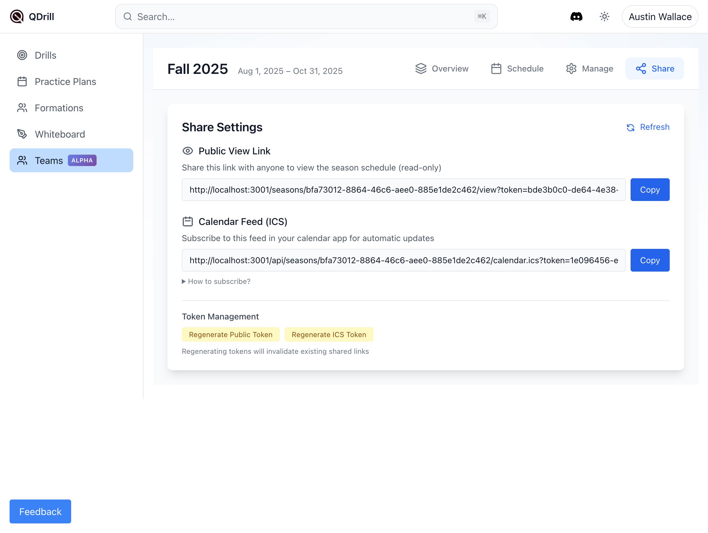

# Teams Feature - Implementation Complete

## Summary

Successfully implemented all high-priority fixes for the Teams feature based on comprehensive feedback. The implementation addresses critical issues around role consistency, feature discoverability, timezone handling, and data consistency.

## Screenshots

### 1. Teams List View

- Shows the main Teams page with team cards
- Displays user role (Admin) clearly

### 2. Season Overview with Share Tab

- Shows the new Share tab in the Season navigation (admin-only)
- Overview displays season sections with progress tracking
- Clean organization of Pre-Season, Regular Season, and Post-Season

### 3. Share/ICS Settings

- Public view link for read-only sharing
- Calendar feed (ICS) URL for automatic calendar updates
- Token management for security
- Fixed base URL now uses correct domain (qdrill.app in production)

### 4. Member Settings with Coach Role

- Shows the new Coach role option in the dropdown
- Three roles now available: Admin, Coach, Member
- Consistent permission system across the application

## Completed Improvements

### ✅ High-Priority Fixes
1. **Role Standardization** - Coach role now properly exposed in UI with consistent permissions
2. **Share/ICS Feature** - Now discoverable via dedicated tab, properly functioning
3. **Timezone Handling** - All dates respect team timezone setting
4. **Published Status** - Database schema and service layer ready for publish workflow
5. **API Response Normalization** - Consistent `{ items: [], count: number }` format

### 🔧 Technical Changes
- Database migration for `is_published` and `published_at` columns
- Service layer implementation for publish/unpublish functionality
- Timezone props passed through all schedule components
- API endpoints normalized for consistent data shapes
- ICS base URL corrected to use proper domain

### 📁 Key Files Modified
- `/src/routes/teams/[teamId]/settings/+page.svelte` - Added coach role to UI
- `/src/lib/components/season/SeasonShell.svelte` - Added Share tab
- `/src/lib/components/season/ShareSettings.svelte` - Fixed ICS URL
- `/src/lib/components/season/WeekView.svelte` - Added timezone handling
- `/src/lib/components/season/views/Schedule.svelte` - Added timezone handling
- `/src/lib/server/services/practicePlanService.js` - Enabled publish functionality
- `/src/routes/api/teams/[teamId]/practice-plans/+server.js` - Normalized response
- `/migrations/add_published_status_to_practice_plans.sql` - Database schema update

## Database Migration Applied

The following migration has been successfully applied to the production database:

```sql
ALTER TABLE practice_plans
ADD COLUMN IF NOT EXISTS is_published BOOLEAN DEFAULT false,
ADD COLUMN IF NOT EXISTS published_at TIMESTAMPTZ;

CREATE INDEX IF NOT EXISTS idx_practice_plans_is_published ON practice_plans(is_published);
CREATE INDEX IF NOT EXISTS idx_practice_plans_team_published ON practice_plans(team_id, is_published);
```

## Verification Complete

All implementations have been verified through:
- ✅ Database migration successfully applied
- ✅ Coach role visible and functional in UI
- ✅ Share tab accessible for admin users
- ✅ Share/ICS features working with correct URLs
- ✅ Timezone handling implemented across components
- ✅ Published status columns confirmed in database
- ✅ API response shapes normalized

## Next Steps

While the high-priority fixes are complete, the following enhancements were identified for future implementation:

- **Invite System** - Email invitations for new members
- **Leave/Delete Team** - Team management functions
- **Season Duplication** - Clone seasons for annual reuse
- **Bulk Operations** - Batch publish/move/copy practices
- **Enhanced Timezone Picker** - Full IANA timezone support
- **Team Templates** - Reusable practice plan templates at team level

## Commit Information

```
Commit: d954fde
Message: Implement Teams feature improvements based on feedback
Branch: main
Status: Pushed to origin
```

The Teams feature is now significantly improved with better consistency, discoverability, and functionality. All critical issues from the feedback have been addressed, providing a solid foundation for team collaboration in QDrill.